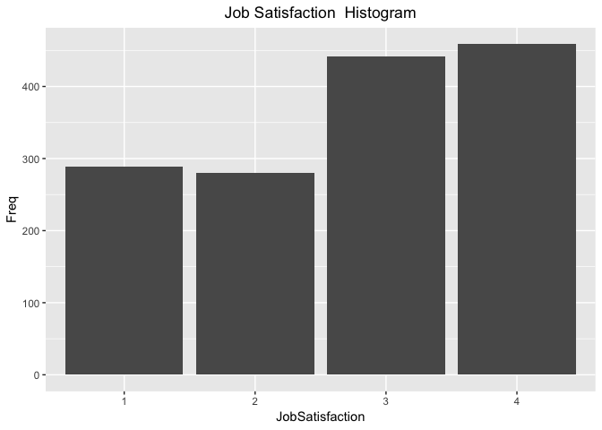

## Case Study 2 Identify factors related to employee attrition at a biotech firm.
a. Initial steps - load data 
b. evaluate data contents


Libraries:


```r
# use pacman package to check and install any required packages

if (!require("pacman")) install.packages("pacman", repos = 'cran.r-project.org/web/packages/pacman/index.html')

pacman::p_load("tidyverse", "kableExtra", "magrittr", "psych", "gmodels", "mlr")
```


```r
emp_data <- read_excel("CaseStudy2-data.xlsx")
str(emp_data)
```

```
Classes 'tbl_df', 'tbl' and 'data.frame':	1470 obs. of  35 variables:
 $ Age                     : num  41 49 37 33 27 32 59 30 38 36 ...
 $ Attrition               : chr  "Yes" "No" "Yes" "No" ...
 $ BusinessTravel          : chr  "Travel_Rarely" "Travel_Frequently" "Travel_Rarely" "Travel_Frequently" ...
 $ DailyRate               : num  1102 279 1373 1392 591 ...
 $ Department              : chr  "Sales" "Research & Development" "Research & Development" "Research & Development" ...
 $ DistanceFromHome        : num  1 8 2 3 2 2 3 24 23 27 ...
 $ Education               : num  2 1 2 4 1 2 3 1 3 3 ...
 $ EducationField          : chr  "Life Sciences" "Life Sciences" "Other" "Life Sciences" ...
 $ EmployeeCount           : num  1 1 1 1 1 1 1 1 1 1 ...
 $ EmployeeNumber          : num  1 2 4 5 7 8 10 11 12 13 ...
 $ EnvironmentSatisfaction : num  2 3 4 4 1 4 3 4 4 3 ...
 $ Gender                  : chr  "Female" "Male" "Male" "Female" ...
 $ HourlyRate              : num  94 61 92 56 40 79 81 67 44 94 ...
 $ JobInvolvement          : num  3 2 2 3 3 3 4 3 2 3 ...
 $ JobLevel                : num  2 2 1 1 1 1 1 1 3 2 ...
 $ JobRole                 : chr  "Sales Executive" "Research Scientist" "Laboratory Technician" "Research Scientist" ...
 $ JobSatisfaction         : num  4 2 3 3 2 4 1 3 3 3 ...
 $ MaritalStatus           : chr  "Single" "Married" "Single" "Married" ...
 $ MonthlyIncome           : num  5993 5130 2090 2909 3468 ...
 $ MonthlyRate             : num  19479 24907 2396 23159 16632 ...
 $ NumCompaniesWorked      : num  8 1 6 1 9 0 4 1 0 6 ...
 $ Over18                  : chr  "Y" "Y" "Y" "Y" ...
 $ OverTime                : chr  "Yes" "No" "Yes" "Yes" ...
 $ PercentSalaryHike       : num  11 23 15 11 12 13 20 22 21 13 ...
 $ PerformanceRating       : num  3 4 3 3 3 3 4 4 4 3 ...
 $ RelationshipSatisfaction: num  1 4 2 3 4 3 1 2 2 2 ...
 $ StandardHours           : num  80 80 80 80 80 80 80 80 80 80 ...
 $ StockOptionLevel        : num  0 1 0 0 1 0 3 1 0 2 ...
 $ TotalWorkingYears       : num  8 10 7 8 6 8 12 1 10 17 ...
 $ TrainingTimesLastYear   : num  0 3 3 3 3 2 3 2 2 3 ...
 $ WorkLifeBalance         : num  1 3 3 3 3 2 2 3 3 2 ...
 $ YearsAtCompany          : num  6 10 0 8 2 7 1 1 9 7 ...
 $ YearsInCurrentRole      : num  4 7 0 7 2 7 0 0 7 7 ...
 $ YearsSinceLastPromotion : num  0 1 0 3 2 3 0 0 1 7 ...
 $ YearsWithCurrManager    : num  5 7 0 0 2 6 0 0 8 7 ...
```

```r
head(emp_data)
```

```
# A tibble: 6 x 35
    Age Attrition BusinessTravel DailyRate Department DistanceFromHome
  <dbl> <chr>     <chr>              <dbl> <chr>                 <dbl>
1    41 Yes       Travel_Rarely       1102 Sales                     1
2    49 No        Travel_Freque…       279 Research …                8
3    37 Yes       Travel_Rarely       1373 Research …                2
4    33 No        Travel_Freque…      1392 Research …                3
5    27 No        Travel_Rarely        591 Research …                2
6    32 No        Travel_Freque…      1005 Research …                2
# … with 29 more variables: Education <dbl>, EducationField <chr>,
#   EmployeeCount <dbl>, EmployeeNumber <dbl>,
#   EnvironmentSatisfaction <dbl>, Gender <chr>, HourlyRate <dbl>,
#   JobInvolvement <dbl>, JobLevel <dbl>, JobRole <chr>,
#   JobSatisfaction <dbl>, MaritalStatus <chr>, MonthlyIncome <dbl>,
#   MonthlyRate <dbl>, NumCompaniesWorked <dbl>, Over18 <chr>,
#   OverTime <chr>, PercentSalaryHike <dbl>, PerformanceRating <dbl>,
#   RelationshipSatisfaction <dbl>, StandardHours <dbl>,
#   StockOptionLevel <dbl>, TotalWorkingYears <dbl>,
#   TrainingTimesLastYear <dbl>, WorkLifeBalance <dbl>,
#   YearsAtCompany <dbl>, YearsInCurrentRole <dbl>,
#   YearsSinceLastPromotion <dbl>, YearsWithCurrManager <dbl>
```
#### The observed data is comprised of numeric and character variables. 
a. evaluate each continuous variable for information level, distribution, and missing values
b. create frequency distributions and plot to understand how scores are distrbuted


```r
knitr::opts_chunk$set(echo = TRUE)

FreqTable <- function(X){ 
  Table <- data.frame( table(X) ) 
  Table$CumFreq <- cumsum(Table$Freq)
  Table$Prop <- prop.table( Table$Freq ) 
  Table$CumProp <-  cumsum( Table$Prop ) 
  Table 
} 

### Age of employee 
ft1 <- FreqTable(emp_data$Age)
ft1
```

```
    X Freq CumFreq        Prop     CumProp
1  18    8       8 0.005442177 0.005442177
2  19    9      17 0.006122449 0.011564626
3  20   11      28 0.007482993 0.019047619
4  21   13      41 0.008843537 0.027891156
5  22   16      57 0.010884354 0.038775510
6  23   14      71 0.009523810 0.048299320
7  24   26      97 0.017687075 0.065986395
8  25   26     123 0.017687075 0.083673469
9  26   39     162 0.026530612 0.110204082
10 27   48     210 0.032653061 0.142857143
11 28   48     258 0.032653061 0.175510204
12 29   68     326 0.046258503 0.221768707
13 30   60     386 0.040816327 0.262585034
14 31   69     455 0.046938776 0.309523810
15 32   61     516 0.041496599 0.351020408
16 33   58     574 0.039455782 0.390476190
17 34   77     651 0.052380952 0.442857143
18 35   78     729 0.053061224 0.495918367
19 36   69     798 0.046938776 0.542857143
20 37   50     848 0.034013605 0.576870748
21 38   58     906 0.039455782 0.616326531
22 39   42     948 0.028571429 0.644897959
23 40   57    1005 0.038775510 0.683673469
24 41   40    1045 0.027210884 0.710884354
25 42   46    1091 0.031292517 0.742176871
26 43   32    1123 0.021768707 0.763945578
27 44   33    1156 0.022448980 0.786394558
28 45   41    1197 0.027891156 0.814285714
29 46   33    1230 0.022448980 0.836734694
30 47   24    1254 0.016326531 0.853061224
31 48   19    1273 0.012925170 0.865986395
32 49   24    1297 0.016326531 0.882312925
33 50   30    1327 0.020408163 0.902721088
34 51   19    1346 0.012925170 0.915646259
35 52   18    1364 0.012244898 0.927891156
36 53   19    1383 0.012925170 0.940816327
37 54   18    1401 0.012244898 0.953061224
38 55   22    1423 0.014965986 0.968027211
39 56   14    1437 0.009523810 0.977551020
40 57    4    1441 0.002721088 0.980272109
41 58   14    1455 0.009523810 0.989795918
42 59   10    1465 0.006802721 0.996598639
43 60    5    1470 0.003401361 1.000000000
```

```r
ggplot(data=ft1, aes(x=X, y=Freq)) +geom_bar(stat="identity") +ylab("Freq") + xlab("Age") +ggtitle("Age Histogram")+ theme(plot.title = element_text(hjust = 0.5)) + theme(legend.position="none")
```

<!-- -->

```r
ggplot(data=ft1, aes(x=X, y=CumProp)) +geom_bar(stat="identity") +ylab("Freq") + xlab("Age") +ggtitle("Age Cumulative Histogram")+ theme(plot.title = element_text(hjust = 0.5)) + theme(legend.position="none")
```

<!-- -->

```r
describe(emp_data$Age)
```

```
   vars    n  mean   sd median trimmed mad min max range skew kurtosis
X1    1 1470 36.92 9.14     36   36.47 8.9  18  60    42 0.41    -0.41
     se
X1 0.24
```

```r
sum(is.na(emp_data$Age))
```

```
[1] 0
```
#### daily rate distribution

```r
knitr::opts_chunk$set(echo = TRUE)
ft2 <- FreqTable(emp_data$DailyRate)
ft2
```

```
       X Freq CumFreq         Prop      CumProp
1    102    1       1 0.0006802721 0.0006802721
2    103    1       2 0.0006802721 0.0013605442
3    104    1       3 0.0006802721 0.0020408163
4    105    1       4 0.0006802721 0.0027210884
5    106    1       5 0.0006802721 0.0034013605
6    107    1       6 0.0006802721 0.0040816327
7    109    1       7 0.0006802721 0.0047619048
8    111    3      10 0.0020408163 0.0068027211
9    115    1      11 0.0006802721 0.0074829932
10   116    2      13 0.0013605442 0.0088435374
11   117    4      17 0.0027210884 0.0115646259
12   118    2      19 0.0013605442 0.0129251701
13   119    2      21 0.0013605442 0.0142857143
14   120    2      23 0.0013605442 0.0156462585
15   121    2      25 0.0013605442 0.0170068027
16   124    2      27 0.0013605442 0.0183673469
17   125    1      28 0.0006802721 0.0190476190
18   128    1      29 0.0006802721 0.0197278912
19   129    1      30 0.0006802721 0.0204081633
20   130    2      32 0.0013605442 0.0217687075
21   131    1      33 0.0006802721 0.0224489796
22   132    1      34 0.0006802721 0.0231292517
23   134    1      35 0.0006802721 0.0238095238
24   135    3      38 0.0020408163 0.0258503401
25   136    2      40 0.0013605442 0.0272108844
26   138    2      42 0.0013605442 0.0285714286
27   140    1      43 0.0006802721 0.0292517007
28   141    2      45 0.0013605442 0.0306122449
29   142    3      48 0.0020408163 0.0326530612
30   143    1      49 0.0006802721 0.0333333333
31   144    2      51 0.0013605442 0.0346938776
32   145    1      52 0.0006802721 0.0353741497
33   146    1      53 0.0006802721 0.0360544218
34   147    4      57 0.0027210884 0.0387755102
35   148    1      58 0.0006802721 0.0394557823
36   150    1      59 0.0006802721 0.0401360544
37   152    1      60 0.0006802721 0.0408163265
38   153    2      62 0.0013605442 0.0421768707
39   154    1      63 0.0006802721 0.0428571429
40   155    2      65 0.0013605442 0.0442176871
41   156    1      66 0.0006802721 0.0448979592
42   157    2      68 0.0013605442 0.0462585034
43   160    2      70 0.0013605442 0.0476190476
44   161    1      71 0.0006802721 0.0482993197
45   163    2      73 0.0013605442 0.0496598639
46   164    1      74 0.0006802721 0.0503401361
47   167    2      76 0.0013605442 0.0517006803
48   168    2      78 0.0013605442 0.0530612245
49   170    2      80 0.0013605442 0.0544217687
50   172    1      81 0.0006802721 0.0551020408
51   174    1      82 0.0006802721 0.0557823129
52   176    1      83 0.0006802721 0.0564625850
53   177    2      85 0.0013605442 0.0578231293
54   179    1      86 0.0006802721 0.0585034014
55   180    1      87 0.0006802721 0.0591836735
56   181    1      88 0.0006802721 0.0598639456
57   182    2      90 0.0013605442 0.0612244898
58   185    2      92 0.0013605442 0.0625850340
59   188    2      94 0.0013605442 0.0639455782
60   189    1      95 0.0006802721 0.0646258503
61   192    3      98 0.0020408163 0.0666666667
62   193    2     100 0.0013605442 0.0680272109
63   194    1     101 0.0006802721 0.0687074830
64   195    1     102 0.0006802721 0.0693877551
65   196    1     103 0.0006802721 0.0700680272
66   199    1     104 0.0006802721 0.0707482993
67   200    2     106 0.0013605442 0.0721088435
68   201    3     109 0.0020408163 0.0741496599
69   202    3     112 0.0020408163 0.0761904762
70   203    1     113 0.0006802721 0.0768707483
71   204    1     114 0.0006802721 0.0775510204
72   205    1     115 0.0006802721 0.0782312925
73   206    1     116 0.0006802721 0.0789115646
74   207    1     117 0.0006802721 0.0795918367
75   208    1     118 0.0006802721 0.0802721088
76   210    2     120 0.0013605442 0.0816326531
77   211    1     121 0.0006802721 0.0823129252
78   213    1     122 0.0006802721 0.0829931973
79   216    3     125 0.0020408163 0.0850340136
80   217    4     129 0.0027210884 0.0877551020
81   218    2     131 0.0013605442 0.0891156463
82   219    1     132 0.0006802721 0.0897959184
83   224    1     133 0.0006802721 0.0904761905
84   228    2     135 0.0013605442 0.0918367347
85   230    1     136 0.0006802721 0.0925170068
86   231    1     137 0.0006802721 0.0931972789
87   232    1     138 0.0006802721 0.0938775510
88   234    2     140 0.0013605442 0.0952380952
89   237    1     141 0.0006802721 0.0959183673
90   238    2     143 0.0013605442 0.0972789116
91   240    3     146 0.0020408163 0.0993197279
92   241    1     147 0.0006802721 0.1000000000
93   243    1     148 0.0006802721 0.1006802721
94   244    1     149 0.0006802721 0.1013605442
95   247    2     151 0.0013605442 0.1027210884
96   248    1     152 0.0006802721 0.1034013605
97   249    2     154 0.0013605442 0.1047619048
98   251    1     155 0.0006802721 0.1054421769
99   252    2     157 0.0013605442 0.1068027211
100  253    1     158 0.0006802721 0.1074829932
101  254    1     159 0.0006802721 0.1081632653
102  256    1     160 0.0006802721 0.1088435374
103  258    2     162 0.0013605442 0.1102040816
104  261    1     163 0.0006802721 0.1108843537
105  263    1     164 0.0006802721 0.1115646259
106  264    1     165 0.0006802721 0.1122448980
107  265    3     168 0.0020408163 0.1142857143
108  266    2     170 0.0013605442 0.1156462585
109  267    4     174 0.0027210884 0.1183673469
110  268    1     175 0.0006802721 0.1190476190
111  269    2     177 0.0013605442 0.1204081633
112  271    1     178 0.0006802721 0.1210884354
113  277    1     179 0.0006802721 0.1217687075
114  279    1     180 0.0006802721 0.1224489796
115  280    1     181 0.0006802721 0.1231292517
116  282    1     182 0.0006802721 0.1238095238
117  285    1     183 0.0006802721 0.1244897959
118  286    1     184 0.0006802721 0.1251700680
119  287    2     186 0.0013605442 0.1265306122
120  288    2     188 0.0013605442 0.1278911565
121  289    2     190 0.0013605442 0.1292517007
122  290    1     191 0.0006802721 0.1299319728
123  294    1     192 0.0006802721 0.1306122449
124  296    1     193 0.0006802721 0.1312925170
125  299    1     194 0.0006802721 0.1319727891
126  300    3     197 0.0020408163 0.1340136054
127  301    2     199 0.0013605442 0.1353741497
128  302    1     200 0.0006802721 0.1360544218
129  303    3     203 0.0020408163 0.1380952381
130  304    2     205 0.0013605442 0.1394557823
131  305    1     206 0.0006802721 0.1401360544
132  306    1     207 0.0006802721 0.1408163265
133  307    1     208 0.0006802721 0.1414965986
134  309    2     210 0.0013605442 0.1428571429
135  310    2     212 0.0013605442 0.1442176871
136  311    2     214 0.0013605442 0.1455782313
137  313    2     216 0.0013605442 0.1469387755
138  314    1     217 0.0006802721 0.1476190476
139  316    1     218 0.0006802721 0.1482993197
140  317    1     219 0.0006802721 0.1489795918
141  318    2     221 0.0013605442 0.1503401361
142  319    3     224 0.0020408163 0.1523809524
143  322    2     226 0.0013605442 0.1537414966
144  325    2     228 0.0013605442 0.1551020408
145  326    2     230 0.0013605442 0.1564625850
146  328    1     231 0.0006802721 0.1571428571
147  329    5     236 0.0034013605 0.1605442177
148  330    3     239 0.0020408163 0.1625850340
149  332    1     240 0.0006802721 0.1632653061
150  333    1     241 0.0006802721 0.1639455782
151  334    4     245 0.0027210884 0.1666666667
152  335    3     248 0.0020408163 0.1687074830
153  336    1     249 0.0006802721 0.1693877551
154  337    3     252 0.0020408163 0.1714285714
155  341    1     253 0.0006802721 0.1721088435
156  342    2     255 0.0013605442 0.1734693878
157  343    2     257 0.0013605442 0.1748299320
158  345    1     258 0.0006802721 0.1755102041
159  346    1     259 0.0006802721 0.1761904762
160  350    4     263 0.0027210884 0.1789115646
161  352    1     264 0.0006802721 0.1795918367
162  355    1     265 0.0006802721 0.1802721088
163  359    2     267 0.0013605442 0.1816326531
164  360    1     268 0.0006802721 0.1823129252
165  362    1     269 0.0006802721 0.1829931973
166  363    1     270 0.0006802721 0.1836734694
167  364    2     272 0.0013605442 0.1850340136
168  365    1     273 0.0006802721 0.1857142857
169  367    1     274 0.0006802721 0.1863945578
170  369    1     275 0.0006802721 0.1870748299
171  370    2     277 0.0013605442 0.1884353741
172  371    2     279 0.0013605442 0.1897959184
173  373    1     280 0.0006802721 0.1904761905
174  374    2     282 0.0013605442 0.1918367347
175  376    1     283 0.0006802721 0.1925170068
176  377    1     284 0.0006802721 0.1931972789
177  379    1     285 0.0006802721 0.1938775510
178  381    2     287 0.0013605442 0.1952380952
179  383    2     289 0.0013605442 0.1965986395
180  384    1     290 0.0006802721 0.1972789116
181  390    2     292 0.0013605442 0.1986394558
182  391    2     294 0.0013605442 0.2000000000
183  392    1     295 0.0006802721 0.2006802721
184  394    1     296 0.0006802721 0.2013605442
185  395    1     297 0.0006802721 0.2020408163
186  397    3     300 0.0020408163 0.2040816327
187  401    1     301 0.0006802721 0.2047619048
188  404    1     302 0.0006802721 0.2054421769
189  405    1     303 0.0006802721 0.2061224490
190  406    1     304 0.0006802721 0.2068027211
191  408    5     309 0.0034013605 0.2102040816
192  410    2     311 0.0013605442 0.2115646259
193  412    1     312 0.0006802721 0.2122448980
194  413    1     313 0.0006802721 0.2129251701
195  414    1     314 0.0006802721 0.2136054422
196  415    1     315 0.0006802721 0.2142857143
197  419    3     318 0.0020408163 0.2163265306
198  422    2     320 0.0013605442 0.2176870748
199  426    2     322 0.0013605442 0.2190476190
200  427    4     326 0.0027210884 0.2217687075
201  428    1     327 0.0006802721 0.2224489796
202  429    2     329 0.0013605442 0.2238095238
203  430    4     333 0.0027210884 0.2265306122
204  431    1     334 0.0006802721 0.2272108844
205  432    1     335 0.0006802721 0.2278911565
206  433    1     336 0.0006802721 0.2285714286
207  436    1     337 0.0006802721 0.2292517007
208  437    1     338 0.0006802721 0.2299319728
209  438    1     339 0.0006802721 0.2306122449
210  439    1     340 0.0006802721 0.2312925170
211  440    1     341 0.0006802721 0.2319727891
212  441    2     343 0.0013605442 0.2333333333
213  442    1     344 0.0006802721 0.2340136054
214  443    2     346 0.0013605442 0.2353741497
215  444    3     349 0.0020408163 0.2374149660
216  446    1     350 0.0006802721 0.2380952381
217  447    2     352 0.0013605442 0.2394557823
218  448    2     354 0.0013605442 0.2408163265
219  452    1     355 0.0006802721 0.2414965986
220  457    1     356 0.0006802721 0.2421768707
221  458    2     358 0.0013605442 0.2435374150
222  459    1     359 0.0006802721 0.2442176871
223  461    2     361 0.0013605442 0.2455782313
224  462    1     362 0.0006802721 0.2462585034
225  464    3     365 0.0020408163 0.2482993197
226  465    4     369 0.0027210884 0.2510204082
227  466    1     370 0.0006802721 0.2517006803
228  467    1     371 0.0006802721 0.2523809524
229  468    1     372 0.0006802721 0.2530612245
230  469    3     375 0.0020408163 0.2551020408
231  470    2     377 0.0013605442 0.2564625850
232  471    3     380 0.0020408163 0.2585034014
233  472    1     381 0.0006802721 0.2591836735
234  474    1     382 0.0006802721 0.2598639456
235  477    2     384 0.0013605442 0.2612244898
236  478    1     385 0.0006802721 0.2619047619
237  479    1     386 0.0006802721 0.2625850340
238  480    1     387 0.0006802721 0.2632653061
239  481    1     388 0.0006802721 0.2639455782
240  482    3     391 0.0020408163 0.2659863946
241  483    1     392 0.0006802721 0.2666666667
242  486    1     393 0.0006802721 0.2673469388
243  488    1     394 0.0006802721 0.2680272109
244  489    2     396 0.0013605442 0.2693877551
245  490    1     397 0.0006802721 0.2700680272
246  492    2     399 0.0013605442 0.2714285714
247  495    2     401 0.0013605442 0.2727891156
248  496    1     402 0.0006802721 0.2734693878
249  498    1     403 0.0006802721 0.2741496599
250  499    1     404 0.0006802721 0.2748299320
251  500    1     405 0.0006802721 0.2755102041
252  501    3     408 0.0020408163 0.2775510204
253  504    2     410 0.0013605442 0.2789115646
254  505    1     411 0.0006802721 0.2795918367
255  506    2     413 0.0013605442 0.2809523810
256  507    2     415 0.0013605442 0.2823129252
257  508    2     417 0.0013605442 0.2836734694
258  509    2     419 0.0013605442 0.2850340136
259  511    2     421 0.0013605442 0.2863945578
260  515    2     423 0.0013605442 0.2877551020
261  516    1     424 0.0006802721 0.2884353741
262  523    2     426 0.0013605442 0.2897959184
263  524    1     427 0.0006802721 0.2904761905
264  525    1     428 0.0006802721 0.2911564626
265  526    1     429 0.0006802721 0.2918367347
266  527    2     431 0.0013605442 0.2931972789
267  528    3     434 0.0020408163 0.2952380952
268  529    2     436 0.0013605442 0.2965986395
269  530    5     441 0.0034013605 0.3000000000
270  531    1     442 0.0006802721 0.3006802721
271  532    2     444 0.0013605442 0.3020408163
272  534    2     446 0.0013605442 0.3034013605
273  535    1     447 0.0006802721 0.3040816327
274  536    1     448 0.0006802721 0.3047619048
275  538    2     450 0.0013605442 0.3061224490
276  541    3     453 0.0020408163 0.3081632653
277  542    1     454 0.0006802721 0.3088435374
278  543    2     456 0.0013605442 0.3102040816
279  544    2     458 0.0013605442 0.3115646259
280  546    2     460 0.0013605442 0.3129251701
281  548    3     463 0.0020408163 0.3149659864
282  549    2     465 0.0013605442 0.3163265306
283  552    1     466 0.0006802721 0.3170068027
284  553    1     467 0.0006802721 0.3176870748
285  555    2     469 0.0013605442 0.3190476190
286  556    2     471 0.0013605442 0.3204081633
287  557    2     473 0.0013605442 0.3217687075
288  558    1     474 0.0006802721 0.3224489796
289  559    2     476 0.0013605442 0.3238095238
290  560    1     477 0.0006802721 0.3244897959
291  561    2     479 0.0013605442 0.3258503401
292  562    1     480 0.0006802721 0.3265306122
293  563    1     481 0.0006802721 0.3272108844
294  566    2     483 0.0013605442 0.3285714286
295  567    1     484 0.0006802721 0.3292517007
296  570    2     486 0.0013605442 0.3306122449
297  571    3     489 0.0020408163 0.3326530612
298  572    1     490 0.0006802721 0.3333333333
299  573    1     491 0.0006802721 0.3340136054
300  574    2     493 0.0013605442 0.3353741497
301  575    4     497 0.0027210884 0.3380952381
302  580    2     499 0.0013605442 0.3394557823
303  581    2     501 0.0013605442 0.3408163265
304  582    1     502 0.0006802721 0.3414965986
305  583    3     505 0.0020408163 0.3435374150
306  584    1     506 0.0006802721 0.3442176871
307  585    2     508 0.0013605442 0.3455782313
308  586    1     509 0.0006802721 0.3462585034
309  587    2     511 0.0013605442 0.3476190476
310  588    1     512 0.0006802721 0.3482993197
311  589    4     516 0.0027210884 0.3510204082
312  590    1     517 0.0006802721 0.3517006803
313  591    2     519 0.0013605442 0.3530612245
314  592    2     521 0.0013605442 0.3544217687
315  593    2     523 0.0013605442 0.3557823129
316  594    2     525 0.0013605442 0.3571428571
317  598    1     526 0.0006802721 0.3578231293
318  599    1     527 0.0006802721 0.3585034014
319  600    1     528 0.0006802721 0.3591836735
320  601    2     530 0.0013605442 0.3605442177
321  602    2     532 0.0013605442 0.3619047619
322  603    2     534 0.0013605442 0.3632653061
323  604    2     536 0.0013605442 0.3646258503
324  605    1     537 0.0006802721 0.3653061224
325  607    3     540 0.0020408163 0.3673469388
326  608    1     541 0.0006802721 0.3680272109
327  611    1     542 0.0006802721 0.3687074830
328  613    1     543 0.0006802721 0.3693877551
329  616    2     545 0.0013605442 0.3707482993
330  617    1     546 0.0006802721 0.3714285714
331  618    2     548 0.0013605442 0.3727891156
332  619    1     549 0.0006802721 0.3734693878
333  621    2     551 0.0013605442 0.3748299320
334  622    3     554 0.0020408163 0.3768707483
335  625    2     556 0.0013605442 0.3782312925
336  626    1     557 0.0006802721 0.3789115646
337  628    1     558 0.0006802721 0.3795918367
338  629    1     559 0.0006802721 0.3802721088
339  630    1     560 0.0006802721 0.3809523810
340  632    1     561 0.0006802721 0.3816326531
341  634    2     563 0.0013605442 0.3829931973
342  635    3     566 0.0020408163 0.3850340136
343  636    2     568 0.0013605442 0.3863945578
344  638    3     571 0.0020408163 0.3884353741
345  640    1     572 0.0006802721 0.3891156463
346  641    1     573 0.0006802721 0.3897959184
347  642    1     574 0.0006802721 0.3904761905
348  644    1     575 0.0006802721 0.3911564626
349  645    2     577 0.0013605442 0.3925170068
350  646    1     578 0.0006802721 0.3931972789
351  647    1     579 0.0006802721 0.3938775510
352  648    1     580 0.0006802721 0.3945578231
353  650    1     581 0.0006802721 0.3952380952
354  652    1     582 0.0006802721 0.3959183673
355  653    2     584 0.0013605442 0.3972789116
356  654    3     587 0.0020408163 0.3993197279
357  655    1     588 0.0006802721 0.4000000000
358  657    1     589 0.0006802721 0.4006802721
359  658    2     591 0.0013605442 0.4020408163
360  660    2     593 0.0013605442 0.4034013605
361  661    3     596 0.0020408163 0.4054421769
362  662    2     598 0.0013605442 0.4068027211
363  663    2     600 0.0013605442 0.4081632653
364  664    1     601 0.0006802721 0.4088435374
365  665    2     603 0.0013605442 0.4102040816
366  666    1     604 0.0006802721 0.4108843537
367  667    2     606 0.0013605442 0.4122448980
368  669    2     608 0.0013605442 0.4136054422
369  670    2     610 0.0013605442 0.4149659864
370  671    1     611 0.0006802721 0.4156462585
371  672    2     613 0.0013605442 0.4170068027
372  673    1     614 0.0006802721 0.4176870748
373  674    1     615 0.0006802721 0.4183673469
374  675    1     616 0.0006802721 0.4190476190
375  676    2     618 0.0013605442 0.4204081633
376  678    1     619 0.0006802721 0.4210884354
377  682    2     621 0.0013605442 0.4224489796
378  683    1     622 0.0006802721 0.4231292517
379  684    1     623 0.0006802721 0.4238095238
380  685    3     626 0.0020408163 0.4258503401
381  688    4     630 0.0027210884 0.4285714286
382  689    1     631 0.0006802721 0.4292517007
383  691    6     637 0.0040816327 0.4333333333
384  692    2     639 0.0013605442 0.4346938776
385  693    2     641 0.0013605442 0.4360544218
386  694    1     642 0.0006802721 0.4367346939
387  696    1     643 0.0006802721 0.4374149660
388  697    2     645 0.0013605442 0.4387755102
389  699    2     647 0.0013605442 0.4401360544
390  702    2     649 0.0013605442 0.4414965986
391  703    3     652 0.0020408163 0.4435374150
392  704    1     653 0.0006802721 0.4442176871
393  705    1     654 0.0006802721 0.4448979592
394  706    1     655 0.0006802721 0.4455782313
395  708    1     656 0.0006802721 0.4462585034
396  711    2     658 0.0013605442 0.4476190476
397  713    1     659 0.0006802721 0.4482993197
398  715    4     663 0.0027210884 0.4510204082
399  717    1     664 0.0006802721 0.4517006803
400  718    2     666 0.0013605442 0.4530612245
401  719    1     667 0.0006802721 0.4537414966
402  720    1     668 0.0006802721 0.4544217687
403  721    1     669 0.0006802721 0.4551020408
404  722    3     672 0.0020408163 0.4571428571
405  723    2     674 0.0013605442 0.4585034014
406  725    1     675 0.0006802721 0.4591836735
407  726    1     676 0.0006802721 0.4598639456
408  727    2     678 0.0013605442 0.4612244898
409  728    2     680 0.0013605442 0.4625850340
410  734    1     681 0.0006802721 0.4632653061
411  735    3     684 0.0020408163 0.4653061224
412  736    1     685 0.0006802721 0.4659863946
413  737    1     686 0.0006802721 0.4666666667
414  738    1     687 0.0006802721 0.4673469388
415  740    1     688 0.0006802721 0.4680272109
416  741    1     689 0.0006802721 0.4687074830
417  746    3     692 0.0020408163 0.4707482993
418  748    1     693 0.0006802721 0.4714285714
419  750    3     696 0.0020408163 0.4734693878
420  754    1     697 0.0006802721 0.4741496599
421  755    1     698 0.0006802721 0.4748299320
422  756    1     699 0.0006802721 0.4755102041
423  759    1     700 0.0006802721 0.4761904762
424  760    1     701 0.0006802721 0.4768707483
425  763    1     702 0.0006802721 0.4775510204
426  766    1     703 0.0006802721 0.4782312925
427  769    1     704 0.0006802721 0.4789115646
428  770    2     706 0.0013605442 0.4802721088
429  771    2     708 0.0013605442 0.4816326531
430  772    1     709 0.0006802721 0.4823129252
431  773    1     710 0.0006802721 0.4829931973
432  775    3     713 0.0020408163 0.4850340136
433  776    1     714 0.0006802721 0.4857142857
434  781    1     715 0.0006802721 0.4863945578
435  782    1     716 0.0006802721 0.4870748299
436  783    2     718 0.0013605442 0.4884353741
437  786    1     719 0.0006802721 0.4891156463
438  788    1     720 0.0006802721 0.4897959184
439  790    1     721 0.0006802721 0.4904761905
440  791    2     723 0.0013605442 0.4918367347
441  792    1     724 0.0006802721 0.4925170068
442  793    3     727 0.0020408163 0.4945578231
443  796    2     729 0.0013605442 0.4959183673
444  797    1     730 0.0006802721 0.4965986395
445  798    2     732 0.0013605442 0.4979591837
446  799    1     733 0.0006802721 0.4986394558
447  801    1     734 0.0006802721 0.4993197279
448  802    2     736 0.0013605442 0.5006802721
449  804    2     738 0.0013605442 0.5020408163
450  805    3     741 0.0020408163 0.5040816327
451  806    2     743 0.0013605442 0.5054421769
452  807    2     745 0.0013605442 0.5068027211
453  809    3     748 0.0020408163 0.5088435374
454  810    3     751 0.0020408163 0.5108843537
455  812    1     752 0.0006802721 0.5115646259
456  813    3     755 0.0020408163 0.5136054422
457  817    2     757 0.0013605442 0.5149659864
458  818    1     758 0.0006802721 0.5156462585
459  819    2     760 0.0013605442 0.5170068027
460  821    2     762 0.0013605442 0.5183673469
461  823    2     764 0.0013605442 0.5197278912
462  824    1     765 0.0006802721 0.5204081633
463  827    4     769 0.0027210884 0.5231292517
464  828    1     770 0.0006802721 0.5238095238
465  829    4     774 0.0027210884 0.5265306122
466  830    1     775 0.0006802721 0.5272108844
467  832    2     777 0.0013605442 0.5285714286
468  833    2     779 0.0013605442 0.5299319728
469  835    1     780 0.0006802721 0.5306122449
470  836    2     782 0.0013605442 0.5319727891
471  840    1     783 0.0006802721 0.5326530612
472  841    1     784 0.0006802721 0.5333333333
473  845    1     785 0.0006802721 0.5340136054
474  848    1     786 0.0006802721 0.5346938776
475  849    2     788 0.0013605442 0.5360544218
476  852    3     791 0.0020408163 0.5380952381
477  853    3     794 0.0020408163 0.5401360544
478  854    1     795 0.0006802721 0.5408163265
479  855    3     798 0.0020408163 0.5428571429
480  857    2     800 0.0013605442 0.5442176871
481  859    1     801 0.0006802721 0.5448979592
482  862    1     802 0.0006802721 0.5455782313
483  866    1     803 0.0006802721 0.5462585034
484  867    3     806 0.0020408163 0.5482993197
485  868    1     807 0.0006802721 0.5489795918
486  869    1     808 0.0006802721 0.5496598639
487  871    1     809 0.0006802721 0.5503401361
488  874    1     810 0.0006802721 0.5510204082
489  878    2     812 0.0013605442 0.5523809524
490  879    1     813 0.0006802721 0.5530612245
491  880    1     814 0.0006802721 0.5537414966
492  881    1     815 0.0006802721 0.5544217687
493  882    2     817 0.0013605442 0.5557823129
494  883    1     818 0.0006802721 0.5564625850
495  884    3     821 0.0020408163 0.5585034014
496  885    2     823 0.0013605442 0.5598639456
497  887    1     824 0.0006802721 0.5605442177
498  888    1     825 0.0006802721 0.5612244898
499  889    1     826 0.0006802721 0.5619047619
500  890    3     829 0.0020408163 0.5639455782
501  891    1     830 0.0006802721 0.5646258503
502  894    2     832 0.0013605442 0.5659863946
503  895    3     835 0.0020408163 0.5680272109
504  896    3     838 0.0020408163 0.5700680272
505  897    1     839 0.0006802721 0.5707482993
506  898    1     840 0.0006802721 0.5714285714
507  902    1     841 0.0006802721 0.5721088435
508  903    2     843 0.0013605442 0.5734693878
509  905    1     844 0.0006802721 0.5741496599
510  906    4     848 0.0027210884 0.5768707483
511  911    1     849 0.0006802721 0.5775510204
512  913    1     850 0.0006802721 0.5782312925
513  916    1     851 0.0006802721 0.5789115646
514  917    1     852 0.0006802721 0.5795918367
515  918    1     853 0.0006802721 0.5802721088
516  920    3     856 0.0020408163 0.5823129252
517  921    4     860 0.0027210884 0.5850340136
518  922    2     862 0.0013605442 0.5863945578
519  924    1     863 0.0006802721 0.5870748299
520  926    1     864 0.0006802721 0.5877551020
521  928    2     866 0.0013605442 0.5891156463
522  929    1     867 0.0006802721 0.5897959184
523  930    3     870 0.0020408163 0.5918367347
524  931    1     871 0.0006802721 0.5925170068
525  932    1     872 0.0006802721 0.5931972789
526  933    4     876 0.0027210884 0.5959183673
527  935    1     877 0.0006802721 0.5965986395
528  937    1     878 0.0006802721 0.5972789116
529  938    1     879 0.0006802721 0.5979591837
530  939    1     880 0.0006802721 0.5986394558
531  942    2     882 0.0013605442 0.6000000000
532  943    1     883 0.0006802721 0.6006802721
533  944    1     884 0.0006802721 0.6013605442
534  945    3     887 0.0020408163 0.6034013605
535  946    1     888 0.0006802721 0.6040816327
536  949    1     889 0.0006802721 0.6047619048
537  950    4     893 0.0027210884 0.6074829932
538  953    1     894 0.0006802721 0.6081632653
539  954    2     896 0.0013605442 0.6095238095
540  955    1     897 0.0006802721 0.6102040816
541  956    1     898 0.0006802721 0.6108843537
542  957    1     899 0.0006802721 0.6115646259
543  959    3     902 0.0020408163 0.6136054422
544  964    1     903 0.0006802721 0.6142857143
545  966    1     904 0.0006802721 0.6149659864
546  967    2     906 0.0013605442 0.6163265306
547  968    1     907 0.0006802721 0.6170068027
548  969    1     908 0.0006802721 0.6176870748
549  970    3     911 0.0020408163 0.6197278912
550  971    2     913 0.0013605442 0.6210884354
551  974    1     914 0.0006802721 0.6217687075
552  975    1     915 0.0006802721 0.6224489796
553  976    2     917 0.0013605442 0.6238095238
554  977    4     921 0.0027210884 0.6265306122
555  979    2     923 0.0013605442 0.6278911565
556  981    1     924 0.0006802721 0.6285714286
557  982    2     926 0.0013605442 0.6299319728
558  983    1     927 0.0006802721 0.6306122449
559  984    2     929 0.0013605442 0.6319727891
560  986    2     931 0.0013605442 0.6333333333
561  988    1     932 0.0006802721 0.6340136054
562  989    2     934 0.0013605442 0.6353741497
563  990    2     936 0.0013605442 0.6367346939
564  991    3     939 0.0020408163 0.6387755102
565  992    2     941 0.0013605442 0.6401360544
566  994    2     943 0.0013605442 0.6414965986
567  995    2     945 0.0013605442 0.6428571429
568  996    1     946 0.0006802721 0.6435374150
569  999    1     947 0.0006802721 0.6442176871
570 1001    3     950 0.0020408163 0.6462585034
571 1002    1     951 0.0006802721 0.6469387755
572 1003    3     954 0.0020408163 0.6489795918
573 1005    3     957 0.0020408163 0.6510204082
574 1009    3     960 0.0020408163 0.6530612245
575 1010    1     961 0.0006802721 0.6537414966
576 1012    1     962 0.0006802721 0.6544217687
577 1015    1     963 0.0006802721 0.6551020408
578 1017    3     966 0.0020408163 0.6571428571
579 1018    3     969 0.0020408163 0.6591836735
580 1023    1     970 0.0006802721 0.6598639456
581 1029    1     971 0.0006802721 0.6605442177
582 1030    1     972 0.0006802721 0.6612244898
583 1031    1     973 0.0006802721 0.6619047619
584 1033    1     974 0.0006802721 0.6625850340
585 1034    2     976 0.0013605442 0.6639455782
586 1035    1     977 0.0006802721 0.6646258503
587 1037    1     978 0.0006802721 0.6653061224
588 1038    2     980 0.0013605442 0.6666666667
589 1040    2     982 0.0013605442 0.6680272109
590 1041    1     983 0.0006802721 0.6687074830
591 1045    1     984 0.0006802721 0.6693877551
592 1046    1     985 0.0006802721 0.6700680272
593 1050    2     987 0.0013605442 0.6714285714
594 1052    1     988 0.0006802721 0.6721088435
595 1053    1     989 0.0006802721 0.6727891156
596 1054    1     990 0.0006802721 0.6734693878
597 1055    2     992 0.0013605442 0.6748299320
598 1059    1     993 0.0006802721 0.6755102041
599 1060    1     994 0.0006802721 0.6761904762
600 1062    2     996 0.0013605442 0.6775510204
601 1063    1     997 0.0006802721 0.6782312925
602 1064    1     998 0.0006802721 0.6789115646
603 1065    1     999 0.0006802721 0.6795918367
604 1066    1    1000 0.0006802721 0.6802721088
605 1069    2    1002 0.0013605442 0.6816326531
606 1070    1    1003 0.0006802721 0.6823129252
607 1075    1    1004 0.0006802721 0.6829931973
608 1076    1    1005 0.0006802721 0.6836734694
609 1079    2    1007 0.0013605442 0.6850340136
610 1082    5    1012 0.0034013605 0.6884353741
611 1083    1    1013 0.0006802721 0.6891156463
612 1084    2    1015 0.0013605442 0.6904761905
613 1085    1    1016 0.0006802721 0.6911564626
614 1086    1    1017 0.0006802721 0.6918367347
615 1089    3    1020 0.0020408163 0.6938775510
616 1090    1    1021 0.0006802721 0.6945578231
617 1091    2    1023 0.0013605442 0.6959183673
618 1092    3    1026 0.0020408163 0.6979591837
619 1093    2    1028 0.0013605442 0.6993197279
620 1094    1    1029 0.0006802721 0.7000000000
621 1096    1    1030 0.0006802721 0.7006802721
622 1097    3    1033 0.0020408163 0.7027210884
623 1098    1    1034 0.0006802721 0.7034013605
624 1099    3    1037 0.0020408163 0.7054421769
625 1102    1    1038 0.0006802721 0.7061224490
626 1103    2    1040 0.0013605442 0.7074829932
627 1105    1    1041 0.0006802721 0.7081632653
628 1107    3    1044 0.0020408163 0.7102040816
629 1108    1    1045 0.0006802721 0.7108843537
630 1109    1    1046 0.0006802721 0.7115646259
631 1111    2    1048 0.0013605442 0.7129251701
632 1112    2    1050 0.0013605442 0.7142857143
633 1115    3    1053 0.0020408163 0.7163265306
634 1116    1    1054 0.0006802721 0.7170068027
635 1117    3    1057 0.0020408163 0.7190476190
636 1120    1    1058 0.0006802721 0.7197278912
637 1122    1    1059 0.0006802721 0.7204081633
638 1123    1    1060 0.0006802721 0.7210884354
639 1124    2    1062 0.0013605442 0.7224489796
640 1125    4    1066 0.0027210884 0.7251700680
641 1126    1    1067 0.0006802721 0.7258503401
642 1127    1    1068 0.0006802721 0.7265306122
643 1128    1    1069 0.0006802721 0.7272108844
644 1130    2    1071 0.0013605442 0.7285714286
645 1131    1    1072 0.0006802721 0.7292517007
646 1132    1    1073 0.0006802721 0.7299319728
647 1134    1    1074 0.0006802721 0.7306122449
648 1136    2    1076 0.0013605442 0.7319727891
649 1137    2    1078 0.0013605442 0.7333333333
650 1138    1    1079 0.0006802721 0.7340136054
651 1141    3    1082 0.0020408163 0.7360544218
652 1142    3    1085 0.0020408163 0.7380952381
653 1144    2    1087 0.0013605442 0.7394557823
654 1145    1    1088 0.0006802721 0.7401360544
655 1146    4    1092 0.0027210884 0.7428571429
656 1147    2    1094 0.0013605442 0.7442176871
657 1150    1    1095 0.0006802721 0.7448979592
658 1151    1    1096 0.0006802721 0.7455782313
659 1153    2    1098 0.0013605442 0.7469387755
660 1154    1    1099 0.0006802721 0.7476190476
661 1157    4    1103 0.0027210884 0.7503401361
662 1158    1    1104 0.0006802721 0.7510204082
663 1162    3    1107 0.0020408163 0.7530612245
664 1167    2    1109 0.0013605442 0.7544217687
665 1168    1    1110 0.0006802721 0.7551020408
666 1169    3    1113 0.0020408163 0.7571428571
667 1171    1    1114 0.0006802721 0.7578231293
668 1172    1    1115 0.0006802721 0.7585034014
669 1174    1    1116 0.0006802721 0.7591836735
670 1176    3    1119 0.0020408163 0.7612244898
671 1178    1    1120 0.0006802721 0.7619047619
672 1179    3    1123 0.0020408163 0.7639455782
673 1180    3    1126 0.0020408163 0.7659863946
674 1181    2    1128 0.0013605442 0.7673469388
675 1182    1    1129 0.0006802721 0.7680272109
676 1184    3    1132 0.0020408163 0.7700680272
677 1186    1    1133 0.0006802721 0.7707482993
678 1188    1    1134 0.0006802721 0.7714285714
679 1189    2    1136 0.0013605442 0.7727891156
680 1192    1    1137 0.0006802721 0.7734693878
681 1193    1    1138 0.0006802721 0.7741496599
682 1194    2    1140 0.0013605442 0.7755102041
683 1195    2    1142 0.0013605442 0.7768707483
684 1198    1    1143 0.0006802721 0.7775510204
685 1199    3    1146 0.0020408163 0.7795918367
686 1200    2    1148 0.0013605442 0.7809523810
687 1202    1    1149 0.0006802721 0.7816326531
688 1204    1    1150 0.0006802721 0.7823129252
689 1206    3    1153 0.0020408163 0.7843537415
690 1207    1    1154 0.0006802721 0.7850340136
691 1210    2    1156 0.0013605442 0.7863945578
692 1211    1    1157 0.0006802721 0.7870748299
693 1212    1    1158 0.0006802721 0.7877551020
694 1213    1    1159 0.0006802721 0.7884353741
695 1214    1    1160 0.0006802721 0.7891156463
696 1216    2    1162 0.0013605442 0.7904761905
697 1217    2    1164 0.0013605442 0.7918367347
698 1218    2    1166 0.0013605442 0.7931972789
699 1219    3    1169 0.0020408163 0.7952380952
700 1220    1    1170 0.0006802721 0.7959183673
701 1221    1    1171 0.0006802721 0.7965986395
702 1222    1    1172 0.0006802721 0.7972789116
703 1223    2    1174 0.0013605442 0.7986394558
704 1224    2    1176 0.0013605442 0.8000000000
705 1225    4    1180 0.0027210884 0.8027210884
706 1229    3    1183 0.0020408163 0.8047619048
707 1230    1    1184 0.0006802721 0.8054421769
708 1231    1    1185 0.0006802721 0.8061224490
709 1232    2    1187 0.0013605442 0.8074829932
710 1234    2    1189 0.0013605442 0.8088435374
711 1236    1    1190 0.0006802721 0.8095238095
712 1238    1    1191 0.0006802721 0.8102040816
713 1239    2    1193 0.0013605442 0.8115646259
714 1240    3    1196 0.0020408163 0.8136054422
715 1242    2    1198 0.0013605442 0.8149659864
716 1243    1    1199 0.0006802721 0.8156462585
717 1245    2    1201 0.0013605442 0.8170068027
718 1246    2    1203 0.0013605442 0.8183673469
719 1247    1    1204 0.0006802721 0.8190476190
720 1249    1    1205 0.0006802721 0.8197278912
721 1251    1    1206 0.0006802721 0.8204081633
722 1252    2    1208 0.0013605442 0.8217687075
723 1253    1    1209 0.0006802721 0.8224489796
724 1254    1    1210 0.0006802721 0.8231292517
725 1255    1    1211 0.0006802721 0.8238095238
726 1256    2    1213 0.0013605442 0.8251700680
727 1258    1    1214 0.0006802721 0.8258503401
728 1259    1    1215 0.0006802721 0.8265306122
729 1261    2    1217 0.0013605442 0.8278911565
730 1262    1    1218 0.0006802721 0.8285714286
731 1265    1    1219 0.0006802721 0.8292517007
732 1266    1    1220 0.0006802721 0.8299319728
733 1268    1    1221 0.0006802721 0.8306122449
734 1269    1    1222 0.0006802721 0.8312925170
735 1271    1    1223 0.0006802721 0.8319727891
736 1272    1    1224 0.0006802721 0.8326530612
737 1273    1    1225 0.0006802721 0.8333333333
738 1274    1    1226 0.0006802721 0.8340136054
739 1275    1    1227 0.0006802721 0.8346938776
740 1276    3    1230 0.0020408163 0.8367346939
741 1277    3    1233 0.0020408163 0.8387755102
742 1278    2    1235 0.0013605442 0.8401360544
743 1280    1    1236 0.0006802721 0.8408163265
744 1282    1    1237 0.0006802721 0.8414965986
745 1283    4    1241 0.0027210884 0.8442176871
746 1287    1    1242 0.0006802721 0.8448979592
747 1288    1    1243 0.0006802721 0.8455782313
748 1291    2    1245 0.0013605442 0.8469387755
749 1294    1    1246 0.0006802721 0.8476190476
750 1296    2    1248 0.0013605442 0.8489795918
751 1297    2    1250 0.0013605442 0.8503401361
752 1299    1    1251 0.0006802721 0.8510204082
753 1300    2    1253 0.0013605442 0.8523809524
754 1302    3    1256 0.0020408163 0.8544217687
755 1303    2    1258 0.0013605442 0.8557823129
756 1305    1    1259 0.0006802721 0.8564625850
757 1306    1    1260 0.0006802721 0.8571428571
758 1308    1    1261 0.0006802721 0.8578231293
759 1309    2    1263 0.0013605442 0.8591836735
760 1311    2    1265 0.0013605442 0.8605442177
761 1312    2    1267 0.0013605442 0.8619047619
762 1313    3    1270 0.0020408163 0.8639455782
763 1315    2    1272 0.0013605442 0.8653061224
764 1316    2    1274 0.0013605442 0.8666666667
765 1318    2    1276 0.0013605442 0.8680272109
766 1319    2    1278 0.0013605442 0.8693877551
767 1320    2    1280 0.0013605442 0.8707482993
768 1321    1    1281 0.0006802721 0.8714285714
769 1322    2    1283 0.0013605442 0.8727891156
770 1323    2    1285 0.0013605442 0.8741496599
771 1324    1    1286 0.0006802721 0.8748299320
772 1325    1    1287 0.0006802721 0.8755102041
773 1326    1    1288 0.0006802721 0.8761904762
774 1327    2    1290 0.0013605442 0.8775510204
775 1328    1    1291 0.0006802721 0.8782312925
776 1329    5    1296 0.0034013605 0.8816326531
777 1330    1    1297 0.0006802721 0.8823129252
778 1332    2    1299 0.0013605442 0.8836734694
779 1333    2    1301 0.0013605442 0.8850340136
780 1334    2    1303 0.0013605442 0.8863945578
781 1336    1    1304 0.0006802721 0.8870748299
782 1337    1    1305 0.0006802721 0.8877551020
783 1339    2    1307 0.0013605442 0.8891156463
784 1342    1    1308 0.0006802721 0.8897959184
785 1343    2    1310 0.0013605442 0.8911564626
786 1344    1    1311 0.0006802721 0.8918367347
787 1346    1    1312 0.0006802721 0.8925170068
788 1349    2    1314 0.0013605442 0.8938775510
789 1351    3    1317 0.0020408163 0.8959183673
790 1353    1    1318 0.0006802721 0.8965986395
791 1354    2    1320 0.0013605442 0.8979591837
792 1355    2    1322 0.0013605442 0.8993197279
793 1356    2    1324 0.0013605442 0.9006802721
794 1357    1    1325 0.0006802721 0.9013605442
795 1358    2    1327 0.0013605442 0.9027210884
796 1360    1    1328 0.0006802721 0.9034013605
797 1361    1    1329 0.0006802721 0.9040816327
798 1362    2    1331 0.0013605442 0.9054421769
799 1365    1    1332 0.0006802721 0.9061224490
800 1366    1    1333 0.0006802721 0.9068027211
801 1368    2    1335 0.0013605442 0.9081632653
802 1369    1    1336 0.0006802721 0.9088435374
803 1370    2    1338 0.0013605442 0.9102040816
804 1371    1    1339 0.0006802721 0.9108843537
805 1372    3    1342 0.0020408163 0.9129251701
806 1373    2    1344 0.0013605442 0.9142857143
807 1375    1    1345 0.0006802721 0.9149659864
808 1376    2    1347 0.0013605442 0.9163265306
809 1377    2    1349 0.0013605442 0.9176870748
810 1378    1    1350 0.0006802721 0.9183673469
811 1379    1    1351 0.0006802721 0.9190476190
812 1380    1    1352 0.0006802721 0.9197278912
813 1381    1    1353 0.0006802721 0.9204081633
814 1382    1    1354 0.0006802721 0.9210884354
815 1383    2    1356 0.0013605442 0.9224489796
816 1384    1    1357 0.0006802721 0.9231292517
817 1385    1    1358 0.0006802721 0.9238095238
818 1387    1    1359 0.0006802721 0.9244897959
819 1389    1    1360 0.0006802721 0.9251700680
820 1391    1    1361 0.0006802721 0.9258503401
821 1392    1    1362 0.0006802721 0.9265306122
822 1394    1    1363 0.0006802721 0.9272108844
823 1395    3    1366 0.0020408163 0.9292517007
824 1396    3    1369 0.0020408163 0.9312925170
825 1397    1    1370 0.0006802721 0.9319727891
826 1398    3    1373 0.0020408163 0.9340136054
827 1400    3    1376 0.0020408163 0.9360544218
828 1401    2    1378 0.0013605442 0.9374149660
829 1402    2    1380 0.0013605442 0.9387755102
830 1403    1    1381 0.0006802721 0.9394557823
831 1404    3    1384 0.0020408163 0.9414965986
832 1405    1    1385 0.0006802721 0.9421768707
833 1410    1    1386 0.0006802721 0.9428571429
834 1411    1    1387 0.0006802721 0.9435374150
835 1413    2    1389 0.0013605442 0.9448979592
836 1416    1    1390 0.0006802721 0.9455782313
837 1418    1    1391 0.0006802721 0.9462585034
838 1420    2    1393 0.0013605442 0.9476190476
839 1421    1    1394 0.0006802721 0.9482993197
840 1422    1    1395 0.0006802721 0.9489795918
841 1423    1    1396 0.0006802721 0.9496598639
842 1425    1    1397 0.0006802721 0.9503401361
843 1427    2    1399 0.0013605442 0.9517006803
844 1429    1    1400 0.0006802721 0.9523809524
845 1431    2    1402 0.0013605442 0.9537414966
846 1434    2    1404 0.0013605442 0.9551020408
847 1435    1    1405 0.0006802721 0.9557823129
848 1436    1    1406 0.0006802721 0.9564625850
849 1439    1    1407 0.0006802721 0.9571428571
850 1440    1    1408 0.0006802721 0.9578231293
851 1441    2    1410 0.0013605442 0.9591836735
852 1442    1    1411 0.0006802721 0.9598639456
853 1443    2    1413 0.0013605442 0.9612244898
854 1444    1    1414 0.0006802721 0.9619047619
855 1445    1    1415 0.0006802721 0.9625850340
856 1448    3    1418 0.0020408163 0.9646258503
857 1449    2    1420 0.0013605442 0.9659863946
858 1450    2    1422 0.0013605442 0.9673469388
859 1451    1    1423 0.0006802721 0.9680272109
860 1452    1    1424 0.0006802721 0.9687074830
861 1454    1    1425 0.0006802721 0.9693877551
862 1456    2    1427 0.0013605442 0.9707482993
863 1457    1    1428 0.0006802721 0.9714285714
864 1459    1    1429 0.0006802721 0.9721088435
865 1462    2    1431 0.0013605442 0.9734693878
866 1463    1    1432 0.0006802721 0.9741496599
867 1464    1    1433 0.0006802721 0.9748299320
868 1465    1    1434 0.0006802721 0.9755102041
869 1467    2    1436 0.0013605442 0.9768707483
870 1469    4    1440 0.0027210884 0.9795918367
871 1470    1    1441 0.0006802721 0.9802721088
872 1473    1    1442 0.0006802721 0.9809523810
873 1474    2    1444 0.0013605442 0.9823129252
874 1475    2    1446 0.0013605442 0.9836734694
875 1476    3    1449 0.0020408163 0.9857142857
876 1479    2    1451 0.0013605442 0.9870748299
877 1480    2    1453 0.0013605442 0.9884353741
878 1482    1    1454 0.0006802721 0.9891156463
879 1485    3    1457 0.0020408163 0.9911564626
880 1488    1    1458 0.0006802721 0.9918367347
881 1490    4    1462 0.0027210884 0.9945578231
882 1492    1    1463 0.0006802721 0.9952380952
883 1495    3    1466 0.0020408163 0.9972789116
884 1496    2    1468 0.0013605442 0.9986394558
885 1498    1    1469 0.0006802721 0.9993197279
886 1499    1    1470 0.0006802721 1.0000000000
```

```r
hist(emp_data$DailyRate, main="Distribution of Daily Rate", breaks=20, xlab="DailyRate", border="black", col="blue", xlim=c(100,1500)) 
```

<!-- -->

```r
ggplot(data=ft2, aes(x=X, y=CumProp)) +geom_bar(stat="identity") +ylab("Freq") + xlab("DailyRate") +ggtitle("Daily Rate Cumulative Histogram")+ theme(plot.title = element_text(hjust = 0.5)) + theme(legend.position="none")
```

<!-- -->

```r
describe(emp_data$DailyRate)
```

```
   vars    n   mean     sd median trimmed    mad min  max range skew
X1    1 1470 802.49 403.51    802  803.83 510.01 102 1499  1397    0
   kurtosis    se
X1    -1.21 10.52
```

```r
sum(is.na(emp_data$DailyRate))
```

```
[1] 0
```
#### distance from home

```r
knitr::opts_chunk$set(echo = TRUE)

ft3 <- FreqTable(emp_data$DistanceFromHome)
ft3
```

```
    X Freq CumFreq        Prop   CumProp
1   1  208     208 0.141496599 0.1414966
2   2  211     419 0.143537415 0.2850340
3   3   84     503 0.057142857 0.3421769
4   4   64     567 0.043537415 0.3857143
5   5   65     632 0.044217687 0.4299320
6   6   59     691 0.040136054 0.4700680
7   7   84     775 0.057142857 0.5272109
8   8   80     855 0.054421769 0.5816327
9   9   85     940 0.057823129 0.6394558
10 10   86    1026 0.058503401 0.6979592
11 11   29    1055 0.019727891 0.7176871
12 12   20    1075 0.013605442 0.7312925
13 13   19    1094 0.012925170 0.7442177
14 14   21    1115 0.014285714 0.7585034
15 15   26    1141 0.017687075 0.7761905
16 16   32    1173 0.021768707 0.7979592
17 17   20    1193 0.013605442 0.8115646
18 18   26    1219 0.017687075 0.8292517
19 19   22    1241 0.014965986 0.8442177
20 20   25    1266 0.017006803 0.8612245
21 21   18    1284 0.012244898 0.8734694
22 22   19    1303 0.012925170 0.8863946
23 23   27    1330 0.018367347 0.9047619
24 24   28    1358 0.019047619 0.9238095
25 25   25    1383 0.017006803 0.9408163
26 26   25    1408 0.017006803 0.9578231
27 27   12    1420 0.008163265 0.9659864
28 28   23    1443 0.015646259 0.9816327
29 29   27    1470 0.018367347 1.0000000
```

```r
hist(emp_data$DistanceFromHome, main="Distribution of Distance From Home", breaks=10, xlab="DistanceFromHome", border="black", col="blue", xlim=c(1,29)) 
```

<!-- -->

```r
ggplot(data=ft3, aes(x=X, y=CumProp)) +geom_bar(stat="identity") +ylab("Freq") + xlab("DistanceFromHome") +ggtitle("Distance From Home Cumulative Histogram")+ theme(plot.title = element_text(hjust = 0.5)) + theme(legend.position="none")
```

<!-- -->

```r
describe(emp_data$DistanceFromHome )
```

```
   vars    n mean   sd median trimmed  mad min max range skew kurtosis
X1    1 1470 9.19 8.11      7    8.08 7.41   1  29    28 0.96    -0.23
     se
X1 0.21
```

```r
sum(is.na(emp_data$DistanceFromHome ))
```

```
[1] 0
```

#### education level--ordinal


```r
knitr::opts_chunk$set(echo = TRUE)

ft4 <- FreqTable(emp_data$Education)
ft4
```

```
  X Freq CumFreq       Prop   CumProp
1 1  170     170 0.11564626 0.1156463
2 2  282     452 0.19183673 0.3074830
3 3  572    1024 0.38911565 0.6965986
4 4  398    1422 0.27074830 0.9673469
5 5   48    1470 0.03265306 1.0000000
```

```r
ggplot(data=ft4, aes(x=X, y=Freq)) +geom_bar(stat="identity") +ylab("Freq") + xlab("Education") +ggtitle("Education  Histogram")+ theme(plot.title = element_text(hjust = 0.5)) + theme(legend.position="none")
```

<!-- -->

```r
ggplot(data=ft4, aes(x=X, y=CumProp)) +geom_bar(stat="identity") +ylab("Freq") + xlab("Education") +ggtitle("Education Cumulative Histogram")+ theme(plot.title = element_text(hjust = 0.5)) + theme(legend.position="none")
```

<!-- -->

```r
describe(emp_data$Education )
```

```
   vars    n mean   sd median trimmed  mad min max range  skew kurtosis
X1    1 1470 2.91 1.02      3    2.98 1.48   1   5     4 -0.29    -0.56
     se
X1 0.03
```

```r
sum(is.na(emp_data$Education ))
```

```
[1] 0
```
#### Employee count

```r
knitr::opts_chunk$set(echo = TRUE)

ft5 <- FreqTable(emp_data$EmployeeCount )
ft5
```

```
  X Freq CumFreq Prop CumProp
1 1 1470    1470    1       1
```

```r
ggplot(data=ft5, aes(x=X, y=Freq)) +geom_bar(stat="identity") +ylab("Freq") + xlab("EmployeeCount ") +ggtitle("Employee Count Histogram")+ theme(plot.title = element_text(hjust = 0.5)) + theme(legend.position="none")
```

<!-- -->

```r
ggplot(data=ft5, aes(x=X, y=CumProp)) +geom_bar(stat="identity") +ylab("Freq") + xlab("EmployeeCount ") +ggtitle("Employee Cumulative Count   Histogram")+ theme(plot.title = element_text(hjust = 0.5)) + theme(legend.position="none")
```

<!-- -->

```r
describe(emp_data$EmployeeCount  )
```

```
   vars    n mean sd median trimmed mad min max range skew kurtosis se
X1    1 1470    1  0      1       1   0   1   1     0  NaN      NaN  0
```

```r
sum(is.na(emp_data$EmployeeCount  ))
```

```
[1] 0
```

```r
### employee count has not information and will be dropped
```
#### Environmental satisfaction


```r
knitr::opts_chunk$set(echo = TRUE)

ft6 <- FreqTable(emp_data$EnvironmentSatisfaction)
ft6
```

```
  X Freq CumFreq      Prop   CumProp
1 1  284     284 0.1931973 0.1931973
2 2  287     571 0.1952381 0.3884354
3 3  453    1024 0.3081633 0.6965986
4 4  446    1470 0.3034014 1.0000000
```

```r
ggplot(data=ft6, aes(x=X, y=Freq)) +geom_bar(stat="identity") +ylab("Freq") + xlab("EnvironmentSatisfaction") +ggtitle("Environment Satisfaction  Histogram")+ theme(plot.title = element_text(hjust = 0.5)) + theme(legend.position="none")
```

<!-- -->

```r
ggplot(data=ft6, aes(x=X, y=CumProp)) +geom_bar(stat="identity") +ylab("Freq") + xlab("EnvironmentSatisfaction") +ggtitle("Environment Satisfaction Cumulative Histogram")+ theme(plot.title = element_text(hjust = 0.5)) + theme(legend.position="none")
```

<!-- -->

```r
describe(emp_data$EnvironmentSatisfaction )
```

```
   vars    n mean   sd median trimmed  mad min max range  skew kurtosis
X1    1 1470 2.72 1.09      3    2.78 1.48   1   4     3 -0.32     -1.2
     se
X1 0.03
```

```r
sum(is.na(emp_data$EnvironmentSatisfaction ))
```

```
[1] 0
```

### Hourly Rate 

```r
knitr::opts_chunk$set(echo = TRUE)

ft7 <- FreqTable(emp_data$HourlyRate)
ft7
```

```
     X Freq CumFreq        Prop    CumProp
1   30   19      19 0.012925170 0.01292517
2   31   15      34 0.010204082 0.02312925
3   32   24      58 0.016326531 0.03945578
4   33   19      77 0.012925170 0.05238095
5   34   12      89 0.008163265 0.06054422
6   35   18     107 0.012244898 0.07278912
7   36   18     125 0.012244898 0.08503401
8   37   18     143 0.012244898 0.09727891
9   38   13     156 0.008843537 0.10612245
10  39   17     173 0.011564626 0.11768707
11  40   18     191 0.012244898 0.12993197
12  41   21     212 0.014285714 0.14421769
13  42   28     240 0.019047619 0.16326531
14  43   24     264 0.016326531 0.17959184
15  44   18     282 0.012244898 0.19183673
16  45   24     306 0.016326531 0.20816327
17  46   25     331 0.017006803 0.22517007
18  47   16     347 0.010884354 0.23605442
19  48   28     375 0.019047619 0.25510204
20  49   18     393 0.012244898 0.26734694
21  50   16     409 0.010884354 0.27823129
22  51   22     431 0.014965986 0.29319728
23  52   26     457 0.017687075 0.31088435
24  53   14     471 0.009523810 0.32040816
25  54   26     497 0.017687075 0.33809524
26  55   16     513 0.010884354 0.34897959
27  56   26     539 0.017687075 0.36666667
28  57   27     566 0.018367347 0.38503401
29  58   17     583 0.011564626 0.39659864
30  59   21     604 0.014285714 0.41088435
31  60   23     627 0.015646259 0.42653061
32  61   20     647 0.013605442 0.44013605
33  62   23     670 0.015646259 0.45578231
34  63   16     686 0.010884354 0.46666667
35  64   19     705 0.012925170 0.47959184
36  65   19     724 0.012925170 0.49251701
37  66   29     753 0.019727891 0.51224490
38  67   19     772 0.012925170 0.52517007
39  68   14     786 0.009523810 0.53469388
40  69   15     801 0.010204082 0.54489796
41  70   16     817 0.010884354 0.55578231
42  71   18     835 0.012244898 0.56802721
43  72   25     860 0.017006803 0.58503401
44  73   24     884 0.016326531 0.60136054
45  74   20     904 0.013605442 0.61496599
46  75   20     924 0.013605442 0.62857143
47  76   19     943 0.012925170 0.64149660
48  77   21     964 0.014285714 0.65578231
49  78   23     987 0.015646259 0.67142857
50  79   27    1014 0.018367347 0.68979592
51  80   21    1035 0.014285714 0.70408163
52  81   22    1057 0.014965986 0.71904762
53  82   23    1080 0.015646259 0.73469388
54  83   22    1102 0.014965986 0.74965986
55  84   28    1130 0.019047619 0.76870748
56  85   18    1148 0.012244898 0.78095238
57  86   22    1170 0.014965986 0.79591837
58  87   26    1196 0.017687075 0.81360544
59  88   21    1217 0.014285714 0.82789116
60  89   15    1232 0.010204082 0.83809524
61  90   19    1251 0.012925170 0.85102041
62  91   18    1269 0.012244898 0.86326531
63  92   25    1294 0.017006803 0.88027211
64  93   16    1310 0.010884354 0.89115646
65  94   22    1332 0.014965986 0.90612245
66  95   23    1355 0.015646259 0.92176871
67  96   27    1382 0.018367347 0.94013605
68  97   21    1403 0.014285714 0.95442177
69  98   28    1431 0.019047619 0.97346939
70  99   20    1451 0.013605442 0.98707483
71 100   19    1470 0.012925170 1.00000000
```

```r
hist(emp_data$HourlyRate, main="Distribution of Hourly Rate", breaks=10, xlab="HourlyRate", border="black", col="blue", xlim=c(30,100)) 
```

<!-- -->

```r
ggplot(data=ft7, aes(x=X, y=CumProp)) +geom_bar(stat="identity") +ylab("Freq") + xlab("HourlyRate") +ggtitle("Hourly Rate Cumulative Histogram")+ theme(plot.title = element_text(hjust = 0.5)) + theme(legend.position="none")
```

<!-- -->

```r
describe(emp_data$HourlyRate )
```

```
   vars    n  mean    sd median trimmed   mad min max range  skew kurtosis
X1    1 1470 65.89 20.33     66   66.02 26.69  30 100    70 -0.03     -1.2
     se
X1 0.53
```

```r
sum(is.na(emp_data$HourlyRate ))
```

```
[1] 0
```

##### Job Involvement


```r
knitr::opts_chunk$set(echo = TRUE)

ft8 <- FreqTable(emp_data$JobInvolvement)
ft8
```

```
  X Freq CumFreq       Prop    CumProp
1 1   83      83 0.05646259 0.05646259
2 2  375     458 0.25510204 0.31156463
3 3  868    1326 0.59047619 0.90204082
4 4  144    1470 0.09795918 1.00000000
```

```r
ggplot(data=ft8, aes(x=X, y=Freq)) +geom_bar(stat="identity") +ylab("Freq") + xlab("JobInvolvement") +ggtitle("Job Involvement  Histogram")+ theme(plot.title = element_text(hjust = 0.5)) + theme(legend.position="none")
```

<!-- -->

```r
ggplot(data=ft8, aes(x=X, y=CumProp)) +geom_bar(stat="identity") +ylab("Freq") + xlab("JobInvolvement") +ggtitle("Job Involvement Cumulative Histogram")+ theme(plot.title = element_text(hjust = 0.5)) + theme(legend.position="none")
```

<!-- -->

```r
describe(emp_data$JobInvolvement )
```

```
   vars    n mean   sd median trimmed mad min max range skew kurtosis   se
X1    1 1470 2.73 0.71      3    2.74   0   1   4     3 -0.5     0.26 0.02
```

```r
sum(is.na(emp_data$JobInvolvement ))
```

```
[1] 0
```
#### Job Level


```r
knitr::opts_chunk$set(echo = TRUE)

ft9 <- FreqTable(emp_data$JobLevel)
ft9
```

```
  X Freq CumFreq       Prop   CumProp
1 1  543     543 0.36938776 0.3693878
2 2  534    1077 0.36326531 0.7326531
3 3  218    1295 0.14829932 0.8809524
4 4  106    1401 0.07210884 0.9530612
5 5   69    1470 0.04693878 1.0000000
```

```r
ggplot(data=ft9, aes(x=X, y=Freq)) +geom_bar(stat="identity") +ylab("Freq") + xlab("JobLevel") +ggtitle("Job Level  Histogram")+ theme(plot.title = element_text(hjust = 0.5)) + theme(legend.position="none")
```

<!-- -->

```r
ggplot(data=ft9, aes(x=X, y=CumProp)) +geom_bar(stat="identity") +ylab("Freq") + xlab("JobLevel") +ggtitle("Job Level Cumulative Histogram")+ theme(plot.title = element_text(hjust = 0.5)) + theme(legend.position="none")
```

<!-- -->

```r
describe(emp_data$JobLevel )
```

```
   vars    n mean   sd median trimmed  mad min max range skew kurtosis
X1    1 1470 2.06 1.11      2     1.9 1.48   1   5     4 1.02     0.39
     se
X1 0.03
```

```r
sum(is.na(emp_data$JobLevel ))
```

```
[1] 0
```
### Job Satisfaction

```r
knitr::opts_chunk$set(echo = TRUE)

ft10 <- FreqTable(emp_data$JobSatisfaction)
ft10
```

```
  X Freq CumFreq      Prop   CumProp
1 1  289     289 0.1965986 0.1965986
2 2  280     569 0.1904762 0.3870748
3 3  442    1011 0.3006803 0.6877551
4 4  459    1470 0.3122449 1.0000000
```

```r
ggplot(data=ft10, aes(x=X, y=Freq)) +geom_bar(stat="identity") +ylab("Freq") + xlab("JobSatisfaction") +ggtitle("Job Satisfaction  Histogram")+ theme(plot.title = element_text(hjust = 0.5)) + theme(legend.position="none")
```

<!-- -->

```r
ggplot(data=ft10, aes(x=X, y=CumProp)) +geom_bar(stat="identity") +ylab("Freq") + xlab("JobSatisfaction") +ggtitle("Job Satisfaction  Cumulative Histogram")+ theme(plot.title = element_text(hjust = 0.5)) + theme(legend.position="none")
```

<!-- -->

```r
describe(emp_data$JobSatisfaction )
```

```
   vars    n mean  sd median trimmed  mad min max range  skew kurtosis
X1    1 1470 2.73 1.1      3    2.79 1.48   1   4     3 -0.33    -1.22
     se
X1 0.03
```

```r
sum(is.na(emp_data$JobSatisfaction ))
```

```
[1] 0
```
#### Monthly Income


```r
knitr::opts_chunk$set(echo = TRUE)

ft11 <- FreqTable(emp_data$MonthlyIncome  )
ft11
```

```
         X Freq CumFreq         Prop      CumProp
1     1009    1       1 0.0006802721 0.0006802721
2     1051    1       2 0.0006802721 0.0013605442
3     1052    1       3 0.0006802721 0.0020408163
4     1081    1       4 0.0006802721 0.0027210884
5     1091    1       5 0.0006802721 0.0034013605
6     1102    1       6 0.0006802721 0.0040816327
7     1118    1       7 0.0006802721 0.0047619048
8     1129    1       8 0.0006802721 0.0054421769
9     1200    1       9 0.0006802721 0.0061224490
10    1223    1      10 0.0006802721 0.0068027211
11    1232    1      11 0.0006802721 0.0074829932
12    1261    1      12 0.0006802721 0.0081632653
13    1274    1      13 0.0006802721 0.0088435374
14    1281    1      14 0.0006802721 0.0095238095
15    1359    1      15 0.0006802721 0.0102040816
16    1393    1      16 0.0006802721 0.0108843537
17    1416    1      17 0.0006802721 0.0115646259
18    1420    1      18 0.0006802721 0.0122448980
19    1483    1      19 0.0006802721 0.0129251701
20    1514    1      20 0.0006802721 0.0136054422
21    1555    1      21 0.0006802721 0.0142857143
22    1563    1      22 0.0006802721 0.0149659864
23    1569    1      23 0.0006802721 0.0156462585
24    1601    1      24 0.0006802721 0.0163265306
25    1611    1      25 0.0006802721 0.0170068027
26    1675    1      26 0.0006802721 0.0176870748
27    1702    1      27 0.0006802721 0.0183673469
28    1706    1      28 0.0006802721 0.0190476190
29    1790    1      29 0.0006802721 0.0197278912
30    1859    1      30 0.0006802721 0.0204081633
31    1878    1      31 0.0006802721 0.0210884354
32    1904    1      32 0.0006802721 0.0217687075
33    1951    1      33 0.0006802721 0.0224489796
34    2001    1      34 0.0006802721 0.0231292517
35    2007    1      35 0.0006802721 0.0238095238
36    2008    2      37 0.0013605442 0.0251700680
37    2011    1      38 0.0006802721 0.0258503401
38    2013    1      39 0.0006802721 0.0265306122
39    2014    1      40 0.0006802721 0.0272108844
40    2018    1      41 0.0006802721 0.0278911565
41    2022    1      42 0.0006802721 0.0285714286
42    2024    1      43 0.0006802721 0.0292517007
43    2028    2      45 0.0013605442 0.0306122449
44    2029    1      46 0.0006802721 0.0312925170
45    2033    2      48 0.0013605442 0.0326530612
46    2042    2      50 0.0013605442 0.0340136054
47    2044    2      52 0.0013605442 0.0353741497
48    2045    1      53 0.0006802721 0.0360544218
49    2058    1      54 0.0006802721 0.0367346939
50    2061    1      55 0.0006802721 0.0374149660
51    2062    1      56 0.0006802721 0.0380952381
52    2064    1      57 0.0006802721 0.0387755102
53    2066    1      58 0.0006802721 0.0394557823
54    2070    2      60 0.0013605442 0.0408163265
55    2073    2      62 0.0013605442 0.0421768707
56    2074    1      63 0.0006802721 0.0428571429
57    2075    1      64 0.0006802721 0.0435374150
58    2080    1      65 0.0006802721 0.0442176871
59    2083    1      66 0.0006802721 0.0448979592
60    2086    1      67 0.0006802721 0.0455782313
61    2088    1      68 0.0006802721 0.0462585034
62    2089    1      69 0.0006802721 0.0469387755
63    2090    1      70 0.0006802721 0.0476190476
64    2093    1      71 0.0006802721 0.0482993197
65    2096    2      73 0.0013605442 0.0496598639
66    2097    1      74 0.0006802721 0.0503401361
67    2099    1      75 0.0006802721 0.0510204082
68    2105    1      76 0.0006802721 0.0517006803
69    2107    1      77 0.0006802721 0.0523809524
70    2109    2      79 0.0013605442 0.0537414966
71    2115    1      80 0.0006802721 0.0544217687
72    2119    1      81 0.0006802721 0.0551020408
73    2121    1      82 0.0006802721 0.0557823129
74    2127    2      84 0.0013605442 0.0571428571
75    2132    2      86 0.0013605442 0.0585034014
76    2133    1      87 0.0006802721 0.0591836735
77    2141    1      88 0.0006802721 0.0598639456
78    2143    1      89 0.0006802721 0.0605442177
79    2144    1      90 0.0006802721 0.0612244898
80    2145    1      91 0.0006802721 0.0619047619
81    2148    1      92 0.0006802721 0.0625850340
82    2153    1      93 0.0006802721 0.0632653061
83    2154    1      94 0.0006802721 0.0639455782
84    2157    1      95 0.0006802721 0.0646258503
85    2166    1      96 0.0006802721 0.0653061224
86    2168    1      97 0.0006802721 0.0659863946
87    2174    1      98 0.0006802721 0.0666666667
88    2176    1      99 0.0006802721 0.0673469388
89    2177    2     101 0.0013605442 0.0687074830
90    2180    1     102 0.0006802721 0.0693877551
91    2187    2     104 0.0013605442 0.0707482993
92    2194    1     105 0.0006802721 0.0714285714
93    2201    1     106 0.0006802721 0.0721088435
94    2206    1     107 0.0006802721 0.0727891156
95    2207    1     108 0.0006802721 0.0734693878
96    2210    1     109 0.0006802721 0.0741496599
97    2213    1     110 0.0006802721 0.0748299320
98    2216    1     111 0.0006802721 0.0755102041
99    2218    1     112 0.0006802721 0.0761904762
100   2220    1     113 0.0006802721 0.0768707483
101   2226    1     114 0.0006802721 0.0775510204
102   2231    1     115 0.0006802721 0.0782312925
103   2232    1     116 0.0006802721 0.0789115646
104   2235    1     117 0.0006802721 0.0795918367
105   2238    1     118 0.0006802721 0.0802721088
106   2244    1     119 0.0006802721 0.0809523810
107   2258    2     121 0.0013605442 0.0823129252
108   2259    1     122 0.0006802721 0.0829931973
109   2267    1     123 0.0006802721 0.0836734694
110   2269    2     125 0.0013605442 0.0850340136
111   2270    1     126 0.0006802721 0.0857142857
112   2272    1     127 0.0006802721 0.0863945578
113   2274    1     128 0.0006802721 0.0870748299
114   2275    1     129 0.0006802721 0.0877551020
115   2277    1     130 0.0006802721 0.0884353741
116   2279    1     131 0.0006802721 0.0891156463
117   2285    1     132 0.0006802721 0.0897959184
118   2288    1     133 0.0006802721 0.0904761905
119   2289    1     134 0.0006802721 0.0911564626
120   2290    1     135 0.0006802721 0.0918367347
121   2293    2     137 0.0013605442 0.0931972789
122   2296    1     138 0.0006802721 0.0938775510
123   2297    1     139 0.0006802721 0.0945578231
124   2302    1     140 0.0006802721 0.0952380952
125   2305    1     141 0.0006802721 0.0959183673
126   2306    1     142 0.0006802721 0.0965986395
127   2307    1     143 0.0006802721 0.0972789116
128   2308    1     144 0.0006802721 0.0979591837
129   2311    1     145 0.0006802721 0.0986394558
130   2313    1     146 0.0006802721 0.0993197279
131   2314    1     147 0.0006802721 0.1000000000
132   2318    1     148 0.0006802721 0.1006802721
133   2319    1     149 0.0006802721 0.1013605442
134   2321    1     150 0.0006802721 0.1020408163
135   2322    1     151 0.0006802721 0.1027210884
136   2323    2     153 0.0013605442 0.1040816327
137   2325    1     154 0.0006802721 0.1047619048
138   2326    1     155 0.0006802721 0.1054421769
139   2328    1     156 0.0006802721 0.1061224490
140   2329    1     157 0.0006802721 0.1068027211
141   2332    1     158 0.0006802721 0.1074829932
142   2335    1     159 0.0006802721 0.1081632653
143   2339    1     160 0.0006802721 0.1088435374
144   2340    2     162 0.0013605442 0.1102040816
145   2341    1     163 0.0006802721 0.1108843537
146   2342    4     167 0.0027210884 0.1136054422
147   2345    1     168 0.0006802721 0.1142857143
148   2348    1     169 0.0006802721 0.1149659864
149   2351    1     170 0.0006802721 0.1156462585
150   2356    1     171 0.0006802721 0.1163265306
151   2362    2     173 0.0013605442 0.1176870748
152   2366    1     174 0.0006802721 0.1183673469
153   2367    2     176 0.0013605442 0.1197278912
154   2368    1     177 0.0006802721 0.1204081633
155   2370    1     178 0.0006802721 0.1210884354
156   2372    2     180 0.0013605442 0.1224489796
157   2373    1     181 0.0006802721 0.1231292517
158   2376    1     182 0.0006802721 0.1238095238
159   2377    2     184 0.0013605442 0.1251700680
160   2379    1     185 0.0006802721 0.1258503401
161   2380    3     188 0.0020408163 0.1278911565
162   2387    1     189 0.0006802721 0.1285714286
163   2389    1     190 0.0006802721 0.1292517007
164   2394    1     191 0.0006802721 0.1299319728
165   2398    1     192 0.0006802721 0.1306122449
166   2400    1     193 0.0006802721 0.1312925170
167   2404    3     196 0.0020408163 0.1333333333
168   2406    2     198 0.0013605442 0.1346938776
169   2408    1     199 0.0006802721 0.1353741497
170   2413    1     200 0.0006802721 0.1360544218
171   2422    1     201 0.0006802721 0.1367346939
172   2426    1     202 0.0006802721 0.1374149660
173   2430    1     203 0.0006802721 0.1380952381
174   2432    1     204 0.0006802721 0.1387755102
175   2436    2     206 0.0013605442 0.1401360544
176   2437    1     207 0.0006802721 0.1408163265
177   2438    1     208 0.0006802721 0.1414965986
178   2439    2     210 0.0013605442 0.1428571429
179   2440    1     211 0.0006802721 0.1435374150
180   2450    2     213 0.0013605442 0.1448979592
181   2451    3     216 0.0020408163 0.1469387755
182   2455    1     217 0.0006802721 0.1476190476
183   2461    1     218 0.0006802721 0.1482993197
184   2468    1     219 0.0006802721 0.1489795918
185   2472    1     220 0.0006802721 0.1496598639
186   2476    1     221 0.0006802721 0.1503401361
187   2478    1     222 0.0006802721 0.1510204082
188   2479    1     223 0.0006802721 0.1517006803
189   2496    1     224 0.0006802721 0.1523809524
190   2500    2     226 0.0013605442 0.1537414966
191   2501    1     227 0.0006802721 0.1544217687
192   2506    1     228 0.0006802721 0.1551020408
193   2514    1     229 0.0006802721 0.1557823129
194   2515    2     231 0.0013605442 0.1571428571
195   2517    1     232 0.0006802721 0.1578231293
196   2519    1     233 0.0006802721 0.1585034014
197   2523    1     234 0.0006802721 0.1591836735
198   2532    1     235 0.0006802721 0.1598639456
199   2534    1     236 0.0006802721 0.1605442177
200   2539    1     237 0.0006802721 0.1612244898
201   2543    1     238 0.0006802721 0.1619047619
202   2544    1     239 0.0006802721 0.1625850340
203   2546    1     240 0.0006802721 0.1632653061
204   2552    1     241 0.0006802721 0.1639455782
205   2553    1     242 0.0006802721 0.1646258503
206   2559    3     245 0.0020408163 0.1666666667
207   2561    1     246 0.0006802721 0.1673469388
208   2564    2     248 0.0013605442 0.1687074830
209   2566    1     249 0.0006802721 0.1693877551
210   2570    1     250 0.0006802721 0.1700680272
211   2571    1     251 0.0006802721 0.1707482993
212   2572    1     252 0.0006802721 0.1714285714
213   2576    1     253 0.0006802721 0.1721088435
214   2579    1     254 0.0006802721 0.1727891156
215   2580    1     255 0.0006802721 0.1734693878
216   2585    1     256 0.0006802721 0.1741496599
217   2587    2     258 0.0013605442 0.1755102041
218   2592    1     259 0.0006802721 0.1761904762
219   2593    1     260 0.0006802721 0.1768707483
220   2596    1     261 0.0006802721 0.1775510204
221   2600    1     262 0.0006802721 0.1782312925
222   2610    3     265 0.0020408163 0.1802721088
223   2613    1     266 0.0006802721 0.1809523810
224   2619    1     267 0.0006802721 0.1816326531
225   2622    1     268 0.0006802721 0.1823129252
226   2625    1     269 0.0006802721 0.1829931973
227   2632    1     270 0.0006802721 0.1836734694
228   2642    1     271 0.0006802721 0.1843537415
229   2644    1     272 0.0006802721 0.1850340136
230   2645    1     273 0.0006802721 0.1857142857
231   2647    1     274 0.0006802721 0.1863945578
232   2654    1     275 0.0006802721 0.1870748299
233   2655    1     276 0.0006802721 0.1877551020
234   2657    2     278 0.0013605442 0.1891156463
235   2659    1     279 0.0006802721 0.1897959184
236   2660    1     280 0.0006802721 0.1904761905
237   2661    1     281 0.0006802721 0.1911564626
238   2662    1     282 0.0006802721 0.1918367347
239   2670    1     283 0.0006802721 0.1925170068
240   2678    1     284 0.0006802721 0.1931972789
241   2679    1     285 0.0006802721 0.1938775510
242   2683    1     286 0.0006802721 0.1945578231
243   2684    1     287 0.0006802721 0.1952380952
244   2686    1     288 0.0006802721 0.1959183673
245   2690    1     289 0.0006802721 0.1965986395
246   2691    1     290 0.0006802721 0.1972789116
247   2693    2     292 0.0013605442 0.1986394558
248   2694    1     293 0.0006802721 0.1993197279
249   2695    1     294 0.0006802721 0.2000000000
250   2696    1     295 0.0006802721 0.2006802721
251   2700    1     296 0.0006802721 0.2013605442
252   2703    2     298 0.0013605442 0.2027210884
253   2705    1     299 0.0006802721 0.2034013605
254   2706    1     300 0.0006802721 0.2040816327
255   2707    1     301 0.0006802721 0.2047619048
256   2713    1     302 0.0006802721 0.2054421769
257   2716    1     303 0.0006802721 0.2061224490
258   2718    1     304 0.0006802721 0.2068027211
259   2720    2     306 0.0013605442 0.2081632653
260   2723    1     307 0.0006802721 0.2088435374
261   2725    1     308 0.0006802721 0.2095238095
262   2728    1     309 0.0006802721 0.2102040816
263   2741    3     312 0.0020408163 0.2122448980
264   2742    1     313 0.0006802721 0.2129251701
265   2743    2     315 0.0013605442 0.2142857143
266   2756    1     316 0.0006802721 0.2149659864
267   2759    1     317 0.0006802721 0.2156462585
268   2760    1     318 0.0006802721 0.2163265306
269   2766    1     319 0.0006802721 0.2170068027
270   2768    1     320 0.0006802721 0.2176870748
271   2773    1     321 0.0006802721 0.2183673469
272   2774    1     322 0.0006802721 0.2190476190
273   2778    1     323 0.0006802721 0.2197278912
274   2781    1     324 0.0006802721 0.2204081633
275   2782    2     326 0.0013605442 0.2217687075
276   2783    1     327 0.0006802721 0.2224489796
277   2785    1     328 0.0006802721 0.2231292517
278   2789    1     329 0.0006802721 0.2238095238
279   2791    1     330 0.0006802721 0.2244897959
280   2793    1     331 0.0006802721 0.2251700680
281   2794    1     332 0.0006802721 0.2258503401
282   2795    1     333 0.0006802721 0.2265306122
283   2799    1     334 0.0006802721 0.2272108844
284   2800    1     335 0.0006802721 0.2278911565
285   2804    1     336 0.0006802721 0.2285714286
286   2809    1     337 0.0006802721 0.2292517007
287   2810    1     338 0.0006802721 0.2299319728
288   2811    1     339 0.0006802721 0.2306122449
289   2814    1     340 0.0006802721 0.2312925170
290   2818    1     341 0.0006802721 0.2319727891
291   2819    1     342 0.0006802721 0.2326530612
292   2821    1     343 0.0006802721 0.2333333333
293   2827    1     344 0.0006802721 0.2340136054
294   2835    1     345 0.0006802721 0.2346938776
295   2836    1     346 0.0006802721 0.2353741497
296   2837    1     347 0.0006802721 0.2360544218
297   2838    1     348 0.0006802721 0.2367346939
298   2844    1     349 0.0006802721 0.2374149660
299   2851    1     350 0.0006802721 0.2380952381
300   2853    1     351 0.0006802721 0.2387755102
301   2856    1     352 0.0006802721 0.2394557823
302   2858    1     353 0.0006802721 0.2401360544
303   2859    1     354 0.0006802721 0.2408163265
304   2862    1     355 0.0006802721 0.2414965986
305   2863    1     356 0.0006802721 0.2421768707
306   2867    1     357 0.0006802721 0.2428571429
307   2871    1     358 0.0006802721 0.2435374150
308   2875    1     359 0.0006802721 0.2442176871
309   2886    2     361 0.0013605442 0.2455782313
310   2889    1     362 0.0006802721 0.2462585034
311   2897    1     363 0.0006802721 0.2469387755
312   2899    1     364 0.0006802721 0.2476190476
313   2904    1     365 0.0006802721 0.2482993197
314   2909    2     367 0.0013605442 0.2496598639
315   2911    2     369 0.0013605442 0.2510204082
316   2926    1     370 0.0006802721 0.2517006803
317   2929    1     371 0.0006802721 0.2523809524
318   2932    1     372 0.0006802721 0.2530612245
319   2933    1     373 0.0006802721 0.2537414966
320   2935    1     374 0.0006802721 0.2544217687
321   2936    2     376 0.0013605442 0.2557823129
322   2942    2     378 0.0013605442 0.2571428571
323   2950    1     379 0.0006802721 0.2578231293
324   2956    2     381 0.0013605442 0.2591836735
325   2960    1     382 0.0006802721 0.2598639456
326   2966    1     383 0.0006802721 0.2605442177
327   2972    1     384 0.0006802721 0.2612244898
328   2973    2     386 0.0013605442 0.2625850340
329   2974    1     387 0.0006802721 0.2632653061
330   2976    1     388 0.0006802721 0.2639455782
331   2977    1     389 0.0006802721 0.2646258503
332   2979    1     390 0.0006802721 0.2653061224
333   2983    1     391 0.0006802721 0.2659863946
334   2991    1     392 0.0006802721 0.2666666667
335   2994    1     393 0.0006802721 0.2673469388
336   2996    2     395 0.0013605442 0.2687074830
337   3022    1     396 0.0006802721 0.2693877551
338   3033    1     397 0.0006802721 0.2700680272
339   3034    1     398 0.0006802721 0.2707482993
340   3038    2     400 0.0013605442 0.2721088435
341   3041    1     401 0.0006802721 0.2727891156
342   3055    1     402 0.0006802721 0.2734693878
343   3057    1     403 0.0006802721 0.2741496599
344   3058    1     404 0.0006802721 0.2748299320
345   3065    1     405 0.0006802721 0.2755102041
346   3067    1     406 0.0006802721 0.2761904762
347   3068    1     407 0.0006802721 0.2768707483
348   3069    1     408 0.0006802721 0.2775510204
349   3072    2     410 0.0013605442 0.2789115646
350   3102    1     411 0.0006802721 0.2795918367
351   3117    1     412 0.0006802721 0.2802721088
352   3131    1     413 0.0006802721 0.2809523810
353   3140    1     414 0.0006802721 0.2816326531
354   3143    1     415 0.0006802721 0.2823129252
355   3149    1     416 0.0006802721 0.2829931973
356   3161    1     417 0.0006802721 0.2836734694
357   3162    2     419 0.0013605442 0.2850340136
358   3172    1     420 0.0006802721 0.2857142857
359   3180    1     421 0.0006802721 0.2863945578
360   3195    1     422 0.0006802721 0.2870748299
361   3196    1     423 0.0006802721 0.2877551020
362   3201    1     424 0.0006802721 0.2884353741
363   3202    1     425 0.0006802721 0.2891156463
364   3204    1     426 0.0006802721 0.2897959184
365   3210    1     427 0.0006802721 0.2904761905
366   3211    1     428 0.0006802721 0.2911564626
367   3212    1     429 0.0006802721 0.2918367347
368   3221    1     430 0.0006802721 0.2925170068
369   3229    1     431 0.0006802721 0.2931972789
370   3230    1     432 0.0006802721 0.2938775510
371   3280    1     433 0.0006802721 0.2945578231
372   3291    1     434 0.0006802721 0.2952380952
373   3294    2     436 0.0013605442 0.2965986395
374   3295    1     437 0.0006802721 0.2972789116
375   3298    1     438 0.0006802721 0.2979591837
376   3306    1     439 0.0006802721 0.2986394558
377   3310    1     440 0.0006802721 0.2993197279
378   3312    1     441 0.0006802721 0.3000000000
379   3319    1     442 0.0006802721 0.3006802721
380   3339    1     443 0.0006802721 0.3013605442
381   3346    1     444 0.0006802721 0.3020408163
382   3348    1     445 0.0006802721 0.3027210884
383   3375    1     446 0.0006802721 0.3034013605
384   3376    1     447 0.0006802721 0.3040816327
385   3377    1     448 0.0006802721 0.3047619048
386   3388    1     449 0.0006802721 0.3054421769
387   3407    2     451 0.0013605442 0.3068027211
388   3408    1     452 0.0006802721 0.3074829932
389   3419    1     453 0.0006802721 0.3081632653
390   3420    2     455 0.0013605442 0.3095238095
391   3423    1     456 0.0006802721 0.3102040816
392   3424    1     457 0.0006802721 0.3108843537
393   3433    1     458 0.0006802721 0.3115646259
394   3441    1     459 0.0006802721 0.3122448980
395   3445    1     460 0.0006802721 0.3129251701
396   3447    1     461 0.0006802721 0.3136054422
397   3448    1     462 0.0006802721 0.3142857143
398   3452    3     465 0.0020408163 0.3163265306
399   3464    1     466 0.0006802721 0.3170068027
400   3468    1     467 0.0006802721 0.3176870748
401   3477    1     468 0.0006802721 0.3183673469
402   3479    1     469 0.0006802721 0.3190476190
403   3482    1     470 0.0006802721 0.3197278912
404   3485    1     471 0.0006802721 0.3204081633
405   3491    1     472 0.0006802721 0.3210884354
406   3500    1     473 0.0006802721 0.3217687075
407   3505    1     474 0.0006802721 0.3224489796
408   3506    1     475 0.0006802721 0.3231292517
409   3517    1     476 0.0006802721 0.3238095238
410   3537    1     477 0.0006802721 0.3244897959
411   3539    1     478 0.0006802721 0.3251700680
412   3540    1     479 0.0006802721 0.3258503401
413   3544    1     480 0.0006802721 0.3265306122
414   3564    1     481 0.0006802721 0.3272108844
415   3578    1     482 0.0006802721 0.3278911565
416   3579    1     483 0.0006802721 0.3285714286
417   3580    1     484 0.0006802721 0.3292517007
418   3591    1     485 0.0006802721 0.3299319728
419   3597    1     486 0.0006802721 0.3306122449
420   3600    1     487 0.0006802721 0.3312925170
421   3617    1     488 0.0006802721 0.3319727891
422   3622    1     489 0.0006802721 0.3326530612
423   3629    1     490 0.0006802721 0.3333333333
424   3633    1     491 0.0006802721 0.3340136054
425   3646    1     492 0.0006802721 0.3346938776
426   3660    1     493 0.0006802721 0.3353741497
427   3669    1     494 0.0006802721 0.3360544218
428   3673    1     495 0.0006802721 0.3367346939
429   3681    1     496 0.0006802721 0.3374149660
430   3688    1     497 0.0006802721 0.3380952381
431   3690    1     498 0.0006802721 0.3387755102
432   3691    1     499 0.0006802721 0.3394557823
433   3692    1     500 0.0006802721 0.3401360544
434   3697    1     501 0.0006802721 0.3408163265
435   3702    1     502 0.0006802721 0.3414965986
436   3708    1     503 0.0006802721 0.3421768707
437   3722    1     504 0.0006802721 0.3428571429
438   3730    1     505 0.0006802721 0.3435374150
439   3737    1     506 0.0006802721 0.3442176871
440   3743    1     507 0.0006802721 0.3448979592
441   3748    1     508 0.0006802721 0.3455782313
442   3755    1     509 0.0006802721 0.3462585034
443   3760    2     511 0.0013605442 0.3476190476
444   3761    1     512 0.0006802721 0.3482993197
445   3780    1     513 0.0006802721 0.3489795918
446   3785    1     514 0.0006802721 0.3496598639
447   3812    1     515 0.0006802721 0.3503401361
448   3815    1     516 0.0006802721 0.3510204082
449   3816    1     517 0.0006802721 0.3517006803
450   3833    1     518 0.0006802721 0.3523809524
451   3838    1     519 0.0006802721 0.3530612245
452   3867    1     520 0.0006802721 0.3537414966
453   3875    1     521 0.0006802721 0.3544217687
454   3886    1     522 0.0006802721 0.3551020408
455   3894    1     523 0.0006802721 0.3557823129
456   3902    1     524 0.0006802721 0.3564625850
457   3904    2     526 0.0013605442 0.3578231293
458   3907    1     527 0.0006802721 0.3585034014
459   3917    1     528 0.0006802721 0.3591836735
460   3919    1     529 0.0006802721 0.3598639456
461   3920    1     530 0.0006802721 0.3605442177
462   3929    1     531 0.0006802721 0.3612244898
463   3931    1     532 0.0006802721 0.3619047619
464   3936    1     533 0.0006802721 0.3625850340
465   3944    1     534 0.0006802721 0.3632653061
466   3955    1     535 0.0006802721 0.3639455782
467   3968    1     536 0.0006802721 0.3646258503
468   3975    1     537 0.0006802721 0.3653061224
469   3977    1     538 0.0006802721 0.3659863946
470   3978    1     539 0.0006802721 0.3666666667
471   3983    1     540 0.0006802721 0.3673469388
472   3986    1     541 0.0006802721 0.3680272109
473   3989    1     542 0.0006802721 0.3687074830
474   4000    1     543 0.0006802721 0.3693877551
475   4001    1     544 0.0006802721 0.3700680272
476   4011    2     546 0.0013605442 0.3714285714
477   4014    2     548 0.0013605442 0.3727891156
478   4025    2     550 0.0013605442 0.3741496599
479   4028    1     551 0.0006802721 0.3748299320
480   4031    1     552 0.0006802721 0.3755102041
481   4033    1     553 0.0006802721 0.3761904762
482   4035    1     554 0.0006802721 0.3768707483
483   4037    1     555 0.0006802721 0.3775510204
484   4051    1     556 0.0006802721 0.3782312925
485   4066    1     557 0.0006802721 0.3789115646
486   4069    1     558 0.0006802721 0.3795918367
487   4071    1     559 0.0006802721 0.3802721088
488   4078    1     560 0.0006802721 0.3809523810
489   4081    1     561 0.0006802721 0.3816326531
490   4084    1     562 0.0006802721 0.3823129252
491   4087    1     563 0.0006802721 0.3829931973
492   4089    1     564 0.0006802721 0.3836734694
493   4103    1     565 0.0006802721 0.3843537415
494   4105    1     566 0.0006802721 0.3850340136
495   4107    1     567 0.0006802721 0.3857142857
496   4108    1     568 0.0006802721 0.3863945578
497   4115    1     569 0.0006802721 0.3870748299
498   4127    1     570 0.0006802721 0.3877551020
499   4148    2     572 0.0013605442 0.3891156463
500   4152    1     573 0.0006802721 0.3897959184
501   4157    1     574 0.0006802721 0.3904761905
502   4162    1     575 0.0006802721 0.3911564626
503   4163    1     576 0.0006802721 0.3918367347
504   4171    1     577 0.0006802721 0.3925170068
505   4187    1     578 0.0006802721 0.3931972789
506   4189    1     579 0.0006802721 0.3938775510
507   4193    1     580 0.0006802721 0.3945578231
508   4194    1     581 0.0006802721 0.3952380952
509   4197    2     583 0.0013605442 0.3965986395
510   4198    1     584 0.0006802721 0.3972789116
511   4200    1     585 0.0006802721 0.3979591837
512   4213    1     586 0.0006802721 0.3986394558
513   4221    1     587 0.0006802721 0.3993197279
514   4227    1     588 0.0006802721 0.4000000000
515   4230    1     589 0.0006802721 0.4006802721
516   4233    1     590 0.0006802721 0.4013605442
517   4240    1     591 0.0006802721 0.4020408163
518   4244    1     592 0.0006802721 0.4027210884
519   4249    1     593 0.0006802721 0.4034013605
520   4256    1     594 0.0006802721 0.4040816327
521   4257    1     595 0.0006802721 0.4047619048
522   4258    1     596 0.0006802721 0.4054421769
523   4260    1     597 0.0006802721 0.4061224490
524   4262    1     598 0.0006802721 0.4068027211
525   4272    1     599 0.0006802721 0.4074829932
526   4284    2     601 0.0013605442 0.4088435374
527   4285    1     602 0.0006802721 0.4095238095
528   4286    1     603 0.0006802721 0.4102040816
529   4294    1     604 0.0006802721 0.4108843537
530   4298    1     605 0.0006802721 0.4115646259
531   4302    1     606 0.0006802721 0.4122448980
532   4306    2     608 0.0013605442 0.4136054422
533   4312    1     609 0.0006802721 0.4142857143
534   4317    1     610 0.0006802721 0.4149659864
535   4319    1     611 0.0006802721 0.4156462585
536   4320    1     612 0.0006802721 0.4163265306
537   4323    1     613 0.0006802721 0.4170068027
538   4325    1     614 0.0006802721 0.4176870748
539   4327    1     615 0.0006802721 0.4183673469
540   4332    1     616 0.0006802721 0.4190476190
541   4335    1     617 0.0006802721 0.4197278912
542   4342    1     618 0.0006802721 0.4204081633
543   4345    1     619 0.0006802721 0.4210884354
544   4364    1     620 0.0006802721 0.4217687075
545   4373    1     621 0.0006802721 0.4224489796
546   4374    1     622 0.0006802721 0.4231292517
547   4377    1     623 0.0006802721 0.4238095238
548   4381    1     624 0.0006802721 0.4244897959
549   4382    1     625 0.0006802721 0.4251700680
550   4385    1     626 0.0006802721 0.4258503401
551   4393    1     627 0.0006802721 0.4265306122
552   4400    1     628 0.0006802721 0.4272108844
553   4401    1     629 0.0006802721 0.4278911565
554   4403    1     630 0.0006802721 0.4285714286
555   4404    1     631 0.0006802721 0.4292517007
556   4420    1     632 0.0006802721 0.4299319728
557   4422    1     633 0.0006802721 0.4306122449
558   4424    1     634 0.0006802721 0.4312925170
559   4425    1     635 0.0006802721 0.4319727891
560   4434    1     636 0.0006802721 0.4326530612
561   4440    2     638 0.0013605442 0.4340136054
562   4444    1     639 0.0006802721 0.4346938776
563   4447    1     640 0.0006802721 0.4353741497
564   4448    1     641 0.0006802721 0.4360544218
565   4449    1     642 0.0006802721 0.4367346939
566   4450    1     643 0.0006802721 0.4374149660
567   4465    1     644 0.0006802721 0.4380952381
568   4477    1     645 0.0006802721 0.4387755102
569   4478    1     646 0.0006802721 0.4394557823
570   4485    1     647 0.0006802721 0.4401360544
571   4487    1     648 0.0006802721 0.4408163265
572   4490    1     649 0.0006802721 0.4414965986
573   4502    1     650 0.0006802721 0.4421768707
574   4505    1     651 0.0006802721 0.4428571429
575   4507    1     652 0.0006802721 0.4435374150
576   4508    1     653 0.0006802721 0.4442176871
577   4522    1     654 0.0006802721 0.4448979592
578   4523    1     655 0.0006802721 0.4455782313
579   4534    1     656 0.0006802721 0.4462585034
580   4537    1     657 0.0006802721 0.4469387755
581   4538    1     658 0.0006802721 0.4476190476
582   4539    1     659 0.0006802721 0.4482993197
583   4541    1     660 0.0006802721 0.4489795918
584   4553    1     661 0.0006802721 0.4496598639
585   4554    1     662 0.0006802721 0.4503401361
586   4556    1     663 0.0006802721 0.4510204082
587   4558    1     664 0.0006802721 0.4517006803
588   4559    1     665 0.0006802721 0.4523809524
589   4568    1     666 0.0006802721 0.4530612245
590   4577    1     667 0.0006802721 0.4537414966
591   4581    1     668 0.0006802721 0.4544217687
592   4591    1     669 0.0006802721 0.4551020408
593   4599    1     670 0.0006802721 0.4557823129
594   4601    1     671 0.0006802721 0.4564625850
595   4614    1     672 0.0006802721 0.4571428571
596   4615    1     673 0.0006802721 0.4578231293
597   4617    1     674 0.0006802721 0.4585034014
598   4621    1     675 0.0006802721 0.4591836735
599   4627    1     676 0.0006802721 0.4598639456
600   4639    2     678 0.0013605442 0.4612244898
601   4647    1     679 0.0006802721 0.4619047619
602   4648    1     680 0.0006802721 0.4625850340
603   4649    1     681 0.0006802721 0.4632653061
604   4661    1     682 0.0006802721 0.4639455782
605   4663    1     683 0.0006802721 0.4646258503
606   4668    1     684 0.0006802721 0.4653061224
607   4678    1     685 0.0006802721 0.4659863946
608   4680    1     686 0.0006802721 0.4666666667
609   4682    1     687 0.0006802721 0.4673469388
610   4684    1     688 0.0006802721 0.4680272109
611   4695    1     689 0.0006802721 0.4687074830
612   4707    1     690 0.0006802721 0.4693877551
613   4717    1     691 0.0006802721 0.4700680272
614   4721    1     692 0.0006802721 0.4707482993
615   4723    1     693 0.0006802721 0.4714285714
616   4724    2     695 0.0013605442 0.4727891156
617   4728    1     696 0.0006802721 0.4734693878
618   4735    1     697 0.0006802721 0.4741496599
619   4736    1     698 0.0006802721 0.4748299320
620   4739    1     699 0.0006802721 0.4755102041
621   4741    1     700 0.0006802721 0.4761904762
622   4759    1     701 0.0006802721 0.4768707483
623   4765    1     702 0.0006802721 0.4775510204
624   4766    1     703 0.0006802721 0.4782312925
625   4768    1     704 0.0006802721 0.4789115646
626   4771    1     705 0.0006802721 0.4795918367
627   4774    1     706 0.0006802721 0.4802721088
628   4775    1     707 0.0006802721 0.4809523810
629   4777    1     708 0.0006802721 0.4816326531
630   4779    2     710 0.0013605442 0.4829931973
631   4787    1     711 0.0006802721 0.4836734694
632   4788    1     712 0.0006802721 0.4843537415
633   4789    1     713 0.0006802721 0.4850340136
634   4805    1     714 0.0006802721 0.4857142857
635   4809    1     715 0.0006802721 0.4863945578
636   4810    1     716 0.0006802721 0.4870748299
637   4821    1     717 0.0006802721 0.4877551020
638   4834    1     718 0.0006802721 0.4884353741
639   4841    1     719 0.0006802721 0.4891156463
640   4850    1     720 0.0006802721 0.4897959184
641   4851    1     721 0.0006802721 0.4904761905
642   4855    1     722 0.0006802721 0.4911564626
643   4859    1     723 0.0006802721 0.4918367347
644   4869    1     724 0.0006802721 0.4925170068
645   4876    2     726 0.0013605442 0.4938775510
646   4877    1     727 0.0006802721 0.4945578231
647   4878    1     728 0.0006802721 0.4952380952
648   4883    1     729 0.0006802721 0.4959183673
649   4898    2     731 0.0013605442 0.4972789116
650   4900    1     732 0.0006802721 0.4979591837
651   4907    2     734 0.0013605442 0.4993197279
652   4908    1     735 0.0006802721 0.5000000000
653   4930    1     736 0.0006802721 0.5006802721
654   4936    2     738 0.0013605442 0.5020408163
655   4941    2     740 0.0013605442 0.5034013605
656   4950    1     741 0.0006802721 0.5040816327
657   4960    1     742 0.0006802721 0.5047619048
658   4963    1     743 0.0006802721 0.5054421769
659   4968    2     745 0.0013605442 0.5068027211
660   4969    1     746 0.0006802721 0.5074829932
661   4978    1     747 0.0006802721 0.5081632653
662   4998    1     748 0.0006802721 0.5088435374
663   4999    1     749 0.0006802721 0.5095238095
664   5003    2     751 0.0013605442 0.5108843537
665   5006    1     752 0.0006802721 0.5115646259
666   5010    1     753 0.0006802721 0.5122448980
667   5021    1     754 0.0006802721 0.5129251701
668   5033    1     755 0.0006802721 0.5136054422
669   5042    1     756 0.0006802721 0.5142857143
670   5055    1     757 0.0006802721 0.5149659864
671   5056    1     758 0.0006802721 0.5156462585
672   5063    1     759 0.0006802721 0.5163265306
673   5067    1     760 0.0006802721 0.5170068027
674   5070    1     761 0.0006802721 0.5176870748
675   5071    1     762 0.0006802721 0.5183673469
676   5079    1     763 0.0006802721 0.5190476190
677   5087    1     764 0.0006802721 0.5197278912
678   5093    1     765 0.0006802721 0.5204081633
679   5094    1     766 0.0006802721 0.5210884354
680   5098    1     767 0.0006802721 0.5217687075
681   5121    1     768 0.0006802721 0.5224489796
682   5126    1     769 0.0006802721 0.5231292517
683   5130    1     770 0.0006802721 0.5238095238
684   5131    1     771 0.0006802721 0.5244897959
685   5147    1     772 0.0006802721 0.5251700680
686   5151    1     773 0.0006802721 0.5258503401
687   5154    1     774 0.0006802721 0.5265306122
688   5155    1     775 0.0006802721 0.5272108844
689   5160    1     776 0.0006802721 0.5278911565
690   5163    1     777 0.0006802721 0.5285714286
691   5171    1     778 0.0006802721 0.5292517007
692   5175    1     779 0.0006802721 0.5299319728
693   5204    2     781 0.0013605442 0.5312925170
694   5206    1     782 0.0006802721 0.5319727891
695   5207    1     783 0.0006802721 0.5326530612
696   5208    1     784 0.0006802721 0.5333333333
697   5209    1     785 0.0006802721 0.5340136054
698   5210    1     786 0.0006802721 0.5346938776
699   5220    1     787 0.0006802721 0.5353741497
700   5228    2     789 0.0013605442 0.5367346939
701   5231    1     790 0.0006802721 0.5374149660
702   5237    1     791 0.0006802721 0.5380952381
703   5238    2     793 0.0013605442 0.5394557823
704   5249    1     794 0.0006802721 0.5401360544
705   5253    1     795 0.0006802721 0.5408163265
706   5257    1     796 0.0006802721 0.5414965986
707   5258    1     797 0.0006802721 0.5421768707
708   5265    1     798 0.0006802721 0.5428571429
709   5294    1     799 0.0006802721 0.5435374150
710   5295    1     800 0.0006802721 0.5442176871
711   5296    1     801 0.0006802721 0.5448979592
712   5301    1     802 0.0006802721 0.5455782313
713   5304    2     804 0.0013605442 0.5469387755
714   5309    1     805 0.0006802721 0.5476190476
715   5321    1     806 0.0006802721 0.5482993197
716   5324    1     807 0.0006802721 0.5489795918
717   5326    1     808 0.0006802721 0.5496598639
718   5329    1     809 0.0006802721 0.5503401361
719   5332    1     810 0.0006802721 0.5510204082
720   5337    1     811 0.0006802721 0.5517006803
721   5343    2     813 0.0013605442 0.5530612245
722   5346    2     815 0.0013605442 0.5544217687
723   5347    1     816 0.0006802721 0.5551020408
724   5363    1     817 0.0006802721 0.5557823129
725   5368    1     818 0.0006802721 0.5564625850
726   5373    1     819 0.0006802721 0.5571428571
727   5376    1     820 0.0006802721 0.5578231293
728   5377    1     821 0.0006802721 0.5585034014
729   5380    1     822 0.0006802721 0.5591836735
730   5381    1     823 0.0006802721 0.5598639456
731   5390    1     824 0.0006802721 0.5605442177
732   5396    1     825 0.0006802721 0.5612244898
733   5399    1     826 0.0006802721 0.5619047619
734   5405    2     828 0.0013605442 0.5632653061
735   5406    1     829 0.0006802721 0.5639455782
736   5410    2     831 0.0013605442 0.5653061224
737   5415    1     832 0.0006802721 0.5659863946
738   5429    1     833 0.0006802721 0.5666666667
739   5433    1     834 0.0006802721 0.5673469388
740   5440    1     835 0.0006802721 0.5680272109
741   5441    1     836 0.0006802721 0.5687074830
742   5454    1     837 0.0006802721 0.5693877551
743   5460    1     838 0.0006802721 0.5700680272
744   5467    2     840 0.0013605442 0.5714285714
745   5468    1     841 0.0006802721 0.5721088435
746   5470    1     842 0.0006802721 0.5727891156
747   5472    1     843 0.0006802721 0.5734693878
748   5473    2     845 0.0013605442 0.5748299320
749   5476    1     846 0.0006802721 0.5755102041
750   5482    1     847 0.0006802721 0.5761904762
751   5484    2     849 0.0013605442 0.5775510204
752   5485    1     850 0.0006802721 0.5782312925
753   5486    1     851 0.0006802721 0.5789115646
754   5487    1     852 0.0006802721 0.5795918367
755   5488    1     853 0.0006802721 0.5802721088
756   5505    1     854 0.0006802721 0.5809523810
757   5507    1     855 0.0006802721 0.5816326531
758   5538    1     856 0.0006802721 0.5823129252
759   5561    2     858 0.0013605442 0.5836734694
760   5562    3     861 0.0020408163 0.5857142857
761   5577    1     862 0.0006802721 0.5863945578
762   5582    1     863 0.0006802721 0.5870748299
763   5593    1     864 0.0006802721 0.5877551020
764   5605    2     866 0.0013605442 0.5891156463
765   5617    1     867 0.0006802721 0.5897959184
766   5647    1     868 0.0006802721 0.5904761905
767   5660    1     869 0.0006802721 0.5911564626
768   5661    1     870 0.0006802721 0.5918367347
769   5666    1     871 0.0006802721 0.5925170068
770   5673    1     872 0.0006802721 0.5931972789
771   5674    1     873 0.0006802721 0.5938775510
772   5675    1     874 0.0006802721 0.5945578231
773   5677    1     875 0.0006802721 0.5952380952
774   5679    1     876 0.0006802721 0.5959183673
775   5689    1     877 0.0006802721 0.5965986395
776   5714    1     878 0.0006802721 0.5972789116
777   5715    1     879 0.0006802721 0.5979591837
778   5731    1     880 0.0006802721 0.5986394558
779   5736    1     881 0.0006802721 0.5993197279
780   5743    1     882 0.0006802721 0.6000000000
781   5744    1     883 0.0006802721 0.6006802721
782   5745    1     884 0.0006802721 0.6013605442
783   5747    1     885 0.0006802721 0.6020408163
784   5762    1     886 0.0006802721 0.6027210884
785   5765    1     887 0.0006802721 0.6034013605
786   5768    1     888 0.0006802721 0.6040816327
787   5769    2     890 0.0013605442 0.6054421769
788   5770    1     891 0.0006802721 0.6061224490
789   5772    1     892 0.0006802721 0.6068027211
790   5775    1     893 0.0006802721 0.6074829932
791   5810    1     894 0.0006802721 0.6081632653
792   5811    1     895 0.0006802721 0.6088435374
793   5813    1     896 0.0006802721 0.6095238095
794   5828    1     897 0.0006802721 0.6102040816
795   5855    1     898 0.0006802721 0.6108843537
796   5869    1     899 0.0006802721 0.6115646259
797   5878    1     900 0.0006802721 0.6122448980
798   5902    1     901 0.0006802721 0.6129251701
799   5906    1     902 0.0006802721 0.6136054422
800   5914    1     903 0.0006802721 0.6142857143
801   5915    1     904 0.0006802721 0.6149659864
802   5916    1     905 0.0006802721 0.6156462585
803   5933    1     906 0.0006802721 0.6163265306
804   5940    1     907 0.0006802721 0.6170068027
805   5957    1     908 0.0006802721 0.6176870748
806   5968    1     909 0.0006802721 0.6183673469
807   5974    1     910 0.0006802721 0.6190476190
808   5980    1     911 0.0006802721 0.6197278912
809   5985    1     912 0.0006802721 0.6204081633
810   5993    2     914 0.0013605442 0.6217687075
811   6029    1     915 0.0006802721 0.6224489796
812   6032    1     916 0.0006802721 0.6231292517
813   6062    1     917 0.0006802721 0.6238095238
814   6074    1     918 0.0006802721 0.6244897959
815   6077    1     919 0.0006802721 0.6251700680
816   6091    1     920 0.0006802721 0.6258503401
817   6118    1     921 0.0006802721 0.6265306122
818   6120    1     922 0.0006802721 0.6272108844
819   6125    1     923 0.0006802721 0.6278911565
820   6132    1     924 0.0006802721 0.6285714286
821   6134    1     925 0.0006802721 0.6292517007
822   6142    3     928 0.0020408163 0.6312925170
823   6146    1     929 0.0006802721 0.6319727891
824   6151    1     930 0.0006802721 0.6326530612
825   6162    2     932 0.0013605442 0.6340136054
826   6172    1     933 0.0006802721 0.6346938776
827   6179    1     934 0.0006802721 0.6353741497
828   6180    1     935 0.0006802721 0.6360544218
829   6201    1     936 0.0006802721 0.6367346939
830   6209    1     937 0.0006802721 0.6374149660
831   6214    1     938 0.0006802721 0.6380952381
832   6220    1     939 0.0006802721 0.6387755102
833   6230    1     940 0.0006802721 0.6394557823
834   6232    1     941 0.0006802721 0.6401360544
835   6244    1     942 0.0006802721 0.6408163265
836   6261    1     943 0.0006802721 0.6414965986
837   6272    2     945 0.0013605442 0.6428571429
838   6274    1     946 0.0006802721 0.6435374150
839   6288    1     947 0.0006802721 0.6442176871
840   6294    1     948 0.0006802721 0.6448979592
841   6306    1     949 0.0006802721 0.6455782313
842   6322    1     950 0.0006802721 0.6462585034
843   6323    1     951 0.0006802721 0.6469387755
844   6334    1     952 0.0006802721 0.6476190476
845   6347    3     955 0.0020408163 0.6496598639
846   6349    1     956 0.0006802721 0.6503401361
847   6377    1     957 0.0006802721 0.6510204082
848   6380    1     958 0.0006802721 0.6517006803
849   6384    1     959 0.0006802721 0.6523809524
850   6385    1     960 0.0006802721 0.6530612245
851   6388    1     961 0.0006802721 0.6537414966
852   6389    1     962 0.0006802721 0.6544217687
853   6392    1     963 0.0006802721 0.6551020408
854   6397    2     965 0.0013605442 0.6564625850
855   6410    1     966 0.0006802721 0.6571428571
856   6430    1     967 0.0006802721 0.6578231293
857   6434    1     968 0.0006802721 0.6585034014
858   6439    1     969 0.0006802721 0.6591836735
859   6447    1     970 0.0006802721 0.6598639456
860   6465    1     971 0.0006802721 0.6605442177
861   6472    1     972 0.0006802721 0.6612244898
862   6474    1     973 0.0006802721 0.6619047619
863   6499    1     974 0.0006802721 0.6625850340
864   6500    2     976 0.0013605442 0.6639455782
865   6502    1     977 0.0006802721 0.6646258503
866   6513    1     978 0.0006802721 0.6653061224
867   6516    1     979 0.0006802721 0.6659863946
868   6524    1     980 0.0006802721 0.6666666667
869   6538    1     981 0.0006802721 0.6673469388
870   6540    1     982 0.0006802721 0.6680272109
871   6545    1     983 0.0006802721 0.6687074830
872   6549    1     984 0.0006802721 0.6693877551
873   6553    1     985 0.0006802721 0.6700680272
874   6567    1     986 0.0006802721 0.6707482993
875   6577    1     987 0.0006802721 0.6714285714
876   6578    1     988 0.0006802721 0.6721088435
877   6582    1     989 0.0006802721 0.6727891156
878   6583    1     990 0.0006802721 0.6734693878
879   6586    1     991 0.0006802721 0.6741496599
880   6623    1     992 0.0006802721 0.6748299320
881   6632    1     993 0.0006802721 0.6755102041
882   6644    1     994 0.0006802721 0.6761904762
883   6646    1     995 0.0006802721 0.6768707483
884   6651    1     996 0.0006802721 0.6775510204
885   6652    1     997 0.0006802721 0.6782312925
886   6653    1     998 0.0006802721 0.6789115646
887   6667    1     999 0.0006802721 0.6795918367
888   6673    1    1000 0.0006802721 0.6802721088
889   6674    1    1001 0.0006802721 0.6809523810
890   6687    1    1002 0.0006802721 0.6816326531
891   6694    1    1003 0.0006802721 0.6823129252
892   6696    1    1004 0.0006802721 0.6829931973
893   6712    1    1005 0.0006802721 0.6836734694
894   6725    1    1006 0.0006802721 0.6843537415
895   6728    1    1007 0.0006802721 0.6850340136
896   6735    1    1008 0.0006802721 0.6857142857
897   6755    1    1009 0.0006802721 0.6863945578
898   6781    1    1010 0.0006802721 0.6870748299
899   6782    1    1011 0.0006802721 0.6877551020
900   6796    1    1012 0.0006802721 0.6884353741
901   6799    1    1013 0.0006802721 0.6891156463
902   6804    2    1015 0.0013605442 0.6904761905
903   6811    2    1017 0.0013605442 0.6918367347
904   6812    1    1018 0.0006802721 0.6925170068
905   6815    1    1019 0.0006802721 0.6931972789
906   6825    1    1020 0.0006802721 0.6938775510
907   6833    1    1021 0.0006802721 0.6945578231
908   6834    1    1022 0.0006802721 0.6952380952
909   6842    1    1023 0.0006802721 0.6959183673
910   6852    1    1024 0.0006802721 0.6965986395
911   6854    1    1025 0.0006802721 0.6972789116
912   6861    1    1026 0.0006802721 0.6979591837
913   6870    1    1027 0.0006802721 0.6986394558
914   6877    1    1028 0.0006802721 0.6993197279
915   6883    1    1029 0.0006802721 0.7000000000
916   6893    1    1030 0.0006802721 0.7006802721
917   6929    1    1031 0.0006802721 0.7013605442
918   6931    1    1032 0.0006802721 0.7020408163
919   6932    1    1033 0.0006802721 0.7027210884
920   6949    1    1034 0.0006802721 0.7034013605
921   6962    1    1035 0.0006802721 0.7040816327
922   7005    1    1036 0.0006802721 0.7047619048
923   7082    1    1037 0.0006802721 0.7054421769
924   7083    1    1038 0.0006802721 0.7061224490
925   7094    1    1039 0.0006802721 0.7068027211
926   7104    1    1040 0.0006802721 0.7074829932
927   7119    1    1041 0.0006802721 0.7081632653
928   7140    1    1042 0.0006802721 0.7088435374
929   7143    1    1043 0.0006802721 0.7095238095
930   7260    1    1044 0.0006802721 0.7102040816
931   7264    1    1045 0.0006802721 0.7108843537
932   7295    1    1046 0.0006802721 0.7115646259
933   7314    1    1047 0.0006802721 0.7122448980
934   7336    1    1048 0.0006802721 0.7129251701
935   7351    1    1049 0.0006802721 0.7136054422
936   7379    1    1050 0.0006802721 0.7142857143
937   7403    1    1051 0.0006802721 0.7149659864
938   7406    1    1052 0.0006802721 0.7156462585
939   7412    1    1053 0.0006802721 0.7163265306
940   7428    1    1054 0.0006802721 0.7170068027
941   7441    1    1055 0.0006802721 0.7176870748
942   7446    1    1056 0.0006802721 0.7183673469
943   7457    1    1057 0.0006802721 0.7190476190
944   7484    1    1058 0.0006802721 0.7197278912
945   7491    1    1059 0.0006802721 0.7204081633
946   7510    1    1060 0.0006802721 0.7210884354
947   7525    1    1061 0.0006802721 0.7217687075
948   7547    1    1062 0.0006802721 0.7224489796
949   7553    1    1063 0.0006802721 0.7231292517
950   7587    1    1064 0.0006802721 0.7238095238
951   7596    1    1065 0.0006802721 0.7244897959
952   7625    1    1066 0.0006802721 0.7251700680
953   7632    1    1067 0.0006802721 0.7258503401
954   7637    1    1068 0.0006802721 0.7265306122
955   7639    1    1069 0.0006802721 0.7272108844
956   7642    1    1070 0.0006802721 0.7278911565
957   7644    1    1071 0.0006802721 0.7285714286
958   7654    1    1072 0.0006802721 0.7292517007
959   7655    1    1073 0.0006802721 0.7299319728
960   7725    1    1074 0.0006802721 0.7306122449
961   7756    2    1076 0.0013605442 0.7319727891
962   7779    1    1077 0.0006802721 0.7326530612
963   7823    1    1078 0.0006802721 0.7333333333
964   7847    1    1079 0.0006802721 0.7340136054
965   7861    1    1080 0.0006802721 0.7346938776
966   7879    1    1081 0.0006802721 0.7353741497
967   7880    1    1082 0.0006802721 0.7360544218
968   7898    1    1083 0.0006802721 0.7367346939
969   7918    1    1084 0.0006802721 0.7374149660
970   7945    1    1085 0.0006802721 0.7380952381
971   7969    1    1086 0.0006802721 0.7387755102
972   7978    1    1087 0.0006802721 0.7394557823
973   7988    1    1088 0.0006802721 0.7401360544
974   7991    1    1089 0.0006802721 0.7408163265
975   8008    1    1090 0.0006802721 0.7414965986
976   8020    1    1091 0.0006802721 0.7421768707
977   8095    1    1092 0.0006802721 0.7428571429
978   8103    1    1093 0.0006802721 0.7435374150
979   8120    1    1094 0.0006802721 0.7442176871
980   8161    1    1095 0.0006802721 0.7448979592
981   8189    1    1096 0.0006802721 0.7455782313
982   8224    1    1097 0.0006802721 0.7462585034
983   8237    1    1098 0.0006802721 0.7469387755
984   8268    1    1099 0.0006802721 0.7476190476
985   8321    1    1100 0.0006802721 0.7482993197
986   8346    1    1101 0.0006802721 0.7489795918
987   8376    1    1102 0.0006802721 0.7496598639
988   8380    1    1103 0.0006802721 0.7503401361
989   8381    1    1104 0.0006802721 0.7510204082
990   8392    1    1105 0.0006802721 0.7517006803
991   8396    1    1106 0.0006802721 0.7523809524
992   8412    1    1107 0.0006802721 0.7530612245
993   8446    1    1108 0.0006802721 0.7537414966
994   8463    1    1109 0.0006802721 0.7544217687
995   8474    1    1110 0.0006802721 0.7551020408
996   8500    1    1111 0.0006802721 0.7557823129
997   8564    1    1112 0.0006802721 0.7564625850
998   8578    1    1113 0.0006802721 0.7571428571
999   8606    1    1114 0.0006802721 0.7578231293
1000  8620    1    1115 0.0006802721 0.7585034014
1001  8621    1    1116 0.0006802721 0.7591836735
1002  8628    1    1117 0.0006802721 0.7598639456
1003  8633    1    1118 0.0006802721 0.7605442177
1004  8639    1    1119 0.0006802721 0.7612244898
1005  8686    1    1120 0.0006802721 0.7619047619
1006  8722    1    1121 0.0006802721 0.7625850340
1007  8726    1    1122 0.0006802721 0.7632653061
1008  8740    1    1123 0.0006802721 0.7639455782
1009  8789    1    1124 0.0006802721 0.7646258503
1010  8793    1    1125 0.0006802721 0.7653061224
1011  8823    1    1126 0.0006802721 0.7659863946
1012  8834    1    1127 0.0006802721 0.7666666667
1013  8837    1    1128 0.0006802721 0.7673469388
1014  8847    1    1129 0.0006802721 0.7680272109
1015  8853    1    1130 0.0006802721 0.7687074830
1016  8858    1    1131 0.0006802721 0.7693877551
1017  8865    1    1132 0.0006802721 0.7700680272
1018  8926    1    1133 0.0006802721 0.7707482993
1019  8938    1    1134 0.0006802721 0.7714285714
1020  8943    1    1135 0.0006802721 0.7721088435
1021  8966    1    1136 0.0006802721 0.7727891156
1022  8998    1    1137 0.0006802721 0.7734693878
1023  9069    1    1138 0.0006802721 0.7741496599
1024  9071    1    1139 0.0006802721 0.7748299320
1025  9094    1    1140 0.0006802721 0.7755102041
1026  9204    1    1141 0.0006802721 0.7761904762
1027  9208    1    1142 0.0006802721 0.7768707483
1028  9241    1    1143 0.0006802721 0.7775510204
1029  9250    1    1144 0.0006802721 0.7782312925
1030  9278    1    1145 0.0006802721 0.7789115646
1031  9355    1    1146 0.0006802721 0.7795918367
1032  9362    1    1147 0.0006802721 0.7802721088
1033  9380    1    1148 0.0006802721 0.7809523810
1034  9396    1    1149 0.0006802721 0.7816326531
1035  9419    1    1150 0.0006802721 0.7823129252
1036  9434    1    1151 0.0006802721 0.7829931973
1037  9439    1    1152 0.0006802721 0.7836734694
1038  9525    1    1153 0.0006802721 0.7843537415
1039  9526    1    1154 0.0006802721 0.7850340136
1040  9547    1    1155 0.0006802721 0.7857142857
1041  9582    1    1156 0.0006802721 0.7863945578
1042  9602    1    1157 0.0006802721 0.7870748299
1043  9610    1    1158 0.0006802721 0.7877551020
1044  9613    1    1159 0.0006802721 0.7884353741
1045  9619    1    1160 0.0006802721 0.7891156463
1046  9637    1    1161 0.0006802721 0.7897959184
1047  9667    1    1162 0.0006802721 0.7904761905
1048  9679    1    1163 0.0006802721 0.7911564626
1049  9699    1    1164 0.0006802721 0.7918367347
1050  9705    1    1165 0.0006802721 0.7925170068
1051  9713    1    1166 0.0006802721 0.7931972789
1052  9714    1    1167 0.0006802721 0.7938775510
1053  9715    1    1168 0.0006802721 0.7945578231
1054  9724    1    1169 0.0006802721 0.7952380952
1055  9725    1    1170 0.0006802721 0.7959183673
1056  9738    1    1171 0.0006802721 0.7965986395
1057  9756    1    1172 0.0006802721 0.7972789116
1058  9824    2    1174 0.0013605442 0.7986394558
1059  9852    1    1175 0.0006802721 0.7993197279
1060  9854    1    1176 0.0006802721 0.8000000000
1061  9884    1    1177 0.0006802721 0.8006802721
1062  9888    1    1178 0.0006802721 0.8013605442
1063  9907    1    1179 0.0006802721 0.8020408163
1064  9924    1    1180 0.0006802721 0.8027210884
1065  9936    1    1181 0.0006802721 0.8034013605
1066  9950    1    1182 0.0006802721 0.8040816327
1067  9957    1    1183 0.0006802721 0.8047619048
1068  9980    2    1185 0.0013605442 0.8061224490
1069  9981    1    1186 0.0006802721 0.8068027211
1070  9985    1    1187 0.0006802721 0.8074829932
1071  9991    1    1188 0.0006802721 0.8081632653
1072  9998    1    1189 0.0006802721 0.8088435374
1073 10008    1    1190 0.0006802721 0.8095238095
1074 10048    1    1191 0.0006802721 0.8102040816
1075 10096    2    1193 0.0013605442 0.8115646259
1076 10124    1    1194 0.0006802721 0.8122448980
1077 10169    1    1195 0.0006802721 0.8129251701
1078 10209    1    1196 0.0006802721 0.8136054422
1079 10221    1    1197 0.0006802721 0.8142857143
1080 10231    1    1198 0.0006802721 0.8149659864
1081 10239    1    1199 0.0006802721 0.8156462585
1082 10248    1    1200 0.0006802721 0.8163265306
1083 10252    1    1201 0.0006802721 0.8170068027
1084 10266    1    1202 0.0006802721 0.8176870748
1085 10274    1    1203 0.0006802721 0.8183673469
1086 10306    1    1204 0.0006802721 0.8190476190
1087 10312    1    1205 0.0006802721 0.8197278912
1088 10322    1    1206 0.0006802721 0.8204081633
1089 10325    1    1207 0.0006802721 0.8210884354
1090 10333    1    1208 0.0006802721 0.8217687075
1091 10368    1    1209 0.0006802721 0.8224489796
1092 10377    1    1210 0.0006802721 0.8231292517
1093 10388    1    1211 0.0006802721 0.8238095238
1094 10400    1    1212 0.0006802721 0.8244897959
1095 10422    1    1213 0.0006802721 0.8251700680
1096 10435    1    1214 0.0006802721 0.8258503401
1097 10445    1    1215 0.0006802721 0.8265306122
1098 10447    1    1216 0.0006802721 0.8272108844
1099 10448    1    1217 0.0006802721 0.8278911565
1100 10453    1    1218 0.0006802721 0.8285714286
1101 10466    1    1219 0.0006802721 0.8292517007
1102 10475    1    1220 0.0006802721 0.8299319728
1103 10482    1    1221 0.0006802721 0.8306122449
1104 10496    1    1222 0.0006802721 0.8312925170
1105 10502    1    1223 0.0006802721 0.8319727891
1106 10512    1    1224 0.0006802721 0.8326530612
1107 10527    1    1225 0.0006802721 0.8333333333
1108 10552    1    1226 0.0006802721 0.8340136054
1109 10596    1    1227 0.0006802721 0.8346938776
1110 10609    2    1229 0.0013605442 0.8360544218
1111 10648    1    1230 0.0006802721 0.8367346939
1112 10650    1    1231 0.0006802721 0.8374149660
1113 10673    1    1232 0.0006802721 0.8380952381
1114 10685    1    1233 0.0006802721 0.8387755102
1115 10686    1    1234 0.0006802721 0.8394557823
1116 10725    1    1235 0.0006802721 0.8401360544
1117 10739    1    1236 0.0006802721 0.8408163265
1118 10748    1    1237 0.0006802721 0.8414965986
1119 10761    1    1238 0.0006802721 0.8421768707
1120 10793    1    1239 0.0006802721 0.8428571429
1121 10798    1    1240 0.0006802721 0.8435374150
1122 10820    1    1241 0.0006802721 0.8442176871
1123 10845    1    1242 0.0006802721 0.8448979592
1124 10851    1    1243 0.0006802721 0.8455782313
1125 10854    1    1244 0.0006802721 0.8462585034
1126 10855    1    1245 0.0006802721 0.8469387755
1127 10880    1    1246 0.0006802721 0.8476190476
1128 10883    1    1247 0.0006802721 0.8482993197
1129 10903    1    1248 0.0006802721 0.8489795918
1130 10920    1    1249 0.0006802721 0.8496598639
1131 10932    1    1250 0.0006802721 0.8503401361
1132 10934    1    1251 0.0006802721 0.8510204082
1133 10938    1    1252 0.0006802721 0.8517006803
1134 10965    1    1253 0.0006802721 0.8523809524
1135 10976    1    1254 0.0006802721 0.8530612245
1136 10999    1    1255 0.0006802721 0.8537414966
1137 11031    1    1256 0.0006802721 0.8544217687
1138 11103    1    1257 0.0006802721 0.8551020408
1139 11159    1    1258 0.0006802721 0.8557823129
1140 11244    1    1259 0.0006802721 0.8564625850
1141 11245    1    1260 0.0006802721 0.8571428571
1142 11416    1    1261 0.0006802721 0.8578231293
1143 11510    1    1262 0.0006802721 0.8585034014
1144 11557    1    1263 0.0006802721 0.8591836735
1145 11631    1    1264 0.0006802721 0.8598639456
1146 11691    1    1265 0.0006802721 0.8605442177
1147 11713    1    1266 0.0006802721 0.8612244898
1148 11836    1    1267 0.0006802721 0.8619047619
1149 11849    1    1268 0.0006802721 0.8625850340
1150 11878    1    1269 0.0006802721 0.8632653061
1151 11904    1    1270 0.0006802721 0.8639455782
1152 11916    1    1271 0.0006802721 0.8646258503
1153 11935    1    1272 0.0006802721 0.8653061224
1154 11957    1    1273 0.0006802721 0.8659863946
1155 11994    1    1274 0.0006802721 0.8666666667
1156 11996    1    1275 0.0006802721 0.8673469388
1157 12031    1    1276 0.0006802721 0.8680272109
1158 12061    1    1277 0.0006802721 0.8687074830
1159 12169    1    1278 0.0006802721 0.8693877551
1160 12185    1    1279 0.0006802721 0.8700680272
1161 12490    1    1280 0.0006802721 0.8707482993
1162 12504    1    1281 0.0006802721 0.8714285714
1163 12742    1    1282 0.0006802721 0.8721088435
1164 12808    1    1283 0.0006802721 0.8727891156
1165 12936    1    1284 0.0006802721 0.8734693878
1166 12965    1    1285 0.0006802721 0.8741496599
1167 13116    1    1286 0.0006802721 0.8748299320
1168 13120    1    1287 0.0006802721 0.8755102041
1169 13142    1    1288 0.0006802721 0.8761904762
1170 13191    1    1289 0.0006802721 0.8768707483
1171 13194    1    1290 0.0006802721 0.8775510204
1172 13206    1    1291 0.0006802721 0.8782312925
1173 13212    1    1292 0.0006802721 0.8789115646
1174 13225    1    1293 0.0006802721 0.8795918367
1175 13237    1    1294 0.0006802721 0.8802721088
1176 13245    1    1295 0.0006802721 0.8809523810
1177 13247    1    1296 0.0006802721 0.8816326531
1178 13269    1    1297 0.0006802721 0.8823129252
1179 13320    1    1298 0.0006802721 0.8829931973
1180 13341    1    1299 0.0006802721 0.8836734694
1181 13348    1    1300 0.0006802721 0.8843537415
1182 13402    1    1301 0.0006802721 0.8850340136
1183 13458    1    1302 0.0006802721 0.8857142857
1184 13464    1    1303 0.0006802721 0.8863945578
1185 13496    1    1304 0.0006802721 0.8870748299
1186 13499    1    1305 0.0006802721 0.8877551020
1187 13503    1    1306 0.0006802721 0.8884353741
1188 13525    1    1307 0.0006802721 0.8891156463
1189 13549    1    1308 0.0006802721 0.8897959184
1190 13570    1    1309 0.0006802721 0.8904761905
1191 13577    1    1310 0.0006802721 0.8911564626
1192 13582    1    1311 0.0006802721 0.8918367347
1193 13591    1    1312 0.0006802721 0.8925170068
1194 13603    1    1313 0.0006802721 0.8931972789
1195 13610    1    1314 0.0006802721 0.8938775510
1196 13664    1    1315 0.0006802721 0.8945578231
1197 13675    1    1316 0.0006802721 0.8952380952
1198 13695    1    1317 0.0006802721 0.8959183673
1199 13726    1    1318 0.0006802721 0.8965986395
1200 13734    1    1319 0.0006802721 0.8972789116
1201 13744    1    1320 0.0006802721 0.8979591837
1202 13757    1    1321 0.0006802721 0.8986394558
1203 13758    1    1322 0.0006802721 0.8993197279
1204 13770    1    1323 0.0006802721 0.9000000000
1205 13826    1    1324 0.0006802721 0.9006802721
1206 13872    1    1325 0.0006802721 0.9013605442
1207 13964    1    1326 0.0006802721 0.9020408163
1208 13966    1    1327 0.0006802721 0.9027210884
1209 13973    1    1328 0.0006802721 0.9034013605
1210 14026    1    1329 0.0006802721 0.9040816327
1211 14118    1    1330 0.0006802721 0.9047619048
1212 14275    1    1331 0.0006802721 0.9054421769
1213 14336    1    1332 0.0006802721 0.9061224490
1214 14411    1    1333 0.0006802721 0.9068027211
1215 14732    1    1334 0.0006802721 0.9074829932
1216 14756    1    1335 0.0006802721 0.9081632653
1217 14814    1    1336 0.0006802721 0.9088435374
1218 14852    1    1337 0.0006802721 0.9095238095
1219 15202    1    1338 0.0006802721 0.9102040816
1220 15379    1    1339 0.0006802721 0.9108843537
1221 15402    1    1340 0.0006802721 0.9115646259
1222 15427    1    1341 0.0006802721 0.9122448980
1223 15787    1    1342 0.0006802721 0.9129251701
1224 15972    1    1343 0.0006802721 0.9136054422
1225 15992    1    1344 0.0006802721 0.9142857143
1226 16015    1    1345 0.0006802721 0.9149659864
1227 16032    1    1346 0.0006802721 0.9156462585
1228 16064    1    1347 0.0006802721 0.9163265306
1229 16124    1    1348 0.0006802721 0.9170068027
1230 16184    1    1349 0.0006802721 0.9176870748
1231 16291    1    1350 0.0006802721 0.9183673469
1232 16307    1    1351 0.0006802721 0.9190476190
1233 16328    1    1352 0.0006802721 0.9197278912
1234 16413    1    1353 0.0006802721 0.9204081633
1235 16422    1    1354 0.0006802721 0.9210884354
1236 16437    1    1355 0.0006802721 0.9217687075
1237 16555    1    1356 0.0006802721 0.9224489796
1238 16595    1    1357 0.0006802721 0.9231292517
1239 16598    1    1358 0.0006802721 0.9238095238
1240 16606    1    1359 0.0006802721 0.9244897959
1241 16627    1    1360 0.0006802721 0.9251700680
1242 16659    1    1361 0.0006802721 0.9258503401
1243 16704    1    1362 0.0006802721 0.9265306122
1244 16752    1    1363 0.0006802721 0.9272108844
1245 16756    1    1364 0.0006802721 0.9278911565
1246 16792    1    1365 0.0006802721 0.9285714286
1247 16799    1    1366 0.0006802721 0.9292517007
1248 16823    1    1367 0.0006802721 0.9299319728
1249 16835    1    1368 0.0006802721 0.9306122449
1250 16856    1    1369 0.0006802721 0.9312925170
1251 16872    1    1370 0.0006802721 0.9319727891
1252 16880    1    1371 0.0006802721 0.9326530612
1253 16885    1    1372 0.0006802721 0.9333333333
1254 16959    1    1373 0.0006802721 0.9340136054
1255 17007    1    1374 0.0006802721 0.9346938776
1256 17046    1    1375 0.0006802721 0.9353741497
1257 17048    1    1376 0.0006802721 0.9360544218
1258 17068    1    1377 0.0006802721 0.9367346939
1259 17099    1    1378 0.0006802721 0.9374149660
1260 17123    1    1379 0.0006802721 0.9380952381
1261 17159    1    1380 0.0006802721 0.9387755102
1262 17169    1    1381 0.0006802721 0.9394557823
1263 17174    1    1382 0.0006802721 0.9401360544
1264 17181    1    1383 0.0006802721 0.9408163265
1265 17328    2    1385 0.0013605442 0.9421768707
1266 17399    1    1386 0.0006802721 0.9428571429
1267 17426    1    1387 0.0006802721 0.9435374150
1268 17444    1    1388 0.0006802721 0.9442176871
1269 17465    1    1389 0.0006802721 0.9448979592
1270 17567    1    1390 0.0006802721 0.9455782313
1271 17584    1    1391 0.0006802721 0.9462585034
1272 17603    1    1392 0.0006802721 0.9469387755
1273 17639    1    1393 0.0006802721 0.9476190476
1274 17650    1    1394 0.0006802721 0.9482993197
1275 17665    1    1395 0.0006802721 0.9489795918
1276 17779    1    1396 0.0006802721 0.9496598639
1277 17856    1    1397 0.0006802721 0.9503401361
1278 17861    2    1399 0.0013605442 0.9517006803
1279 17875    1    1400 0.0006802721 0.9523809524
1280 17924    1    1401 0.0006802721 0.9530612245
1281 18041    1    1402 0.0006802721 0.9537414966
1282 18061    1    1403 0.0006802721 0.9544217687
1283 18172    1    1404 0.0006802721 0.9551020408
1284 18200    1    1405 0.0006802721 0.9557823129
1285 18213    1    1406 0.0006802721 0.9564625850
1286 18265    1    1407 0.0006802721 0.9571428571
1287 18300    1    1408 0.0006802721 0.9578231293
1288 18303    1    1409 0.0006802721 0.9585034014
1289 18430    1    1410 0.0006802721 0.9591836735
1290 18606    1    1411 0.0006802721 0.9598639456
1291 18665    1    1412 0.0006802721 0.9605442177
1292 18711    1    1413 0.0006802721 0.9612244898
1293 18722    1    1414 0.0006802721 0.9619047619
1294 18740    1    1415 0.0006802721 0.9625850340
1295 18789    1    1416 0.0006802721 0.9632653061
1296 18824    1    1417 0.0006802721 0.9639455782
1297 18844    1    1418 0.0006802721 0.9646258503
1298 18880    1    1419 0.0006802721 0.9653061224
1299 18947    1    1420 0.0006802721 0.9659863946
1300 19033    1    1421 0.0006802721 0.9666666667
1301 19038    1    1422 0.0006802721 0.9673469388
1302 19045    1    1423 0.0006802721 0.9680272109
1303 19049    1    1424 0.0006802721 0.9687074830
1304 19068    1    1425 0.0006802721 0.9693877551
1305 19081    1    1426 0.0006802721 0.9700680272
1306 19094    1    1427 0.0006802721 0.9707482993
1307 19141    1    1428 0.0006802721 0.9714285714
1308 19144    1    1429 0.0006802721 0.9721088435
1309 19161    1    1430 0.0006802721 0.9727891156
1310 19187    1    1431 0.0006802721 0.9734693878
1311 19189    1    1432 0.0006802721 0.9741496599
1312 19190    1    1433 0.0006802721 0.9748299320
1313 19197    1    1434 0.0006802721 0.9755102041
1314 19202    1    1435 0.0006802721 0.9761904762
1315 19232    1    1436 0.0006802721 0.9768707483
1316 19237    1    1437 0.0006802721 0.9775510204
1317 19246    1    1438 0.0006802721 0.9782312925
1318 19272    1    1439 0.0006802721 0.9789115646
1319 19328    1    1440 0.0006802721 0.9795918367
1320 19331    1    1441 0.0006802721 0.9802721088
1321 19392    1    1442 0.0006802721 0.9809523810
1322 19406    1    1443 0.0006802721 0.9816326531
1323 19419    1    1444 0.0006802721 0.9823129252
1324 19431    1    1445 0.0006802721 0.9829931973
1325 19436    1    1446 0.0006802721 0.9836734694
1326 19502    1    1447 0.0006802721 0.9843537415
1327 19513    1    1448 0.0006802721 0.9850340136
1328 19517    1    1449 0.0006802721 0.9857142857
1329 19537    1    1450 0.0006802721 0.9863945578
1330 19545    1    1451 0.0006802721 0.9870748299
1331 19566    1    1452 0.0006802721 0.9877551020
1332 19586    1    1453 0.0006802721 0.9884353741
1333 19613    1    1454 0.0006802721 0.9891156463
1334 19626    1    1455 0.0006802721 0.9897959184
1335 19627    1    1456 0.0006802721 0.9904761905
1336 19636    1    1457 0.0006802721 0.9911564626
1337 19658    1    1458 0.0006802721 0.9918367347
1338 19665    1    1459 0.0006802721 0.9925170068
1339 19701    1    1460 0.0006802721 0.9931972789
1340 19717    1    1461 0.0006802721 0.9938775510
1341 19740    1    1462 0.0006802721 0.9945578231
1342 19833    1    1463 0.0006802721 0.9952380952
1343 19845    1    1464 0.0006802721 0.9959183673
1344 19847    1    1465 0.0006802721 0.9965986395
1345 19859    1    1466 0.0006802721 0.9972789116
1346 19926    1    1467 0.0006802721 0.9979591837
1347 19943    1    1468 0.0006802721 0.9986394558
1348 19973    1    1469 0.0006802721 0.9993197279
1349 19999    1    1470 0.0006802721 1.0000000000
```

```r
hist(emp_data$MonthlyIncome, main="Distribution of Monthly Income", breaks=50, xlab="MonthlyIncome", border="black", col="blue", xlim=c(1000,20000)) 
```

<!-- -->

```r
ggplot(data=ft11, aes(x=X, y=CumProp)) +geom_bar(stat="identity") +ylab("Freq") + xlab("MonthlyIncome  ") +ggtitle("Monthly Income Cumulative    Histogram")+ theme(plot.title = element_text(hjust = 0.5)) + theme(legend.position="none")
```

<!-- -->

```r
describe(emp_data$MonthlyIncome   )
```

```
   vars    n    mean      sd median trimmed     mad  min   max range skew
X1    1 1470 6502.93 4707.96   4919 5667.24 3260.24 1009 19999 18990 1.37
   kurtosis     se
X1     0.99 122.79
```

```r
sum(is.na(emp_data$MonthlyIncome   ))
```

```
[1] 0
```
#### Monthly Rate


```r
knitr::opts_chunk$set(echo = TRUE)

ft12 <- FreqTable(emp_data$MonthlyRate)
ft12
```

```
         X Freq CumFreq         Prop      CumProp
1     2094    1       1 0.0006802721 0.0006802721
2     2097    1       2 0.0006802721 0.0013605442
3     2104    1       3 0.0006802721 0.0020408163
4     2112    1       4 0.0006802721 0.0027210884
5     2122    1       5 0.0006802721 0.0034013605
6     2125    2       7 0.0013605442 0.0047619048
7     2137    1       8 0.0006802721 0.0054421769
8     2227    1       9 0.0006802721 0.0061224490
9     2243    1      10 0.0006802721 0.0068027211
10    2253    1      11 0.0006802721 0.0074829932
11    2261    1      12 0.0006802721 0.0081632653
12    2288    1      13 0.0006802721 0.0088435374
13    2302    1      14 0.0006802721 0.0095238095
14    2323    1      15 0.0006802721 0.0102040816
15    2326    1      16 0.0006802721 0.0108843537
16    2338    1      17 0.0006802721 0.0115646259
17    2354    1      18 0.0006802721 0.0122448980
18    2373    1      19 0.0006802721 0.0129251701
19    2396    1      20 0.0006802721 0.0136054422
20    2437    1      21 0.0006802721 0.0142857143
21    2447    1      22 0.0006802721 0.0149659864
22    2493    1      23 0.0006802721 0.0156462585
23    2539    1      24 0.0006802721 0.0163265306
24    2560    1      25 0.0006802721 0.0170068027
25    2561    1      26 0.0006802721 0.0176870748
26    2613    1      27 0.0006802721 0.0183673469
27    2671    1      28 0.0006802721 0.0190476190
28    2689    1      29 0.0006802721 0.0197278912
29    2690    1      30 0.0006802721 0.0204081633
30    2706    1      31 0.0006802721 0.0210884354
31    2721    1      32 0.0006802721 0.0217687075
32    2725    1      33 0.0006802721 0.0224489796
33    2739    1      34 0.0006802721 0.0231292517
34    2755    2      36 0.0013605442 0.0244897959
35    2819    1      37 0.0006802721 0.0251700680
36    2823    1      38 0.0006802721 0.0258503401
37    2845    1      39 0.0006802721 0.0265306122
38    2851    1      40 0.0006802721 0.0272108844
39    2890    1      41 0.0006802721 0.0278911565
40    2900    1      42 0.0006802721 0.0285714286
41    2912    1      43 0.0006802721 0.0292517007
42    2939    1      44 0.0006802721 0.0299319728
43    2967    1      45 0.0006802721 0.0306122449
44    2975    1      46 0.0006802721 0.0312925170
45    2993    1      47 0.0006802721 0.0319727891
46    2997    1      48 0.0006802721 0.0326530612
47    3010    1      49 0.0006802721 0.0333333333
48    3020    1      50 0.0006802721 0.0340136054
49    3031    1      51 0.0006802721 0.0346938776
50    3032    1      52 0.0006802721 0.0353741497
51    3064    1      53 0.0006802721 0.0360544218
52    3072    1      54 0.0006802721 0.0367346939
53    3088    1      55 0.0006802721 0.0374149660
54    3119    1      56 0.0006802721 0.0380952381
55    3129    1      57 0.0006802721 0.0387755102
56    3140    1      58 0.0006802721 0.0394557823
57    3142    1      59 0.0006802721 0.0401360544
58    3156    1      60 0.0006802721 0.0408163265
59    3157    1      61 0.0006802721 0.0414965986
60    3164    1      62 0.0006802721 0.0421768707
61    3173    1      63 0.0006802721 0.0428571429
62    3193    1      64 0.0006802721 0.0435374150
63    3208    1      65 0.0006802721 0.0442176871
64    3297    1      66 0.0006802721 0.0448979592
65    3300    1      67 0.0006802721 0.0455782313
66    3334    1      68 0.0006802721 0.0462585034
67    3335    1      69 0.0006802721 0.0469387755
68    3339    2      71 0.0013605442 0.0482993197
69    3356    1      72 0.0006802721 0.0489795918
70    3372    1      73 0.0006802721 0.0496598639
71    3376    1      74 0.0006802721 0.0503401361
72    3395    1      75 0.0006802721 0.0510204082
73    3415    1      76 0.0006802721 0.0517006803
74    3423    1      77 0.0006802721 0.0523809524
75    3425    1      78 0.0006802721 0.0530612245
76    3427    1      79 0.0006802721 0.0537414966
77    3445    1      80 0.0006802721 0.0544217687
78    3449    1      81 0.0006802721 0.0551020408
79    3458    1      82 0.0006802721 0.0557823129
80    3465    1      83 0.0006802721 0.0564625850
81    3487    1      84 0.0006802721 0.0571428571
82    3498    1      85 0.0006802721 0.0578231293
83    3525    1      86 0.0006802721 0.0585034014
84    3536    1      87 0.0006802721 0.0591836735
85    3549    1      88 0.0006802721 0.0598639456
86    3567    1      89 0.0006802721 0.0605442177
87    3622    1      90 0.0006802721 0.0612244898
88    3666    1      91 0.0006802721 0.0619047619
89    3687    1      92 0.0006802721 0.0625850340
90    3692    1      93 0.0006802721 0.0632653061
91    3698    1      94 0.0006802721 0.0639455782
92    3708    1      95 0.0006802721 0.0646258503
93    3735    1      96 0.0006802721 0.0653061224
94    3787    1      97 0.0006802721 0.0659863946
95    3809    1      98 0.0006802721 0.0666666667
96    3810    1      99 0.0006802721 0.0673469388
97    3811    1     100 0.0006802721 0.0680272109
98    3835    1     101 0.0006802721 0.0687074830
99    3840    1     102 0.0006802721 0.0693877551
100   3854    1     103 0.0006802721 0.0700680272
101   3872    1     104 0.0006802721 0.0707482993
102   3909    1     105 0.0006802721 0.0714285714
103   3921    1     106 0.0006802721 0.0721088435
104   3956    1     107 0.0006802721 0.0727891156
105   3974    1     108 0.0006802721 0.0734693878
106   3987    1     109 0.0006802721 0.0741496599
107   3995    1     110 0.0006802721 0.0748299320
108   4009    1     111 0.0006802721 0.0755102041
109   4022    1     112 0.0006802721 0.0761904762
110   4050    1     113 0.0006802721 0.0768707483
111   4051    1     114 0.0006802721 0.0775510204
112   4060    1     115 0.0006802721 0.0782312925
113   4077    1     116 0.0006802721 0.0789115646
114   4156    2     118 0.0013605442 0.0802721088
115   4161    1     119 0.0006802721 0.0809523810
116   4167    1     120 0.0006802721 0.0816326531
117   4185    1     121 0.0006802721 0.0823129252
118   4187    1     122 0.0006802721 0.0829931973
119   4204    1     123 0.0006802721 0.0836734694
120   4223    3     126 0.0020408163 0.0857142857
121   4235    1     127 0.0006802721 0.0863945578
122   4244    1     128 0.0006802721 0.0870748299
123   4257    1     129 0.0006802721 0.0877551020
124   4258    1     130 0.0006802721 0.0884353741
125   4267    1     131 0.0006802721 0.0891156463
126   4279    1     132 0.0006802721 0.0897959184
127   4284    1     133 0.0006802721 0.0904761905
128   4297    1     134 0.0006802721 0.0911564626
129   4303    1     135 0.0006802721 0.0918367347
130   4306    1     136 0.0006802721 0.0925170068
131   4317    1     137 0.0006802721 0.0931972789
132   4344    1     138 0.0006802721 0.0938775510
133   4345    1     139 0.0006802721 0.0945578231
134   4349    1     140 0.0006802721 0.0952380952
135   4381    1     141 0.0006802721 0.0959183673
136   4386    1     142 0.0006802721 0.0965986395
137   4488    1     143 0.0006802721 0.0972789116
138   4510    1     144 0.0006802721 0.0979591837
139   4544    1     145 0.0006802721 0.0986394558
140   4567    1     146 0.0006802721 0.0993197279
141   4585    1     147 0.0006802721 0.1000000000
142   4605    1     148 0.0006802721 0.1006802721
143   4609    1     149 0.0006802721 0.1013605442
144   4652    1     150 0.0006802721 0.1020408163
145   4658    2     152 0.0013605442 0.1034013605
146   4668    1     153 0.0006802721 0.1040816327
147   4673    1     154 0.0006802721 0.1047619048
148   4681    1     155 0.0006802721 0.1054421769
149   4732    1     156 0.0006802721 0.1061224490
150   4759    1     157 0.0006802721 0.1068027211
151   4761    1     158 0.0006802721 0.1074829932
152   4809    1     159 0.0006802721 0.1081632653
153   4814    1     160 0.0006802721 0.1088435374
154   4821    1     161 0.0006802721 0.1095238095
155   4824    1     162 0.0006802721 0.1102040816
156   4892    1     163 0.0006802721 0.1108843537
157   4905    1     164 0.0006802721 0.1115646259
158   4910    1     165 0.0006802721 0.1122448980
159   4933    1     166 0.0006802721 0.1129251701
160   4944    1     167 0.0006802721 0.1136054422
161   4956    1     168 0.0006802721 0.1142857143
162   4973    1     169 0.0006802721 0.1149659864
163   4981    1     170 0.0006802721 0.1156462585
164   4992    1     171 0.0006802721 0.1163265306
165   5013    1     172 0.0006802721 0.1170068027
166   5033    1     173 0.0006802721 0.1176870748
167   5041    1     174 0.0006802721 0.1183673469
168   5044    1     175 0.0006802721 0.1190476190
169   5050    1     176 0.0006802721 0.1197278912
170   5083    1     177 0.0006802721 0.1204081633
171   5099    1     178 0.0006802721 0.1210884354
172   5100    1     179 0.0006802721 0.1217687075
173   5118    1     180 0.0006802721 0.1224489796
174   5141    1     181 0.0006802721 0.1231292517
175   5151    1     182 0.0006802721 0.1238095238
176   5174    1     183 0.0006802721 0.1244897959
177   5182    1     184 0.0006802721 0.1251700680
178   5197    1     185 0.0006802721 0.1258503401
179   5200    1     186 0.0006802721 0.1265306122
180   5207    1     187 0.0006802721 0.1272108844
181   5220    1     188 0.0006802721 0.1278911565
182   5224    1     189 0.0006802721 0.1285714286
183   5228    1     190 0.0006802721 0.1292517007
184   5242    1     191 0.0006802721 0.1299319728
185   5268    1     192 0.0006802721 0.1306122449
186   5288    1     193 0.0006802721 0.1312925170
187   5323    1     194 0.0006802721 0.1319727891
188   5335    1     195 0.0006802721 0.1326530612
189   5340    1     196 0.0006802721 0.1333333333
190   5348    1     197 0.0006802721 0.1340136054
191   5355    2     199 0.0013605442 0.1353741497
192   5388    1     200 0.0006802721 0.1360544218
193   5404    1     201 0.0006802721 0.1367346939
194   5411    1     202 0.0006802721 0.1374149660
195   5431    1     203 0.0006802721 0.1380952381
196   5456    1     204 0.0006802721 0.1387755102
197   5494    1     205 0.0006802721 0.1394557823
198   5518    1     206 0.0006802721 0.1401360544
199   5530    1     207 0.0006802721 0.1408163265
200   5531    1     208 0.0006802721 0.1414965986
201   5543    1     209 0.0006802721 0.1421768707
202   5549    1     210 0.0006802721 0.1428571429
203   5561    1     211 0.0006802721 0.1435374150
204   5569    1     212 0.0006802721 0.1442176871
205   5586    1     213 0.0006802721 0.1448979592
206   5594    1     214 0.0006802721 0.1455782313
207   5596    1     215 0.0006802721 0.1462585034
208   5598    1     216 0.0006802721 0.1469387755
209   5602    1     217 0.0006802721 0.1476190476
210   5615    1     218 0.0006802721 0.1482993197
211   5626    1     219 0.0006802721 0.1489795918
212   5628    1     220 0.0006802721 0.1496598639
213   5630    1     221 0.0006802721 0.1503401361
214   5640    1     222 0.0006802721 0.1510204082
215   5652    1     223 0.0006802721 0.1517006803
216   5678    1     224 0.0006802721 0.1523809524
217   5696    1     225 0.0006802721 0.1530612245
218   5711    1     226 0.0006802721 0.1537414966
219   5718    1     227 0.0006802721 0.1544217687
220   5747    1     228 0.0006802721 0.1551020408
221   5771    1     229 0.0006802721 0.1557823129
222   5829    1     230 0.0006802721 0.1564625850
223   5843    1     231 0.0006802721 0.1571428571
224   5855    1     232 0.0006802721 0.1578231293
225   5860    1     233 0.0006802721 0.1585034014
226   5868    1     234 0.0006802721 0.1591836735
227   5869    1     235 0.0006802721 0.1598639456
228   5915    1     236 0.0006802721 0.1605442177
229   5949    1     237 0.0006802721 0.1612244898
230   5970    1     238 0.0006802721 0.1619047619
231   5972    1     239 0.0006802721 0.1625850340
232   5982    1     240 0.0006802721 0.1632653061
233   6004    1     241 0.0006802721 0.1639455782
234   6009    1     242 0.0006802721 0.1646258503
235   6020    1     243 0.0006802721 0.1653061224
236   6039    1     244 0.0006802721 0.1659863946
237   6054    1     245 0.0006802721 0.1666666667
238   6060    1     246 0.0006802721 0.1673469388
239   6069    2     248 0.0013605442 0.1687074830
240   6073    1     249 0.0006802721 0.1693877551
241   6076    1     250 0.0006802721 0.1700680272
242   6110    1     251 0.0006802721 0.1707482993
243   6148    1     252 0.0006802721 0.1714285714
244   6152    1     253 0.0006802721 0.1721088435
245   6153    1     254 0.0006802721 0.1727891156
246   6161    1     255 0.0006802721 0.1734693878
247   6163    1     256 0.0006802721 0.1741496599
248   6179    1     257 0.0006802721 0.1748299320
249   6194    1     258 0.0006802721 0.1755102041
250   6208    1     259 0.0006802721 0.1761904762
251   6217    1     260 0.0006802721 0.1768707483
252   6219    1     261 0.0006802721 0.1775510204
253   6225    1     262 0.0006802721 0.1782312925
254   6227    1     263 0.0006802721 0.1789115646
255   6233    1     264 0.0006802721 0.1795918367
256   6297    1     265 0.0006802721 0.1802721088
257   6311    1     266 0.0006802721 0.1809523810
258   6319    2     268 0.0013605442 0.1823129252
259   6393    1     269 0.0006802721 0.1829931973
260   6409    1     270 0.0006802721 0.1836734694
261   6420    1     271 0.0006802721 0.1843537415
262   6462    1     272 0.0006802721 0.1850340136
263   6499    1     273 0.0006802721 0.1857142857
264   6527    1     274 0.0006802721 0.1863945578
265   6582    1     275 0.0006802721 0.1870748299
266   6595    1     276 0.0006802721 0.1877551020
267   6599    1     277 0.0006802721 0.1884353741
268   6615    1     278 0.0006802721 0.1891156463
269   6645    1     279 0.0006802721 0.1897959184
270   6670    2     281 0.0013605442 0.1911564626
271   6672    1     282 0.0006802721 0.1918367347
272   6689    1     283 0.0006802721 0.1925170068
273   6698    1     284 0.0006802721 0.1931972789
274   6705    1     285 0.0006802721 0.1938775510
275   6729    1     286 0.0006802721 0.1945578231
276   6759    1     287 0.0006802721 0.1952380952
277   6762    1     288 0.0006802721 0.1959183673
278   6770    1     289 0.0006802721 0.1965986395
279   6812    1     290 0.0006802721 0.1972789116
280   6842    1     291 0.0006802721 0.1979591837
281   6865    1     292 0.0006802721 0.1986394558
282   6881    2     294 0.0013605442 0.2000000000
283   6889    1     295 0.0006802721 0.2006802721
284   6896    1     296 0.0006802721 0.2013605442
285   6927    1     297 0.0006802721 0.2020408163
286   6950    1     298 0.0006802721 0.2027210884
287   6961    1     299 0.0006802721 0.2034013605
288   6975    1     300 0.0006802721 0.2040816327
289   6984    1     301 0.0006802721 0.2047619048
290   6986    1     302 0.0006802721 0.2054421769
291   6992    1     303 0.0006802721 0.2061224490
292   7003    1     304 0.0006802721 0.2068027211
293   7018    1     305 0.0006802721 0.2074829932
294   7060    1     306 0.0006802721 0.2081632653
295   7100    1     307 0.0006802721 0.2088435374
296   7102    1     308 0.0006802721 0.2095238095
297   7103    1     309 0.0006802721 0.2102040816
298   7108    1     310 0.0006802721 0.2108843537
299   7122    1     311 0.0006802721 0.2115646259
300   7129    1     312 0.0006802721 0.2122448980
301   7143    1     313 0.0006802721 0.2129251701
302   7152    1     314 0.0006802721 0.2136054422
303   7160    1     315 0.0006802721 0.2142857143
304   7172    1     316 0.0006802721 0.2149659864
305   7181    1     317 0.0006802721 0.2156462585
306   7192    1     318 0.0006802721 0.2163265306
307   7246    1     319 0.0006802721 0.2170068027
308   7259    1     320 0.0006802721 0.2176870748
309   7288    1     321 0.0006802721 0.2183673469
310   7298    1     322 0.0006802721 0.2190476190
311   7324    2     324 0.0013605442 0.2204081633
312   7331    1     325 0.0006802721 0.2210884354
313   7346    1     326 0.0006802721 0.2217687075
314   7360    1     327 0.0006802721 0.2224489796
315   7389    1     328 0.0006802721 0.2231292517
316   7419    1     329 0.0006802721 0.2238095238
317   7428    1     330 0.0006802721 0.2244897959
318   7439    1     331 0.0006802721 0.2251700680
319   7501    1     332 0.0006802721 0.2258503401
320   7505    1     333 0.0006802721 0.2265306122
321   7507    1     334 0.0006802721 0.2272108844
322   7508    1     335 0.0006802721 0.2278911565
323   7530    1     336 0.0006802721 0.2285714286
324   7551    1     337 0.0006802721 0.2292517007
325   7568    1     338 0.0006802721 0.2299319728
326   7621    1     339 0.0006802721 0.2306122449
327   7636    1     340 0.0006802721 0.2312925170
328   7653    1     341 0.0006802721 0.2319727891
329   7660    1     342 0.0006802721 0.2326530612
330   7677    1     343 0.0006802721 0.2333333333
331   7679    1     344 0.0006802721 0.2340136054
332   7693    1     345 0.0006802721 0.2346938776
333   7703    1     346 0.0006802721 0.2353741497
334   7713    1     347 0.0006802721 0.2360544218
335   7739    1     348 0.0006802721 0.2367346939
336   7744    2     350 0.0013605442 0.2380952381
337   7747    1     351 0.0006802721 0.2387755102
338   7770    1     352 0.0006802721 0.2394557823
339   7790    1     353 0.0006802721 0.2401360544
340   7791    1     354 0.0006802721 0.2408163265
341   7815    1     355 0.0006802721 0.2414965986
342   7824    1     356 0.0006802721 0.2421768707
343   7858    1     357 0.0006802721 0.2428571429
344   7909    1     358 0.0006802721 0.2435374150
345   7914    1     359 0.0006802721 0.2442176871
346   7950    1     360 0.0006802721 0.2448979592
347   7973    1     361 0.0006802721 0.2455782313
348   7975    1     362 0.0006802721 0.2462585034
349   7999    1     363 0.0006802721 0.2469387755
350   8007    1     364 0.0006802721 0.2476190476
351   8018    1     365 0.0006802721 0.2482993197
352   8039    1     366 0.0006802721 0.2489795918
353   8040    1     367 0.0006802721 0.2496598639
354   8045    1     368 0.0006802721 0.2503401361
355   8053    1     369 0.0006802721 0.2510204082
356   8059    1     370 0.0006802721 0.2517006803
357   8191    1     371 0.0006802721 0.2523809524
358   8192    1     372 0.0006802721 0.2530612245
359   8202    1     373 0.0006802721 0.2537414966
360   8213    1     374 0.0006802721 0.2544217687
361   8232    1     375 0.0006802721 0.2551020408
362   8269    1     376 0.0006802721 0.2557823129
363   8277    1     377 0.0006802721 0.2564625850
364   8302    1     378 0.0006802721 0.2571428571
365   8306    1     379 0.0006802721 0.2578231293
366   8318    1     380 0.0006802721 0.2585034014
367   8319    1     381 0.0006802721 0.2591836735
368   8346    1     382 0.0006802721 0.2598639456
369   8386    1     383 0.0006802721 0.2605442177
370   8392    1     384 0.0006802721 0.2612244898
371   8416    1     385 0.0006802721 0.2619047619
372   8423    1     386 0.0006802721 0.2625850340
373   8429    1     387 0.0006802721 0.2632653061
374   8450    1     388 0.0006802721 0.2639455782
375   8456    1     389 0.0006802721 0.2646258503
376   8489    1     390 0.0006802721 0.2653061224
377   8504    1     391 0.0006802721 0.2659863946
378   8509    1     392 0.0006802721 0.2666666667
379   8532    1     393 0.0006802721 0.2673469388
380   8544    1     394 0.0006802721 0.2680272109
381   8552    1     395 0.0006802721 0.2687074830
382   8556    1     396 0.0006802721 0.2693877551
383   8571    1     397 0.0006802721 0.2700680272
384   8635    1     398 0.0006802721 0.2707482993
385   8658    1     399 0.0006802721 0.2714285714
386   8733    1     400 0.0006802721 0.2721088435
387   8751    1     401 0.0006802721 0.2727891156
388   8758    1     402 0.0006802721 0.2734693878
389   8770    1     403 0.0006802721 0.2741496599
390   8787    1     404 0.0006802721 0.2748299320
391   8800    1     405 0.0006802721 0.2755102041
392   8828    1     406 0.0006802721 0.2761904762
393   8841    1     407 0.0006802721 0.2768707483
394   8842    1     408 0.0006802721 0.2775510204
395   8847    1     409 0.0006802721 0.2782312925
396   8861    1     410 0.0006802721 0.2789115646
397   8863    1     411 0.0006802721 0.2795918367
398   8870    1     412 0.0006802721 0.2802721088
399   8891    1     413 0.0006802721 0.2809523810
400   8916    1     414 0.0006802721 0.2816326531
401   8931    1     415 0.0006802721 0.2823129252
402   8935    1     416 0.0006802721 0.2829931973
403   8952    2     418 0.0013605442 0.2843537415
404   8978    1     419 0.0006802721 0.2850340136
405   8984    1     420 0.0006802721 0.2857142857
406   8989    1     421 0.0006802721 0.2863945578
407   9051    1     422 0.0006802721 0.2870748299
408   9060    1     423 0.0006802721 0.2877551020
409   9068    1     424 0.0006802721 0.2884353741
410   9075    1     425 0.0006802721 0.2891156463
411   9096    2     427 0.0013605442 0.2904761905
412   9100    1     428 0.0006802721 0.2911564626
413   9125    1     429 0.0006802721 0.2918367347
414   9128    1     430 0.0006802721 0.2925170068
415   9129    2     432 0.0013605442 0.2938775510
416   9148    1     433 0.0006802721 0.2945578231
417   9150    3     436 0.0020408163 0.2965986395
418   9192    1     437 0.0006802721 0.2972789116
419   9238    1     438 0.0006802721 0.2979591837
420   9241    1     439 0.0006802721 0.2986394558
421   9250    1     440 0.0006802721 0.2993197279
422   9255    1     441 0.0006802721 0.3000000000
423   9256    1     442 0.0006802721 0.3006802721
424   9260    1     443 0.0006802721 0.3013605442
425   9262    1     444 0.0006802721 0.3020408163
426   9277    1     445 0.0006802721 0.3027210884
427   9278    1     446 0.0006802721 0.3034013605
428   9282    1     447 0.0006802721 0.3040816327
429   9314    1     448 0.0006802721 0.3047619048
430   9358    1     449 0.0006802721 0.3054421769
431   9364    1     450 0.0006802721 0.3061224490
432   9369    1     451 0.0006802721 0.3068027211
433   9396    1     452 0.0006802721 0.3074829932
434   9489    1     453 0.0006802721 0.3081632653
435   9490    1     454 0.0006802721 0.3088435374
436   9518    1     455 0.0006802721 0.3095238095
437   9528    1     456 0.0006802721 0.3102040816
438   9541    1     457 0.0006802721 0.3108843537
439   9558    2     459 0.0013605442 0.3122448980
440   9571    1     460 0.0006802721 0.3129251701
441   9606    1     461 0.0006802721 0.3136054422
442   9647    1     462 0.0006802721 0.3142857143
443   9655    1     463 0.0006802721 0.3149659864
444   9659    1     464 0.0006802721 0.3156462585
445   9679    1     465 0.0006802721 0.3163265306
446   9687    1     466 0.0006802721 0.3170068027
447   9696    1     467 0.0006802721 0.3176870748
448   9697    1     468 0.0006802721 0.3183673469
449   9724    1     469 0.0006802721 0.3190476190
450   9731    1     470 0.0006802721 0.3197278912
451   9732    1     471 0.0006802721 0.3204081633
452   9752    1     472 0.0006802721 0.3210884354
453   9755    1     473 0.0006802721 0.3217687075
454   9769    1     474 0.0006802721 0.3224489796
455   9834    1     475 0.0006802721 0.3231292517
456   9867    1     476 0.0006802721 0.3238095238
457   9873    1     477 0.0006802721 0.3244897959
458   9931    1     478 0.0006802721 0.3251700680
459   9945    1     479 0.0006802721 0.3258503401
460   9946    1     480 0.0006802721 0.3265306122
461   9947    1     481 0.0006802721 0.3272108844
462   9953    1     482 0.0006802721 0.3278911565
463   9961    1     483 0.0006802721 0.3285714286
464   9964    1     484 0.0006802721 0.3292517007
465   9973    1     485 0.0006802721 0.3299319728
466   9977    1     486 0.0006802721 0.3306122449
467   9983    1     487 0.0006802721 0.3312925170
468  10007    1     488 0.0006802721 0.3319727891
469  10022    1     489 0.0006802721 0.3326530612
470  10034    1     490 0.0006802721 0.3333333333
471  10036    1     491 0.0006802721 0.3340136054
472  10056    1     492 0.0006802721 0.3346938776
473  10074    1     493 0.0006802721 0.3353741497
474  10077    1     494 0.0006802721 0.3360544218
475  10084    1     495 0.0006802721 0.3367346939
476  10092    1     496 0.0006802721 0.3374149660
477  10110    1     497 0.0006802721 0.3380952381
478  10138    1     498 0.0006802721 0.3387755102
479  10195    1     499 0.0006802721 0.3394557823
480  10205    1     500 0.0006802721 0.3401360544
481  10224    1     501 0.0006802721 0.3408163265
482  10225    1     502 0.0006802721 0.3414965986
483  10227    1     503 0.0006802721 0.3421768707
484  10228    1     504 0.0006802721 0.3428571429
485  10261    1     505 0.0006802721 0.3435374150
486  10268    1     506 0.0006802721 0.3442176871
487  10293    1     507 0.0006802721 0.3448979592
488  10302    1     508 0.0006802721 0.3455782313
489  10310    1     509 0.0006802721 0.3462585034
490  10322    1     510 0.0006802721 0.3469387755
491  10332    1     511 0.0006802721 0.3476190476
492  10333    1     512 0.0006802721 0.3482993197
493  10339    1     513 0.0006802721 0.3489795918
494  10410    1     514 0.0006802721 0.3496598639
495  10414    1     515 0.0006802721 0.3503401361
496  10415    1     516 0.0006802721 0.3510204082
497  10425    1     517 0.0006802721 0.3517006803
498  10436    1     518 0.0006802721 0.3523809524
499  10494    2     520 0.0013605442 0.3537414966
500  10503    1     521 0.0006802721 0.3544217687
501  10515    1     522 0.0006802721 0.3551020408
502  10531    1     523 0.0006802721 0.3557823129
503  10554    1     524 0.0006802721 0.3564625850
504  10557    1     525 0.0006802721 0.3571428571
505  10558    1     526 0.0006802721 0.3578231293
506  10589    1     527 0.0006802721 0.3585034014
507  10642    1     528 0.0006802721 0.3591836735
508  10675    1     529 0.0006802721 0.3598639456
509  10697    1     530 0.0006802721 0.3605442177
510  10732    1     531 0.0006802721 0.3612244898
511  10735    1     532 0.0006802721 0.3619047619
512  10748    1     533 0.0006802721 0.3625850340
513  10778    1     534 0.0006802721 0.3632653061
514  10781    1     535 0.0006802721 0.3639455782
515  10826    1     536 0.0006802721 0.3646258503
516  10842    1     537 0.0006802721 0.3653061224
517  10846    1     538 0.0006802721 0.3659863946
518  10849    1     539 0.0006802721 0.3666666667
519  10877    1     540 0.0006802721 0.3673469388
520  10893    1     541 0.0006802721 0.3680272109
521  10901    1     542 0.0006802721 0.3687074830
522  10910    1     543 0.0006802721 0.3693877551
523  10919    1     544 0.0006802721 0.3700680272
524  10942    1     545 0.0006802721 0.3707482993
525  10950    1     546 0.0006802721 0.3714285714
526  11005    1     547 0.0006802721 0.3721088435
527  11012    1     548 0.0006802721 0.3727891156
528  11031    1     549 0.0006802721 0.3734693878
529  11038    1     550 0.0006802721 0.3741496599
530  11092    1     551 0.0006802721 0.3748299320
531  11133    1     552 0.0006802721 0.3755102041
532  11135    1     553 0.0006802721 0.3761904762
533  11141    1     554 0.0006802721 0.3768707483
534  11148    1     555 0.0006802721 0.3775510204
535  11162    2     557 0.0013605442 0.3789115646
536  11179    1     558 0.0006802721 0.3795918367
537  11189    1     559 0.0006802721 0.3802721088
538  11262    1     560 0.0006802721 0.3809523810
539  11275    1     561 0.0006802721 0.3816326531
540  11288    1     562 0.0006802721 0.3823129252
541  11309    1     563 0.0006802721 0.3829931973
542  11314    1     564 0.0006802721 0.3836734694
543  11354    1     565 0.0006802721 0.3843537415
544  11373    1     566 0.0006802721 0.3850340136
545  11380    1     567 0.0006802721 0.3857142857
546  11411    1     568 0.0006802721 0.3863945578
547  11439    1     569 0.0006802721 0.3870748299
548  11473    1     570 0.0006802721 0.3877551020
549  11479    1     571 0.0006802721 0.3884353741
550  11512    1     572 0.0006802721 0.3891156463
551  11533    1     573 0.0006802721 0.3897959184
552  11535    1     574 0.0006802721 0.3904761905
553  11539    1     575 0.0006802721 0.3911564626
554  11563    1     576 0.0006802721 0.3918367347
555  11585    1     577 0.0006802721 0.3925170068
556  11591    2     579 0.0013605442 0.3938775510
557  11652    2     581 0.0013605442 0.3952380952
558  11677    1     582 0.0006802721 0.3959183673
559  11693    1     583 0.0006802721 0.3965986395
560  11737    2     585 0.0013605442 0.3979591837
561  11740    1     586 0.0006802721 0.3986394558
562  11757    1     587 0.0006802721 0.3993197279
563  11761    1     588 0.0006802721 0.4000000000
564  11781    1     589 0.0006802721 0.4006802721
565  11806    1     590 0.0006802721 0.4013605442
566  11825    1     591 0.0006802721 0.4020408163
567  11827    1     592 0.0006802721 0.4027210884
568  11864    1     593 0.0006802721 0.4034013605
569  11866    1     594 0.0006802721 0.4040816327
570  11868    1     595 0.0006802721 0.4047619048
571  11873    1     596 0.0006802721 0.4054421769
572  11879    1     597 0.0006802721 0.4061224490
573  11882    1     598 0.0006802721 0.4068027211
574  11912    1     599 0.0006802721 0.4074829932
575  11924    1     600 0.0006802721 0.4081632653
576  11925    1     601 0.0006802721 0.4088435374
577  11929    1     602 0.0006802721 0.4095238095
578  11934    1     603 0.0006802721 0.4102040816
579  11983    1     604 0.0006802721 0.4108843537
580  11992    1     605 0.0006802721 0.4115646259
581  12023    1     606 0.0006802721 0.4122448980
582  12066    1     607 0.0006802721 0.4129251701
583  12069    1     608 0.0006802721 0.4136054422
584  12086    1     609 0.0006802721 0.4142857143
585  12090    1     610 0.0006802721 0.4149659864
586  12102    1     611 0.0006802721 0.4156462585
587  12106    1     612 0.0006802721 0.4163265306
588  12124    1     613 0.0006802721 0.4170068027
589  12127    1     614 0.0006802721 0.4176870748
590  12145    1     615 0.0006802721 0.4183673469
591  12147    1     616 0.0006802721 0.4190476190
592  12154    1     617 0.0006802721 0.4197278912
593  12227    1     618 0.0006802721 0.4204081633
594  12241    1     619 0.0006802721 0.4210884354
595  12250    1     620 0.0006802721 0.4217687075
596  12253    1     621 0.0006802721 0.4224489796
597  12278    1     622 0.0006802721 0.4231292517
598  12287    1     623 0.0006802721 0.4238095238
599  12288    1     624 0.0006802721 0.4244897959
600  12290    1     625 0.0006802721 0.4251700680
601  12291    1     626 0.0006802721 0.4258503401
602  12313    1     627 0.0006802721 0.4265306122
603  12315    1     628 0.0006802721 0.4272108844
604  12355    2     630 0.0013605442 0.4285714286
605  12368    1     631 0.0006802721 0.4292517007
606  12388    1     632 0.0006802721 0.4299319728
607  12392    1     633 0.0006802721 0.4306122449
608  12414    1     634 0.0006802721 0.4312925170
609  12421    1     635 0.0006802721 0.4319727891
610  12430    1     636 0.0006802721 0.4326530612
611  12449    1     637 0.0006802721 0.4333333333
612  12477    1     638 0.0006802721 0.4340136054
613  12482    1     639 0.0006802721 0.4346938776
614  12530    1     640 0.0006802721 0.4353741497
615  12549    1     641 0.0006802721 0.4360544218
616  12682    1     642 0.0006802721 0.4367346939
617  12695    1     643 0.0006802721 0.4374149660
618  12719    1     644 0.0006802721 0.4380952381
619  12740    1     645 0.0006802721 0.4387755102
620  12761    1     646 0.0006802721 0.4394557823
621  12826    1     647 0.0006802721 0.4401360544
622  12828    1     648 0.0006802721 0.4408163265
623  12832    1     649 0.0006802721 0.4414965986
624  12853    1     650 0.0006802721 0.4421768707
625  12858    2     652 0.0013605442 0.4435374150
626  12862    1     653 0.0006802721 0.4442176871
627  12888    1     654 0.0006802721 0.4448979592
628  12916    1     655 0.0006802721 0.4455782313
629  12930    1     656 0.0006802721 0.4462585034
630  12932    1     657 0.0006802721 0.4469387755
631  12947    1     658 0.0006802721 0.4476190476
632  12982    1     659 0.0006802721 0.4482993197
633  12992    1     660 0.0006802721 0.4489795918
634  13008    2     662 0.0013605442 0.4503401361
635  13022    1     663 0.0006802721 0.4510204082
636  13035    1     664 0.0006802721 0.4517006803
637  13072    1     665 0.0006802721 0.4523809524
638  13084    1     666 0.0006802721 0.4530612245
639  13119    1     667 0.0006802721 0.4537414966
640  13137    1     668 0.0006802721 0.4544217687
641  13192    1     669 0.0006802721 0.4551020408
642  13243    1     670 0.0006802721 0.4557823129
643  13248    1     671 0.0006802721 0.4564625850
644  13251    1     672 0.0006802721 0.4571428571
645  13257    1     673 0.0006802721 0.4578231293
646  13273    1     674 0.0006802721 0.4585034014
647  13301    1     675 0.0006802721 0.4591836735
648  13305    1     676 0.0006802721 0.4598639456
649  13335    1     677 0.0006802721 0.4605442177
650  13339    1     678 0.0006802721 0.4612244898
651  13352    1     679 0.0006802721 0.4619047619
652  13364    1     680 0.0006802721 0.4625850340
653  13384    1     681 0.0006802721 0.4632653061
654  13401    1     682 0.0006802721 0.4639455782
655  13402    1     683 0.0006802721 0.4646258503
656  13421    1     684 0.0006802721 0.4653061224
657  13422    1     685 0.0006802721 0.4659863946
658  13430    1     686 0.0006802721 0.4666666667
659  13436    1     687 0.0006802721 0.4673469388
660  13492    1     688 0.0006802721 0.4680272109
661  13493    1     689 0.0006802721 0.4687074830
662  13494    1     690 0.0006802721 0.4693877551
663  13514    1     691 0.0006802721 0.4700680272
664  13523    1     692 0.0006802721 0.4707482993
665  13535    1     693 0.0006802721 0.4714285714
666  13547    1     694 0.0006802721 0.4721088435
667  13551    1     695 0.0006802721 0.4727891156
668  13554    1     696 0.0006802721 0.4734693878
669  13556    1     697 0.0006802721 0.4741496599
670  13583    1     698 0.0006802721 0.4748299320
671  13586    1     699 0.0006802721 0.4755102041
672  13588    1     700 0.0006802721 0.4761904762
673  13596    1     701 0.0006802721 0.4768707483
674  13624    1     702 0.0006802721 0.4775510204
675  13637    1     703 0.0006802721 0.4782312925
676  13672    1     704 0.0006802721 0.4789115646
677  13684    1     705 0.0006802721 0.4795918367
678  13693    1     706 0.0006802721 0.4802721088
679  13738    1     707 0.0006802721 0.4809523810
680  13755    1     708 0.0006802721 0.4816326531
681  13782    1     709 0.0006802721 0.4823129252
682  13829    1     710 0.0006802721 0.4829931973
683  13848    1     711 0.0006802721 0.4836734694
684  13871    1     712 0.0006802721 0.4843537415
685  13888    1     713 0.0006802721 0.4850340136
686  13934    1     714 0.0006802721 0.4857142857
687  13938    1     715 0.0006802721 0.4863945578
688  13939    1     716 0.0006802721 0.4870748299
689  13943    1     717 0.0006802721 0.4877551020
690  13953    1     718 0.0006802721 0.4884353741
691  13970    1     719 0.0006802721 0.4891156463
692  13982    1     720 0.0006802721 0.4897959184
693  13983    1     721 0.0006802721 0.4904761905
694  14004    1     722 0.0006802721 0.4911564626
695  14011    1     723 0.0006802721 0.4918367347
696  14034    1     724 0.0006802721 0.4925170068
697  14039    1     725 0.0006802721 0.4931972789
698  14074    1     726 0.0006802721 0.4938775510
699  14075    1     727 0.0006802721 0.4945578231
700  14115    1     728 0.0006802721 0.4952380952
701  14120    1     729 0.0006802721 0.4959183673
702  14168    1     730 0.0006802721 0.4965986395
703  14180    1     731 0.0006802721 0.4972789116
704  14199    1     732 0.0006802721 0.4979591837
705  14218    1     733 0.0006802721 0.4986394558
706  14222    1     734 0.0006802721 0.4993197279
707  14229    1     735 0.0006802721 0.5000000000
708  14242    1     736 0.0006802721 0.5006802721
709  14255    1     737 0.0006802721 0.5013605442
710  14284    1     738 0.0006802721 0.5020408163
711  14293    1     739 0.0006802721 0.5027210884
712  14295    1     740 0.0006802721 0.5034013605
713  14363    1     741 0.0006802721 0.5040816327
714  14369    1     742 0.0006802721 0.5047619048
715  14377    1     743 0.0006802721 0.5054421769
716  14382    1     744 0.0006802721 0.5061224490
717  14394    1     745 0.0006802721 0.5068027211
718  14399    1     746 0.0006802721 0.5074829932
719  14408    1     747 0.0006802721 0.5081632653
720  14460    1     748 0.0006802721 0.5088435374
721  14470    1     749 0.0006802721 0.5095238095
722  14506    1     750 0.0006802721 0.5102040816
723  14511    1     751 0.0006802721 0.5108843537
724  14561    1     752 0.0006802721 0.5115646259
725  14590    1     753 0.0006802721 0.5122448980
726  14618    1     754 0.0006802721 0.5129251701
727  14630    1     755 0.0006802721 0.5136054422
728  14669    1     756 0.0006802721 0.5142857143
729  14674    1     757 0.0006802721 0.5149659864
730  14720    1     758 0.0006802721 0.5156462585
731  14753    1     759 0.0006802721 0.5163265306
732  14776    1     760 0.0006802721 0.5170068027
733  14810    1     761 0.0006802721 0.5176870748
734  14811    1     762 0.0006802721 0.5183673469
735  14814    1     763 0.0006802721 0.5190476190
736  14842    1     764 0.0006802721 0.5197278912
737  14862    1     765 0.0006802721 0.5204081633
738  14864    1     766 0.0006802721 0.5210884354
739  14871    1     767 0.0006802721 0.5217687075
740  14908    1     768 0.0006802721 0.5224489796
741  14922    1     769 0.0006802721 0.5231292517
742  14935    1     770 0.0006802721 0.5238095238
743  14947    1     771 0.0006802721 0.5244897959
744  14961    1     772 0.0006802721 0.5251700680
745  14977    1     773 0.0006802721 0.5258503401
746  15000    1     774 0.0006802721 0.5265306122
747  15053    1     775 0.0006802721 0.5272108844
748  15062    1     776 0.0006802721 0.5278911565
749  15067    1     777 0.0006802721 0.5285714286
750  15146    1     778 0.0006802721 0.5292517007
751  15170    1     779 0.0006802721 0.5299319728
752  15174    1     780 0.0006802721 0.5306122449
753  15178    1     781 0.0006802721 0.5312925170
754  15182    1     782 0.0006802721 0.5319727891
755  15211    1     783 0.0006802721 0.5326530612
756  15232    1     784 0.0006802721 0.5333333333
757  15238    1     785 0.0006802721 0.5340136054
758  15276    1     786 0.0006802721 0.5346938776
759  15302    1     787 0.0006802721 0.5353741497
760  15318    2     789 0.0013605442 0.5367346939
761  15322    1     790 0.0006802721 0.5374149660
762  15332    1     791 0.0006802721 0.5380952381
763  15346    1     792 0.0006802721 0.5387755102
764  15395    1     793 0.0006802721 0.5394557823
765  15397    1     794 0.0006802721 0.5401360544
766  15411    1     795 0.0006802721 0.5408163265
767  15417    1     796 0.0006802721 0.5414965986
768  15428    1     797 0.0006802721 0.5421768707
769  15434    1     798 0.0006802721 0.5428571429
770  15471    1     799 0.0006802721 0.5435374150
771  15480    1     800 0.0006802721 0.5442176871
772  15497    1     801 0.0006802721 0.5448979592
773  15530    1     802 0.0006802721 0.5455782313
774  15587    1     803 0.0006802721 0.5462585034
775  15589    1     804 0.0006802721 0.5469387755
776  15596    1     805 0.0006802721 0.5476190476
777  15624    1     806 0.0006802721 0.5482993197
778  15669    1     807 0.0006802721 0.5489795918
779  15678    1     808 0.0006802721 0.5496598639
780  15682    1     809 0.0006802721 0.5503401361
781  15696    1     810 0.0006802721 0.5510204082
782  15701    1     811 0.0006802721 0.5517006803
783  15717    1     812 0.0006802721 0.5523809524
784  15736    1     813 0.0006802721 0.5530612245
785  15747    1     814 0.0006802721 0.5537414966
786  15748    1     815 0.0006802721 0.5544217687
787  15813    1     816 0.0006802721 0.5551020408
788  15815    1     817 0.0006802721 0.5557823129
789  15830    1     818 0.0006802721 0.5564625850
790  15834    1     819 0.0006802721 0.5571428571
791  15850    1     820 0.0006802721 0.5578231293
792  15869    1     821 0.0006802721 0.5585034014
793  15881    1     822 0.0006802721 0.5591836735
794  15891    2     824 0.0013605442 0.5605442177
795  15896    1     825 0.0006802721 0.5612244898
796  15901    1     826 0.0006802721 0.5619047619
797  15919    1     827 0.0006802721 0.5625850340
798  15963    1     828 0.0006802721 0.5632653061
799  15970    1     829 0.0006802721 0.5639455782
800  15972    1     830 0.0006802721 0.5646258503
801  15975    1     831 0.0006802721 0.5653061224
802  15986    2     833 0.0013605442 0.5666666667
803  15998    1     834 0.0006802721 0.5673469388
804  15999    1     835 0.0006802721 0.5680272109
805  16002    1     836 0.0006802721 0.5687074830
806  16019    1     837 0.0006802721 0.5693877551
807  16031    1     838 0.0006802721 0.5700680272
808  16044    1     839 0.0006802721 0.5707482993
809  16047    1     840 0.0006802721 0.5714285714
810  16090    1     841 0.0006802721 0.5721088435
811  16092    1     842 0.0006802721 0.5727891156
812  16102    1     843 0.0006802721 0.5734693878
813  16117    1     844 0.0006802721 0.5741496599
814  16130    1     845 0.0006802721 0.5748299320
815  16143    1     846 0.0006802721 0.5755102041
816  16154    2     848 0.0013605442 0.5768707483
817  16177    1     849 0.0006802721 0.5775510204
818  16192    1     850 0.0006802721 0.5782312925
819  16193    1     851 0.0006802721 0.5789115646
820  16213    1     852 0.0006802721 0.5795918367
821  16225    1     853 0.0006802721 0.5802721088
822  16280    1     854 0.0006802721 0.5809523810
823  16290    1     855 0.0006802721 0.5816326531
824  16292    1     856 0.0006802721 0.5823129252
825  16321    1     857 0.0006802721 0.5829931973
826  16340    1     858 0.0006802721 0.5836734694
827  16346    1     859 0.0006802721 0.5843537415
828  16374    1     860 0.0006802721 0.5850340136
829  16375    1     861 0.0006802721 0.5857142857
830  16376    1     862 0.0006802721 0.5863945578
831  16379    1     863 0.0006802721 0.5870748299
832  16392    1     864 0.0006802721 0.5877551020
833  16439    1     865 0.0006802721 0.5884353741
834  16458    1     866 0.0006802721 0.5891156463
835  16479    1     867 0.0006802721 0.5897959184
836  16490    1     868 0.0006802721 0.5904761905
837  16495    1     869 0.0006802721 0.5911564626
838  16523    1     870 0.0006802721 0.5918367347
839  16530    1     871 0.0006802721 0.5925170068
840  16542    1     872 0.0006802721 0.5931972789
841  16571    1     873 0.0006802721 0.5938775510
842  16577    1     874 0.0006802721 0.5945578231
843  16586    1     875 0.0006802721 0.5952380952
844  16612    1     876 0.0006802721 0.5959183673
845  16616    1     877 0.0006802721 0.5965986395
846  16620    1     878 0.0006802721 0.5972789116
847  16632    1     879 0.0006802721 0.5979591837
848  16642    1     880 0.0006802721 0.5986394558
849  16673    1     881 0.0006802721 0.5993197279
850  16701    1     882 0.0006802721 0.6000000000
851  16734    1     883 0.0006802721 0.6006802721
852  16822    1     884 0.0006802721 0.6013605442
853  16840    1     885 0.0006802721 0.6020408163
854  16873    1     886 0.0006802721 0.6027210884
855  16885    1     887 0.0006802721 0.6034013605
856  16900    1     888 0.0006802721 0.6040816327
857  16901    1     889 0.0006802721 0.6047619048
858  16928    1     890 0.0006802721 0.6054421769
859  16985    1     891 0.0006802721 0.6061224490
860  16998    1     892 0.0006802721 0.6068027211
861  17000    1     893 0.0006802721 0.6074829932
862  17001    2     895 0.0013605442 0.6088435374
863  17011    1     896 0.0006802721 0.6095238095
864  17053    1     897 0.0006802721 0.6102040816
865  17056    1     898 0.0006802721 0.6108843537
866  17071    1     899 0.0006802721 0.6115646259
867  17078    1     900 0.0006802721 0.6122448980
868  17089    1     901 0.0006802721 0.6129251701
869  17102    1     902 0.0006802721 0.6136054422
870  17119    1     903 0.0006802721 0.6142857143
871  17171    1     904 0.0006802721 0.6149659864
872  17181    1     905 0.0006802721 0.6156462585
873  17198    1     906 0.0006802721 0.6163265306
874  17205    1     907 0.0006802721 0.6170068027
875  17218    1     908 0.0006802721 0.6176870748
876  17231    1     909 0.0006802721 0.6183673469
877  17235    1     910 0.0006802721 0.6190476190
878  17241    1     911 0.0006802721 0.6197278912
879  17251    1     912 0.0006802721 0.6204081633
880  17258    1     913 0.0006802721 0.6210884354
881  17285    1     914 0.0006802721 0.6217687075
882  17312    1     915 0.0006802721 0.6224489796
883  17323    1     916 0.0006802721 0.6231292517
884  17334    1     917 0.0006802721 0.6238095238
885  17360    1     918 0.0006802721 0.6244897959
886  17363    1     919 0.0006802721 0.6251700680
887  17369    1     920 0.0006802721 0.6258503401
888  17381    1     921 0.0006802721 0.6265306122
889  17433    1     922 0.0006802721 0.6272108844
890  17434    1     923 0.0006802721 0.6278911565
891  17456    1     924 0.0006802721 0.6285714286
892  17477    1     925 0.0006802721 0.6292517007
893  17485    1     926 0.0006802721 0.6299319728
894  17491    1     927 0.0006802721 0.6306122449
895  17519    1     928 0.0006802721 0.6312925170
896  17536    1     929 0.0006802721 0.6319727891
897  17544    1     930 0.0006802721 0.6326530612
898  17588    1     931 0.0006802721 0.6333333333
899  17616    1     932 0.0006802721 0.6340136054
900  17624    1     933 0.0006802721 0.6346938776
901  17654    1     934 0.0006802721 0.6353741497
902  17663    1     935 0.0006802721 0.6360544218
903  17674    1     936 0.0006802721 0.6367346939
904  17689    1     937 0.0006802721 0.6374149660
905  17725    1     938 0.0006802721 0.6380952381
906  17736    1     939 0.0006802721 0.6387755102
907  17747    1     940 0.0006802721 0.6394557823
908  17759    1     941 0.0006802721 0.6401360544
909  17778    1     942 0.0006802721 0.6408163265
910  17783    1     943 0.0006802721 0.6414965986
911  17799    1     944 0.0006802721 0.6421768707
912  17802    1     945 0.0006802721 0.6428571429
913  17808    1     946 0.0006802721 0.6435374150
914  17810    1     947 0.0006802721 0.6442176871
915  17822    1     948 0.0006802721 0.6448979592
916  17852    1     949 0.0006802721 0.6455782313
917  17872    1     950 0.0006802721 0.6462585034
918  17881    1     951 0.0006802721 0.6469387755
919  17940    1     952 0.0006802721 0.6476190476
920  17967    1     953 0.0006802721 0.6482993197
921  17970    1     954 0.0006802721 0.6489795918
922  17997    1     955 0.0006802721 0.6496598639
923  18016    1     956 0.0006802721 0.6503401361
924  18024    1     957 0.0006802721 0.6510204082
925  18079    1     958 0.0006802721 0.6517006803
926  18089    1     959 0.0006802721 0.6523809524
927  18092    1     960 0.0006802721 0.6530612245
928  18103    1     961 0.0006802721 0.6537414966
929  18115    1     962 0.0006802721 0.6544217687
930  18154    1     963 0.0006802721 0.6551020408
931  18168    1     964 0.0006802721 0.6557823129
932  18203    1     965 0.0006802721 0.6564625850
933  18235    1     966 0.0006802721 0.6571428571
934  18256    1     967 0.0006802721 0.6578231293
935  18264    1     968 0.0006802721 0.6585034014
936  18275    1     969 0.0006802721 0.6591836735
937  18300    1     970 0.0006802721 0.6598639456
938  18384    1     971 0.0006802721 0.6605442177
939  18385    1     972 0.0006802721 0.6612244898
940  18398    1     973 0.0006802721 0.6619047619
941  18410    1     974 0.0006802721 0.6625850340
942  18420    1     975 0.0006802721 0.6632653061
943  18437    1     976 0.0006802721 0.6639455782
944  18500    1     977 0.0006802721 0.6646258503
945  18575    1     978 0.0006802721 0.6653061224
946  18597    1     979 0.0006802721 0.6659863946
947  18611    1     980 0.0006802721 0.6666666667
948  18624    1     981 0.0006802721 0.6673469388
949  18625    1     982 0.0006802721 0.6680272109
950  18640    1     983 0.0006802721 0.6687074830
951  18659    1     984 0.0006802721 0.6693877551
952  18685    1     985 0.0006802721 0.6700680272
953  18686    1     986 0.0006802721 0.6707482993
954  18697    1     987 0.0006802721 0.6714285714
955  18698    1     988 0.0006802721 0.6721088435
956  18706    1     989 0.0006802721 0.6727891156
957  18725    1     990 0.0006802721 0.6734693878
958  18767    1     991 0.0006802721 0.6741496599
959  18775    1     992 0.0006802721 0.6748299320
960  18779    1     993 0.0006802721 0.6755102041
961  18783    1     994 0.0006802721 0.6761904762
962  18787    1     995 0.0006802721 0.6768707483
963  18798    1     996 0.0006802721 0.6775510204
964  18830    1     997 0.0006802721 0.6782312925
965  18863    1     998 0.0006802721 0.6789115646
966  18869    1     999 0.0006802721 0.6795918367
967  18899    1    1000 0.0006802721 0.6802721088
968  18938    1    1001 0.0006802721 0.6809523810
969  18959    1    1002 0.0006802721 0.6816326531
970  18991    1    1003 0.0006802721 0.6823129252
971  19002    1    1004 0.0006802721 0.6829931973
972  19028    1    1005 0.0006802721 0.6836734694
973  19100    1    1006 0.0006802721 0.6843537415
974  19106    1    1007 0.0006802721 0.6850340136
975  19121    1    1008 0.0006802721 0.6857142857
976  19124    1    1009 0.0006802721 0.6863945578
977  19146    1    1010 0.0006802721 0.6870748299
978  19170    1    1011 0.0006802721 0.6877551020
979  19188    1    1012 0.0006802721 0.6884353741
980  19191    1    1013 0.0006802721 0.6891156463
981  19196    1    1014 0.0006802721 0.6897959184
982  19225    1    1015 0.0006802721 0.6904761905
983  19239    1    1016 0.0006802721 0.6911564626
984  19246    1    1017 0.0006802721 0.6918367347
985  19255    1    1018 0.0006802721 0.6925170068
986  19271    1    1019 0.0006802721 0.6931972789
987  19281    1    1020 0.0006802721 0.6938775510
988  19293    1    1021 0.0006802721 0.6945578231
989  19294    1    1022 0.0006802721 0.6952380952
990  19299    1    1023 0.0006802721 0.6959183673
991  19305    1    1024 0.0006802721 0.6965986395
992  19332    1    1025 0.0006802721 0.6972789116
993  19345    1    1026 0.0006802721 0.6979591837
994  19368    1    1027 0.0006802721 0.6986394558
995  19373    2    1029 0.0013605442 0.7000000000
996  19383    1    1030 0.0006802721 0.7006802721
997  19384    1    1031 0.0006802721 0.7013605442
998  19394    1    1032 0.0006802721 0.7020408163
999  19461    1    1033 0.0006802721 0.7027210884
1000 19479    1    1034 0.0006802721 0.7034013605
1001 19494    1    1035 0.0006802721 0.7040816327
1002 19519    1    1036 0.0006802721 0.7047619048
1003 19555    1    1037 0.0006802721 0.7054421769
1004 19558    1    1038 0.0006802721 0.7061224490
1005 19562    1    1039 0.0006802721 0.7068027211
1006 19566    1    1040 0.0006802721 0.7074829932
1007 19573    1    1041 0.0006802721 0.7081632653
1008 19588    1    1042 0.0006802721 0.7088435374
1009 19609    1    1043 0.0006802721 0.7095238095
1010 19627    1    1044 0.0006802721 0.7102040816
1011 19630    1    1045 0.0006802721 0.7108843537
1012 19655    1    1046 0.0006802721 0.7115646259
1013 19658    1    1047 0.0006802721 0.7122448980
1014 19665    1    1048 0.0006802721 0.7129251701
1015 19682    1    1049 0.0006802721 0.7136054422
1016 19711    1    1050 0.0006802721 0.7142857143
1017 19715    1    1051 0.0006802721 0.7149659864
1018 19719    1    1052 0.0006802721 0.7156462585
1019 19730    1    1053 0.0006802721 0.7163265306
1020 19737    1    1054 0.0006802721 0.7170068027
1021 19757    1    1055 0.0006802721 0.7176870748
1022 19760    1    1056 0.0006802721 0.7183673469
1023 19764    1    1057 0.0006802721 0.7190476190
1024 19783    1    1058 0.0006802721 0.7197278912
1025 19788    1    1059 0.0006802721 0.7204081633
1026 19805    1    1060 0.0006802721 0.7210884354
1027 19826    1    1061 0.0006802721 0.7217687075
1028 19863    1    1062 0.0006802721 0.7224489796
1029 19877    1    1063 0.0006802721 0.7231292517
1030 19899    1    1064 0.0006802721 0.7238095238
1031 19905    1    1065 0.0006802721 0.7244897959
1032 19911    1    1066 0.0006802721 0.7251700680
1033 19920    1    1067 0.0006802721 0.7258503401
1034 19921    1    1068 0.0006802721 0.7265306122
1035 19944    1    1069 0.0006802721 0.7272108844
1036 19948    1    1070 0.0006802721 0.7278911565
1037 19982    1    1071 0.0006802721 0.7285714286
1038 19989    1    1072 0.0006802721 0.7292517007
1039 20002    1    1073 0.0006802721 0.7299319728
1040 20003    1    1074 0.0006802721 0.7306122449
1041 20006    1    1075 0.0006802721 0.7312925170
1042 20100    1    1076 0.0006802721 0.7319727891
1043 20115    1    1077 0.0006802721 0.7326530612
1044 20156    1    1078 0.0006802721 0.7333333333
1045 20161    1    1079 0.0006802721 0.7340136054
1046 20165    1    1080 0.0006802721 0.7346938776
1047 20206    1    1081 0.0006802721 0.7353741497
1048 20232    1    1082 0.0006802721 0.7360544218
1049 20234    1    1083 0.0006802721 0.7367346939
1050 20251    1    1084 0.0006802721 0.7374149660
1051 20260    1    1085 0.0006802721 0.7380952381
1052 20284    2    1087 0.0013605442 0.7394557823
1053 20293    1    1088 0.0006802721 0.7401360544
1054 20308    1    1089 0.0006802721 0.7408163265
1055 20317    1    1090 0.0006802721 0.7414965986
1056 20328    1    1091 0.0006802721 0.7421768707
1057 20335    1    1092 0.0006802721 0.7428571429
1058 20338    1    1093 0.0006802721 0.7435374150
1059 20364    2    1095 0.0013605442 0.7448979592
1060 20366    1    1096 0.0006802721 0.7455782313
1061 20392    1    1097 0.0006802721 0.7462585034
1062 20420    1    1098 0.0006802721 0.7469387755
1063 20431    1    1099 0.0006802721 0.7476190476
1064 20439    1    1100 0.0006802721 0.7482993197
1065 20445    1    1101 0.0006802721 0.7489795918
1066 20460    1    1102 0.0006802721 0.7496598639
1067 20462    1    1103 0.0006802721 0.7503401361
1068 20467    1    1104 0.0006802721 0.7510204082
1069 20471    1    1105 0.0006802721 0.7517006803
1070 20489    1    1106 0.0006802721 0.7523809524
1071 20490    1    1107 0.0006802721 0.7530612245
1072 20497    1    1108 0.0006802721 0.7537414966
1073 20520    1    1109 0.0006802721 0.7544217687
1074 20586    1    1110 0.0006802721 0.7551020408
1075 20619    1    1111 0.0006802721 0.7557823129
1076 20623    1    1112 0.0006802721 0.7564625850
1077 20652    1    1113 0.0006802721 0.7571428571
1078 20682    1    1114 0.0006802721 0.7578231293
1079 20689    1    1115 0.0006802721 0.7585034014
1080 20715    1    1116 0.0006802721 0.7591836735
1081 20739    1    1117 0.0006802721 0.7598639456
1082 20750    1    1118 0.0006802721 0.7605442177
1083 20763    1    1119 0.0006802721 0.7612244898
1084 20794    1    1120 0.0006802721 0.7619047619
1085 20898    1    1121 0.0006802721 0.7625850340
1086 20925    1    1122 0.0006802721 0.7632653061
1087 20933    1    1123 0.0006802721 0.7639455782
1088 20938    1    1124 0.0006802721 0.7646258503
1089 20943    1    1125 0.0006802721 0.7653061224
1090 20948    1    1126 0.0006802721 0.7659863946
1091 20978    1    1127 0.0006802721 0.7666666667
1092 20989    1    1128 0.0006802721 0.7673469388
1093 20990    1    1129 0.0006802721 0.7680272109
1094 21016    1    1130 0.0006802721 0.7687074830
1095 21026    1    1131 0.0006802721 0.7693877551
1096 21029    1    1132 0.0006802721 0.7700680272
1097 21030    1    1133 0.0006802721 0.7707482993
1098 21057    1    1134 0.0006802721 0.7714285714
1099 21072    1    1135 0.0006802721 0.7721088435
1100 21075    1    1136 0.0006802721 0.7727891156
1101 21081    1    1137 0.0006802721 0.7734693878
1102 21082    1    1138 0.0006802721 0.7741496599
1103 21086    1    1139 0.0006802721 0.7748299320
1104 21123    1    1140 0.0006802721 0.7755102041
1105 21141    1    1141 0.0006802721 0.7761904762
1106 21143    1    1142 0.0006802721 0.7768707483
1107 21146    1    1143 0.0006802721 0.7775510204
1108 21158    1    1144 0.0006802721 0.7782312925
1109 21173    1    1145 0.0006802721 0.7789115646
1110 21195    1    1146 0.0006802721 0.7795918367
1111 21196    1    1147 0.0006802721 0.7802721088
1112 21199    1    1148 0.0006802721 0.7809523810
1113 21203    1    1149 0.0006802721 0.7816326531
1114 21214    1    1150 0.0006802721 0.7823129252
1115 21221    1    1151 0.0006802721 0.7829931973
1116 21222    1    1152 0.0006802721 0.7836734694
1117 21293    1    1153 0.0006802721 0.7843537415
1118 21378    1    1154 0.0006802721 0.7850340136
1119 21412    1    1155 0.0006802721 0.7857142857
1120 21436    1    1156 0.0006802721 0.7863945578
1121 21437    1    1157 0.0006802721 0.7870748299
1122 21445    1    1158 0.0006802721 0.7877551020
1123 21447    1    1159 0.0006802721 0.7884353741
1124 21457    1    1160 0.0006802721 0.7891156463
1125 21495    1    1161 0.0006802721 0.7897959184
1126 21509    1    1162 0.0006802721 0.7904761905
1127 21519    1    1163 0.0006802721 0.7911564626
1128 21526    1    1164 0.0006802721 0.7918367347
1129 21530    1    1165 0.0006802721 0.7925170068
1130 21534    2    1167 0.0013605442 0.7938775510
1131 21602    1    1168 0.0006802721 0.7945578231
1132 21624    1    1169 0.0006802721 0.7952380952
1133 21630    1    1170 0.0006802721 0.7959183673
1134 21632    1    1171 0.0006802721 0.7965986395
1135 21643    1    1172 0.0006802721 0.7972789116
1136 21653    1    1173 0.0006802721 0.7979591837
1137 21698    1    1174 0.0006802721 0.7986394558
1138 21703    1    1175 0.0006802721 0.7993197279
1139 21708    1    1176 0.0006802721 0.8000000000
1140 21728    1    1177 0.0006802721 0.8006802721
1141 21731    1    1178 0.0006802721 0.8013605442
1142 21777    1    1179 0.0006802721 0.8020408163
1143 21782    1    1180 0.0006802721 0.8027210884
1144 21813    1    1181 0.0006802721 0.8034013605
1145 21816    1    1182 0.0006802721 0.8040816327
1146 21821    1    1183 0.0006802721 0.8047619048
1147 21829    1    1184 0.0006802721 0.8054421769
1148 21831    1    1185 0.0006802721 0.8061224490
1149 21833    1    1186 0.0006802721 0.8068027211
1150 21922    1    1187 0.0006802721 0.8074829932
1151 21923    1    1188 0.0006802721 0.8081632653
1152 21972    1    1189 0.0006802721 0.8088435374
1153 21981    2    1191 0.0013605442 0.8102040816
1154 22002    1    1192 0.0006802721 0.8108843537
1155 22021    1    1193 0.0006802721 0.8115646259
1156 22049    1    1194 0.0006802721 0.8122448980
1157 22052    1    1195 0.0006802721 0.8129251701
1158 22061    1    1196 0.0006802721 0.8136054422
1159 22074    2    1198 0.0013605442 0.8149659864
1160 22087    1    1199 0.0006802721 0.8156462585
1161 22088    1    1200 0.0006802721 0.8163265306
1162 22098    1    1201 0.0006802721 0.8170068027
1163 22102    2    1203 0.0013605442 0.8183673469
1164 22107    1    1204 0.0006802721 0.8190476190
1165 22128    1    1205 0.0006802721 0.8197278912
1166 22149    1    1206 0.0006802721 0.8204081633
1167 22154    1    1207 0.0006802721 0.8210884354
1168 22162    1    1208 0.0006802721 0.8217687075
1169 22174    1    1209 0.0006802721 0.8224489796
1170 22217    1    1210 0.0006802721 0.8231292517
1171 22245    1    1211 0.0006802721 0.8238095238
1172 22262    1    1212 0.0006802721 0.8244897959
1173 22266    1    1213 0.0006802721 0.8251700680
1174 22308    1    1214 0.0006802721 0.8258503401
1175 22310    1    1215 0.0006802721 0.8265306122
1176 22376    1    1216 0.0006802721 0.8272108844
1177 22384    1    1217 0.0006802721 0.8278911565
1178 22422    1    1218 0.0006802721 0.8285714286
1179 22455    1    1219 0.0006802721 0.8292517007
1180 22456    1    1220 0.0006802721 0.8299319728
1181 22474    1    1221 0.0006802721 0.8306122449
1182 22477    1    1222 0.0006802721 0.8312925170
1183 22478    1    1223 0.0006802721 0.8319727891
1184 22482    1    1224 0.0006802721 0.8326530612
1185 22490    1    1225 0.0006802721 0.8333333333
1186 22495    1    1226 0.0006802721 0.8340136054
1187 22534    1    1227 0.0006802721 0.8346938776
1188 22539    1    1228 0.0006802721 0.8353741497
1189 22553    1    1229 0.0006802721 0.8360544218
1190 22573    1    1230 0.0006802721 0.8367346939
1191 22577    1    1231 0.0006802721 0.8374149660
1192 22578    1    1232 0.0006802721 0.8380952381
1193 22589    1    1233 0.0006802721 0.8387755102
1194 22604    1    1234 0.0006802721 0.8394557823
1195 22645    1    1235 0.0006802721 0.8401360544
1196 22650    1    1236 0.0006802721 0.8408163265
1197 22653    1    1237 0.0006802721 0.8414965986
1198 22656    1    1238 0.0006802721 0.8421768707
1199 22670    1    1239 0.0006802721 0.8428571429
1200 22673    1    1240 0.0006802721 0.8435374150
1201 22710    1    1241 0.0006802721 0.8442176871
1202 22722    1    1242 0.0006802721 0.8448979592
1203 22789    1    1243 0.0006802721 0.8455782313
1204 22792    1    1244 0.0006802721 0.8462585034
1205 22794    1    1245 0.0006802721 0.8469387755
1206 22807    1    1246 0.0006802721 0.8476190476
1207 22808    1    1247 0.0006802721 0.8482993197
1208 22812    1    1248 0.0006802721 0.8489795918
1209 22822    1    1249 0.0006802721 0.8496598639
1210 22825    1    1250 0.0006802721 0.8503401361
1211 22845    1    1251 0.0006802721 0.8510204082
1212 22887    1    1252 0.0006802721 0.8517006803
1213 22908    1    1253 0.0006802721 0.8523809524
1214 22914    1    1254 0.0006802721 0.8530612245
1215 22929    1    1255 0.0006802721 0.8537414966
1216 22930    1    1256 0.0006802721 0.8544217687
1217 22949    1    1257 0.0006802721 0.8551020408
1218 22952    1    1258 0.0006802721 0.8557823129
1219 22955    1    1259 0.0006802721 0.8564625850
1220 22957    1    1260 0.0006802721 0.8571428571
1221 22967    1    1261 0.0006802721 0.8578231293
1222 22977    1    1262 0.0006802721 0.8585034014
1223 22984    1    1263 0.0006802721 0.8591836735
1224 23016    2    1265 0.0013605442 0.8605442177
1225 23037    1    1266 0.0006802721 0.8612244898
1226 23060    1    1267 0.0006802721 0.8619047619
1227 23070    1    1268 0.0006802721 0.8625850340
1228 23099    1    1269 0.0006802721 0.8632653061
1229 23159    1    1270 0.0006802721 0.8639455782
1230 23163    1    1271 0.0006802721 0.8646258503
1231 23177    1    1272 0.0006802721 0.8653061224
1232 23213    1    1273 0.0006802721 0.8659863946
1233 23231    1    1274 0.0006802721 0.8666666667
1234 23238    1    1275 0.0006802721 0.8673469388
1235 23258    1    1276 0.0006802721 0.8680272109
1236 23281    1    1277 0.0006802721 0.8687074830
1237 23288    1    1278 0.0006802721 0.8693877551
1238 23293    1    1279 0.0006802721 0.8700680272
1239 23300    1    1280 0.0006802721 0.8707482993
1240 23333    1    1281 0.0006802721 0.8714285714
1241 23343    1    1282 0.0006802721 0.8721088435
1242 23352    1    1283 0.0006802721 0.8727891156
1243 23361    1    1284 0.0006802721 0.8734693878
1244 23364    1    1285 0.0006802721 0.8741496599
1245 23371    1    1286 0.0006802721 0.8748299320
1246 23384    1    1287 0.0006802721 0.8755102041
1247 23398    1    1288 0.0006802721 0.8761904762
1248 23402    1    1289 0.0006802721 0.8768707483
1249 23413    1    1290 0.0006802721 0.8775510204
1250 23428    1    1291 0.0006802721 0.8782312925
1251 23447    1    1292 0.0006802721 0.8789115646
1252 23452    1    1293 0.0006802721 0.8795918367
1253 23457    1    1294 0.0006802721 0.8802721088
1254 23474    1    1295 0.0006802721 0.8809523810
1255 23490    1    1296 0.0006802721 0.8816326531
1256 23522    1    1297 0.0006802721 0.8823129252
1257 23537    1    1298 0.0006802721 0.8829931973
1258 23553    1    1299 0.0006802721 0.8836734694
1259 23577    1    1300 0.0006802721 0.8843537415
1260 23631    1    1301 0.0006802721 0.8850340136
1261 23648    1    1302 0.0006802721 0.8857142857
1262 23679    1    1303 0.0006802721 0.8863945578
1263 23683    1    1304 0.0006802721 0.8870748299
1264 23687    1    1305 0.0006802721 0.8877551020
1265 23726    1    1306 0.0006802721 0.8884353741
1266 23737    1    1307 0.0006802721 0.8891156463
1267 23757    1    1308 0.0006802721 0.8897959184
1268 23772    1    1309 0.0006802721 0.8904761905
1269 23779    1    1310 0.0006802721 0.8911564626
1270 23785    1    1311 0.0006802721 0.8918367347
1271 23793    1    1312 0.0006802721 0.8925170068
1272 23814    1    1313 0.0006802721 0.8931972789
1273 23826    1    1314 0.0006802721 0.8938775510
1274 23844    1    1315 0.0006802721 0.8945578231
1275 23848    1    1316 0.0006802721 0.8952380952
1276 23866    1    1317 0.0006802721 0.8959183673
1277 23888    1    1318 0.0006802721 0.8965986395
1278 23910    1    1319 0.0006802721 0.8972789116
1279 23914    1    1320 0.0006802721 0.8979591837
1280 23965    1    1321 0.0006802721 0.8986394558
1281 23978    1    1322 0.0006802721 0.8993197279
1282 24001    1    1323 0.0006802721 0.9000000000
1283 24008    1    1324 0.0006802721 0.9006802721
1284 24017    1    1325 0.0006802721 0.9013605442
1285 24032    1    1326 0.0006802721 0.9020408163
1286 24052    1    1327 0.0006802721 0.9027210884
1287 24097    1    1328 0.0006802721 0.9034013605
1288 24117    1    1329 0.0006802721 0.9040816327
1289 24118    1    1330 0.0006802721 0.9047619048
1290 24152    1    1331 0.0006802721 0.9054421769
1291 24162    1    1332 0.0006802721 0.9061224490
1292 24164    1    1333 0.0006802721 0.9068027211
1293 24200    1    1334 0.0006802721 0.9074829932
1294 24208    1    1335 0.0006802721 0.9081632653
1295 24223    1    1336 0.0006802721 0.9088435374
1296 24232    1    1337 0.0006802721 0.9095238095
1297 24252    1    1338 0.0006802721 0.9102040816
1298 24301    1    1339 0.0006802721 0.9108843537
1299 24375    1    1340 0.0006802721 0.9115646259
1300 24406    1    1341 0.0006802721 0.9122448980
1301 24409    1    1342 0.0006802721 0.9129251701
1302 24439    1    1343 0.0006802721 0.9136054422
1303 24440    1    1344 0.0006802721 0.9142857143
1304 24442    1    1345 0.0006802721 0.9149659864
1305 24444    2    1347 0.0013605442 0.9163265306
1306 24447    1    1348 0.0006802721 0.9170068027
1307 24450    1    1349 0.0006802721 0.9176870748
1308 24456    1    1350 0.0006802721 0.9183673469
1309 24483    1    1351 0.0006802721 0.9190476190
1310 24525    1    1352 0.0006802721 0.9197278912
1311 24532    1    1353 0.0006802721 0.9204081633
1312 24539    1    1354 0.0006802721 0.9210884354
1313 24558    1    1355 0.0006802721 0.9217687075
1314 24594    1    1356 0.0006802721 0.9224489796
1315 24608    1    1357 0.0006802721 0.9231292517
1316 24609    1    1358 0.0006802721 0.9238095238
1317 24619    1    1359 0.0006802721 0.9244897959
1318 24624    1    1360 0.0006802721 0.9251700680
1319 24666    1    1361 0.0006802721 0.9258503401
1320 24668    1    1362 0.0006802721 0.9265306122
1321 24737    1    1363 0.0006802721 0.9272108844
1322 24785    1    1364 0.0006802721 0.9278911565
1323 24788    1    1365 0.0006802721 0.9285714286
1324 24793    1    1366 0.0006802721 0.9292517007
1325 24795    1    1367 0.0006802721 0.9299319728
1326 24812    1    1368 0.0006802721 0.9306122449
1327 24835    1    1369 0.0006802721 0.9312925170
1328 24852    1    1370 0.0006802721 0.9319727891
1329 24907    1    1371 0.0006802721 0.9326530612
1330 24920    1    1372 0.0006802721 0.9333333333
1331 24941    1    1373 0.0006802721 0.9340136054
1332 24978    1    1374 0.0006802721 0.9346938776
1333 25043    1    1375 0.0006802721 0.9353741497
1334 25063    1    1376 0.0006802721 0.9360544218
1335 25098    1    1377 0.0006802721 0.9367346939
1336 25103    1    1378 0.0006802721 0.9374149660
1337 25150    1    1379 0.0006802721 0.9380952381
1338 25166    1    1380 0.0006802721 0.9387755102
1339 25174    1    1381 0.0006802721 0.9394557823
1340 25178    1    1382 0.0006802721 0.9401360544
1341 25198    1    1383 0.0006802721 0.9408163265
1342 25233    1    1384 0.0006802721 0.9414965986
1343 25258    1    1385 0.0006802721 0.9421768707
1344 25265    1    1386 0.0006802721 0.9428571429
1345 25275    1    1387 0.0006802721 0.9435374150
1346 25291    1    1388 0.0006802721 0.9442176871
1347 25308    1    1389 0.0006802721 0.9448979592
1348 25326    2    1391 0.0013605442 0.9462585034
1349 25348    1    1392 0.0006802721 0.9469387755
1350 25353    1    1393 0.0006802721 0.9476190476
1351 25388    1    1394 0.0006802721 0.9482993197
1352 25412    1    1395 0.0006802721 0.9489795918
1353 25422    1    1396 0.0006802721 0.9496598639
1354 25440    1    1397 0.0006802721 0.9503401361
1355 25470    1    1398 0.0006802721 0.9510204082
1356 25479    1    1399 0.0006802721 0.9517006803
1357 25518    1    1400 0.0006802721 0.9523809524
1358 25527    1    1401 0.0006802721 0.9530612245
1359 25549    1    1402 0.0006802721 0.9537414966
1360 25592    1    1403 0.0006802721 0.9544217687
1361 25594    1    1404 0.0006802721 0.9551020408
1362 25605    1    1405 0.0006802721 0.9557823129
1363 25657    1    1406 0.0006802721 0.9564625850
1364 25681    1    1407 0.0006802721 0.9571428571
1365 25713    1    1408 0.0006802721 0.9578231293
1366 25725    1    1409 0.0006802721 0.9585034014
1367 25751    1    1410 0.0006802721 0.9591836735
1368 25755    1    1411 0.0006802721 0.9598639456
1369 25761    1    1412 0.0006802721 0.9605442177
1370 25796    1    1413 0.0006802721 0.9612244898
1371 25800    1    1414 0.0006802721 0.9619047619
1372 25811    1    1415 0.0006802721 0.9625850340
1373 25812    1    1416 0.0006802721 0.9632653061
1374 25846    1    1417 0.0006802721 0.9639455782
1375 25927    1    1418 0.0006802721 0.9646258503
1376 25949    1    1419 0.0006802721 0.9653061224
1377 25952    1    1420 0.0006802721 0.9659863946
1378 25995    1    1421 0.0006802721 0.9666666667
1379 26009    1    1422 0.0006802721 0.9673469388
1380 26062    1    1423 0.0006802721 0.9680272109
1381 26075    1    1424 0.0006802721 0.9687074830
1382 26076    1    1425 0.0006802721 0.9693877551
1383 26085    1    1426 0.0006802721 0.9700680272
1384 26092    1    1427 0.0006802721 0.9707482993
1385 26124    1    1428 0.0006802721 0.9714285714
1386 26176    1    1429 0.0006802721 0.9721088435
1387 26186    1    1430 0.0006802721 0.9727891156
1388 26204    1    1431 0.0006802721 0.9734693878
1389 26227    1    1432 0.0006802721 0.9741496599
1390 26236    1    1433 0.0006802721 0.9748299320
1391 26250    1    1434 0.0006802721 0.9755102041
1392 26278    1    1435 0.0006802721 0.9761904762
1393 26283    1    1436 0.0006802721 0.9768707483
1394 26285    1    1437 0.0006802721 0.9775510204
1395 26308    1    1438 0.0006802721 0.9782312925
1396 26312    1    1439 0.0006802721 0.9789115646
1397 26314    1    1440 0.0006802721 0.9795918367
1398 26342    1    1441 0.0006802721 0.9802721088
1399 26362    1    1442 0.0006802721 0.9809523810
1400 26376    1    1443 0.0006802721 0.9816326531
1401 26427    1    1444 0.0006802721 0.9823129252
1402 26458    1    1445 0.0006802721 0.9829931973
1403 26493    1    1446 0.0006802721 0.9836734694
1404 26496    1    1447 0.0006802721 0.9843537415
1405 26507    1    1448 0.0006802721 0.9850340136
1406 26537    1    1449 0.0006802721 0.9857142857
1407 26542    1    1450 0.0006802721 0.9863945578
1408 26551    1    1451 0.0006802721 0.9870748299
1409 26582    1    1452 0.0006802721 0.9877551020
1410 26589    1    1453 0.0006802721 0.9884353741
1411 26619    1    1454 0.0006802721 0.9891156463
1412 26703    1    1455 0.0006802721 0.9897959184
1413 26707    1    1456 0.0006802721 0.9904761905
1414 26767    1    1457 0.0006802721 0.9911564626
1415 26820    1    1458 0.0006802721 0.9918367347
1416 26841    1    1459 0.0006802721 0.9925170068
1417 26849    1    1460 0.0006802721 0.9931972789
1418 26862    1    1461 0.0006802721 0.9938775510
1419 26894    1    1462 0.0006802721 0.9945578231
1420 26897    1    1463 0.0006802721 0.9952380952
1421 26914    1    1464 0.0006802721 0.9959183673
1422 26933    1    1465 0.0006802721 0.9965986395
1423 26956    1    1466 0.0006802721 0.9972789116
1424 26959    1    1467 0.0006802721 0.9979591837
1425 26968    1    1468 0.0006802721 0.9986394558
1426 26997    1    1469 0.0006802721 0.9993197279
1427 26999    1    1470 0.0006802721 1.0000000000
```

```r
hist(emp_data$MonthlyRate, main="Distribution of Monthly Rate", breaks=50, xlab="MonthlyRate", border="black", col="blue", xlim=c(2090,27000)) 
```

<!-- -->

```r
ggplot(data=ft12, aes(x=X, y=CumProp)) +geom_bar(stat="identity") +ylab("Freq") + xlab("MonthlyRate") +ggtitle("Monthly Rate Cumulative  Histogram")+ theme(plot.title = element_text(hjust = 0.5)) + theme(legend.position="none")
```

<!-- -->

```r
describe(emp_data$MonthlyRate )
```

```
   vars    n    mean      sd  median  trimmed     mad  min   max range
X1    1 1470 14313.1 7117.79 14235.5 14286.48 9201.76 2094 26999 24905
   skew kurtosis     se
X1 0.02    -1.22 185.65
```

```r
sum(is.na(emp_data$MonthlyRate ))
```

```
[1] 0
```

#### Number of Other Companies Empoyee has worked at


```r
knitr::opts_chunk$set(echo = TRUE)

ft13 <- FreqTable(emp_data$NumCompaniesWorked )
ft13
```

```
   X Freq CumFreq       Prop   CumProp
1  0  197     197 0.13401361 0.1340136
2  1  521     718 0.35442177 0.4884354
3  2  146     864 0.09931973 0.5877551
4  3  159    1023 0.10816327 0.6959184
5  4  139    1162 0.09455782 0.7904762
6  5   63    1225 0.04285714 0.8333333
7  6   70    1295 0.04761905 0.8809524
8  7   74    1369 0.05034014 0.9312925
9  8   49    1418 0.03333333 0.9646259
10 9   52    1470 0.03537415 1.0000000
```

```r
ggplot(data=ft13, aes(x=X, y=Freq)) +geom_bar(stat="identity") +ylab("Freq") + xlab("NumCompaniesWorked ") +ggtitle("Number of Other Companies Worked at Histogram")+ theme(plot.title = element_text(hjust = 0.5)) + theme(legend.position="none")
```

<!-- -->

```r
ggplot(data=ft13, aes(x=X, y=CumProp)) +geom_bar(stat="identity") +ylab("Freq") + xlab("NumCompaniesWorked ") +ggtitle("Number of Other Companies Worked at Cumulative Histogram")+ theme(plot.title = element_text(hjust = 0.5)) + theme(legend.position="none")
```

<!-- -->

```r
describe(emp_data$NumCompaniesWorked  )
```

```
   vars    n mean  sd median trimmed  mad min max range skew kurtosis   se
X1    1 1470 2.69 2.5      2    2.36 1.48   0   9     9 1.02        0 0.07
```

```r
sum(is.na(emp_data$NumCompaniesWorked))
```

```
[1] 0
```

### Percent Salary Hike Received


```r
knitr::opts_chunk$set(echo = TRUE)

ft14 <- FreqTable(emp_data$PercentSalaryHike )
ft14
```

```
    X Freq CumFreq       Prop   CumProp
1  11  210     210 0.14285714 0.1428571
2  12  198     408 0.13469388 0.2775510
3  13  209     617 0.14217687 0.4197279
4  14  201     818 0.13673469 0.5564626
5  15  101     919 0.06870748 0.6251701
6  16   78     997 0.05306122 0.6782313
7  17   82    1079 0.05578231 0.7340136
8  18   89    1168 0.06054422 0.7945578
9  19   76    1244 0.05170068 0.8462585
10 20   55    1299 0.03741497 0.8836735
11 21   48    1347 0.03265306 0.9163265
12 22   56    1403 0.03809524 0.9544218
13 23   28    1431 0.01904762 0.9734694
14 24   21    1452 0.01428571 0.9877551
15 25   18    1470 0.01224490 1.0000000
```

```r
ggplot(data=ft14, aes(x=X, y=Freq)) +geom_bar(stat="identity") +ylab("Freq") + xlab("PercentSalaryHike ") +ggtitle("Percent Salary Hike   Histogram")+ theme(plot.title = element_text(hjust = 0.5)) + theme(legend.position="none")
```

<!-- -->

```r
ggplot(data=ft14, aes(x=X, y=CumProp)) +geom_bar(stat="identity") +ylab("Freq") + xlab("PercentSalaryHike ") +ggtitle("Percent Salary Hike   Cumulative Histogram")+ theme(plot.title = element_text(hjust = 0.5)) + theme(legend.position="none")
```

<!-- -->

```r
describe(emp_data$PercentSalaryHike  )
```

```
   vars    n  mean   sd median trimmed  mad min max range skew kurtosis
X1    1 1470 15.21 3.66     14    14.8 2.97  11  25    14 0.82    -0.31
    se
X1 0.1
```

```r
sum(is.na(emp_data$PercentSalaryHike))
```

```
[1] 0
```

### Performance Rating

```r
knitr::opts_chunk$set(echo = TRUE)

ft15 <- FreqTable(emp_data$PerformanceRating)
ft15
```

```
  X Freq CumFreq      Prop   CumProp
1 3 1244    1244 0.8462585 0.8462585
2 4  226    1470 0.1537415 1.0000000
```

```r
ggplot(data=ft15, aes(x=X, y=Freq)) +geom_bar(stat="identity") +ylab("Freq") + xlab("PerformanceRating ") +ggtitle("Performance Rating   Histogram")+ theme(plot.title = element_text(hjust = 0.5)) + theme(legend.position="none")
```

<!-- -->

```r
ggplot(data=ft15, aes(x=X, y=CumProp)) +geom_bar(stat="identity") +ylab("Freq") + xlab("PerformanceRating ") +ggtitle("Performance Rating   Cumulative Histogram")+ theme(plot.title = element_text(hjust = 0.5)) + theme(legend.position="none")
```

<!-- -->

```r
describe(emp_data$PerformanceRating  )
```

```
   vars    n mean   sd median trimmed mad min max range skew kurtosis   se
X1    1 1470 3.15 0.36      3    3.07   0   3   4     1 1.92     1.68 0.01
```

```r
sum(is.na(emp_data$PerformanceRating))
```

```
[1] 0
```

```r
### performance rating has very little variance with most receiving 3's
```
#### Relationship Satisfaction


```r
knitr::opts_chunk$set(echo = TRUE)

ft16 <- FreqTable(emp_data$RelationshipSatisfaction )
ft16
```

```
  X Freq CumFreq      Prop   CumProp
1 1  276     276 0.1877551 0.1877551
2 2  303     579 0.2061224 0.3938776
3 3  459    1038 0.3122449 0.7061224
4 4  432    1470 0.2938776 1.0000000
```

```r
ggplot(data=ft16, aes(x=X, y=Freq)) +geom_bar(stat="identity") +ylab("Freq") + xlab("RelationshipSatisfaction ") +ggtitle("RelationshipSatisfaction   Histogram")+ theme(plot.title = element_text(hjust = 0.5)) + theme(legend.position="none")
```

<!-- -->

```r
ggplot(data=ft16, aes(x=X, y=CumProp)) +geom_bar(stat="identity") +ylab("Freq") + xlab("RelationshipSatisfaction ") +ggtitle("RelationshipSatisfaction   Histogram")+ theme(plot.title = element_text(hjust = 0.5)) + theme(legend.position="none")
```

<!-- -->

```r
describe(emp_data$RelationshipSatisfaction  )
```

```
   vars    n mean   sd median trimmed  mad min max range skew kurtosis
X1    1 1470 2.71 1.08      3    2.77 1.48   1   4     3 -0.3    -1.19
     se
X1 0.03
```

```r
sum(is.na(emp_data$RelationshipSatisfaction  ))
```

```
[1] 0
```
#### Standard Hours

```r
knitr::opts_chunk$set(echo = TRUE)

ft17 <- FreqTable(emp_data$StandardHours)
ft17
```

```
   X Freq CumFreq Prop CumProp
1 80 1470    1470    1       1
```

```r
ggplot(data=ft17, aes(x=X, y=Freq)) +geom_bar(stat="identity") +ylab("Freq") + xlab("StandardHours ") +ggtitle("Standard Hours   Histogram")+ theme(plot.title = element_text(hjust = 0.5)) + theme(legend.position="none")
```

<!-- -->

```r
ggplot(data=ft17, aes(x=X, y=CumProp)) +geom_bar(stat="identity") +ylab("Freq") + xlab("StandardHours ") +ggtitle("Standard Hours Cumulative   Histogram")+ theme(plot.title = element_text(hjust = 0.5)) + theme(legend.position="none")
```

<!-- -->

```r
describe(emp_data$StandardHours)
```

```
   vars    n mean sd median trimmed mad min max range skew kurtosis se
X1    1 1470   80  0     80      80   0  80  80     0  NaN      NaN  0
```

```r
sum(is.na(emp_data$StandardHours))
```

```
[1] 0
```

```r
### note standard hours has no variance drop this variable
```
### Stock Option Level

```r
knitr::opts_chunk$set(echo = TRUE)

ft18 <- FreqTable(emp_data$StockOptionLevel)
ft18
```

```
  X Freq CumFreq       Prop   CumProp
1 0  631     631 0.42925170 0.4292517
2 1  596    1227 0.40544218 0.8346939
3 2  158    1385 0.10748299 0.9421769
4 3   85    1470 0.05782313 1.0000000
```

```r
ggplot(data=ft18, aes(x=X, y=Freq)) +geom_bar(stat="identity") +ylab("Freq") + xlab("StockOptionLevel ") +ggtitle("Stock Option Level   Histogram")+ theme(plot.title = element_text(hjust = 0.5)) + theme(legend.position="none")
```

<!-- -->

```r
ggplot(data=ft18, aes(x=X, y=CumProp)) +geom_bar(stat="identity") +ylab("Freq") + xlab("StockOptionLevel ") +ggtitle("Stock Option Level    Cumulative Histogram")+ theme(plot.title = element_text(hjust = 0.5)) + theme(legend.position="none")
```

<!-- -->

```r
describe(emp_data$StockOptionLevel)
```

```
   vars    n mean   sd median trimmed  mad min max range skew kurtosis
X1    1 1470 0.79 0.85      1    0.67 1.48   0   3     3 0.97     0.35
     se
X1 0.02
```

```r
sum(is.na(emp_data$StockOptionLevel))
```

```
[1] 0
```
####  Total Working Years

```r
knitr::opts_chunk$set(echo = TRUE)

ft19 <- FreqTable(emp_data$TotalWorkingYears)
ft19
```

```
    X Freq CumFreq         Prop     CumProp
1   0   11      11 0.0074829932 0.007482993
2   1   81      92 0.0551020408 0.062585034
3   2   31     123 0.0210884354 0.083673469
4   3   42     165 0.0285714286 0.112244898
5   4   63     228 0.0428571429 0.155102041
6   5   88     316 0.0598639456 0.214965986
7   6  125     441 0.0850340136 0.300000000
8   7   81     522 0.0551020408 0.355102041
9   8  103     625 0.0700680272 0.425170068
10  9   96     721 0.0653061224 0.490476190
11 10  202     923 0.1374149660 0.627891156
12 11   36     959 0.0244897959 0.652380952
13 12   48    1007 0.0326530612 0.685034014
14 13   36    1043 0.0244897959 0.709523810
15 14   31    1074 0.0210884354 0.730612245
16 15   40    1114 0.0272108844 0.757823129
17 16   37    1151 0.0251700680 0.782993197
18 17   33    1184 0.0224489796 0.805442177
19 18   27    1211 0.0183673469 0.823809524
20 19   22    1233 0.0149659864 0.838775510
21 20   30    1263 0.0204081633 0.859183673
22 21   34    1297 0.0231292517 0.882312925
23 22   21    1318 0.0142857143 0.896598639
24 23   22    1340 0.0149659864 0.911564626
25 24   18    1358 0.0122448980 0.923809524
26 25   14    1372 0.0095238095 0.933333333
27 26   14    1386 0.0095238095 0.942857143
28 27    7    1393 0.0047619048 0.947619048
29 28   14    1407 0.0095238095 0.957142857
30 29   10    1417 0.0068027211 0.963945578
31 30    7    1424 0.0047619048 0.968707483
32 31    9    1433 0.0061224490 0.974829932
33 32    9    1442 0.0061224490 0.980952381
34 33    7    1449 0.0047619048 0.985714286
35 34    5    1454 0.0034013605 0.989115646
36 35    3    1457 0.0020408163 0.991156463
37 36    6    1463 0.0040816327 0.995238095
38 37    4    1467 0.0027210884 0.997959184
39 38    1    1468 0.0006802721 0.998639456
40 40    2    1470 0.0013605442 1.000000000
```

```r
hist(emp_data$TotalWorkingYears, main="Total Working Years", breaks=15, xlab="TotalWorkingYears", border="black", col="blue", xlim=c(0,40)) 
```

<!-- -->

```r
ggplot(data=ft19, aes(x=X, y=CumProp)) +geom_bar(stat="identity") +ylab("Freq") + xlab("TotalWorkingYears ") +ggtitle("Total Working Years   Cumulative Histogram")+ theme(plot.title = element_text(hjust = 0.5)) + theme(legend.position="none")
```

<!-- -->

```r
describe(emp_data$TotalWorkingYears)
```

```
   vars    n  mean   sd median trimmed  mad min max range skew kurtosis
X1    1 1470 11.28 7.78     10   10.37 5.93   0  40    40 1.11     0.91
    se
X1 0.2
```

```r
sum(is.na(emp_data$TotalWorkingYears))
```

```
[1] 0
```
####  Training Times last year


```r
knitr::opts_chunk$set(echo = TRUE)

ft20 <- FreqTable(emp_data$TrainingTimesLastYear)
ft20
```

```
  X Freq CumFreq       Prop    CumProp
1 0   54      54 0.03673469 0.03673469
2 1   71     125 0.04829932 0.08503401
3 2  547     672 0.37210884 0.45714286
4 3  491    1163 0.33401361 0.79115646
5 4  123    1286 0.08367347 0.87482993
6 5  119    1405 0.08095238 0.95578231
7 6   65    1470 0.04421769 1.00000000
```

```r
ggplot(data=ft20, aes(x=X, y=Freq)) +geom_bar(stat="identity") +ylab("Freq") + xlab("TrainingTimesLastYear ") +ggtitle("Training Times Last Year Histogram")+ theme(plot.title = element_text(hjust = 0.5)) + theme(legend.position="none")
```

<!-- -->

```r
ggplot(data=ft20, aes(x=X, y=CumProp)) +geom_bar(stat="identity") +ylab("Freq") + xlab("TrainingTimesLastYear ") +ggtitle("Training Times Last Year Cumulative Histogram")+ theme(plot.title = element_text(hjust = 0.5)) + theme(legend.position="none")
```

<!-- -->

```r
describe(emp_data$TrainingTimesLastYear)
```

```
   vars    n mean   sd median trimmed  mad min max range skew kurtosis
X1    1 1470  2.8 1.29      3    2.72 1.48   0   6     6 0.55     0.48
     se
X1 0.03
```

```r
sum(is.na(emp_data$TrainingTimesLastYear))
```

```
[1] 0
```
#### Work Life Balance


```r
knitr::opts_chunk$set(echo = TRUE)

ft21 <- FreqTable(emp_data$WorkLifeBalance)
ft21
```

```
  X Freq CumFreq       Prop    CumProp
1 1   80      80 0.05442177 0.05442177
2 2  344     424 0.23401361 0.28843537
3 3  893    1317 0.60748299 0.89591837
4 4  153    1470 0.10408163 1.00000000
```

```r
ggplot(data=ft21, aes(x=X, y=Freq)) +geom_bar(stat="identity") +ylab("Freq") + xlab("WorkLifeBalance ") +ggtitle("Work Life Balance   Histogram")+ theme(plot.title = element_text(hjust = 0.5)) + theme(legend.position="none")
```

<!-- -->

```r
ggplot(data=ft21, aes(x=X, y=CumProp)) +geom_bar(stat="identity") +ylab("Freq") + xlab("WorkLifeBalance ") +ggtitle("Work Life Balance   Cumulative Histogram")+ theme(plot.title = element_text(hjust = 0.5)) + theme(legend.position="none")
```

<!-- -->

```r
describe(emp_data$WorkLifeBalance)
```

```
   vars    n mean   sd median trimmed mad min max range  skew kurtosis
X1    1 1470 2.76 0.71      3    2.77   0   1   4     3 -0.55     0.41
     se
X1 0.02
```

```r
sum(is.na(emp_data$WorkLifeBalance))
```

```
[1] 0
```
### Years at Company

```r
knitr::opts_chunk$set(echo = TRUE)

ft22 <- FreqTable(emp_data$YearsAtCompany)
ft22
```

```
    X Freq CumFreq         Prop    CumProp
1   0   44      44 0.0299319728 0.02993197
2   1  171     215 0.1163265306 0.14625850
3   2  127     342 0.0863945578 0.23265306
4   3  128     470 0.0870748299 0.31972789
5   4  110     580 0.0748299320 0.39455782
6   5  196     776 0.1333333333 0.52789116
7   6   76     852 0.0517006803 0.57959184
8   7   90     942 0.0612244898 0.64081633
9   8   80    1022 0.0544217687 0.69523810
10  9   82    1104 0.0557823129 0.75102041
11 10  120    1224 0.0816326531 0.83265306
12 11   32    1256 0.0217687075 0.85442177
13 12   14    1270 0.0095238095 0.86394558
14 13   24    1294 0.0163265306 0.88027211
15 14   18    1312 0.0122448980 0.89251701
16 15   20    1332 0.0136054422 0.90612245
17 16   12    1344 0.0081632653 0.91428571
18 17    9    1353 0.0061224490 0.92040816
19 18   13    1366 0.0088435374 0.92925170
20 19   11    1377 0.0074829932 0.93673469
21 20   27    1404 0.0183673469 0.95510204
22 21   14    1418 0.0095238095 0.96462585
23 22   15    1433 0.0102040816 0.97482993
24 23    2    1435 0.0013605442 0.97619048
25 24    6    1441 0.0040816327 0.98027211
26 25    4    1445 0.0027210884 0.98299320
27 26    4    1449 0.0027210884 0.98571429
28 27    2    1451 0.0013605442 0.98707483
29 29    2    1453 0.0013605442 0.98843537
30 30    1    1454 0.0006802721 0.98911565
31 31    3    1457 0.0020408163 0.99115646
32 32    3    1460 0.0020408163 0.99319728
33 33    5    1465 0.0034013605 0.99659864
34 34    1    1466 0.0006802721 0.99727891
35 36    2    1468 0.0013605442 0.99863946
36 37    1    1469 0.0006802721 0.99931973
37 40    1    1470 0.0006802721 1.00000000
```

```r
hist(emp_data$YearsAtCompany, main="Years At Company", breaks=15, xlab="YearsAtCompany", border="black", col="blue", xlim=c(0,40)) 
```

<!-- -->

```r
ggplot(data=ft22, aes(x=X, y=CumProp)) +geom_bar(stat="identity") +ylab("Freq") + xlab("YearsAtCompany ") +ggtitle("Years A tCompany   Cumulative Histogram")+ theme(plot.title = element_text(hjust = 0.5)) + theme(legend.position="none")
```

<!-- -->

```r
describe(emp_data$YearsAtCompany)
```

```
   vars    n mean   sd median trimmed  mad min max range skew kurtosis
X1    1 1470 7.01 6.13      5    5.99 4.45   0  40    40 1.76     3.91
     se
X1 0.16
```

```r
sum(is.na(emp_data$YearsAtCompany))
```

```
[1] 0
```
#### Years in Current Role


```r
knitr::opts_chunk$set(echo = TRUE)

ft23 <- FreqTable(emp_data$YearsInCurrentRole)
ft23
```

```
    X Freq CumFreq        Prop   CumProp
1   0  244     244 0.165986395 0.1659864
2   1   57     301 0.038775510 0.2047619
3   2  372     673 0.253061224 0.4578231
4   3  135     808 0.091836735 0.5496599
5   4  104     912 0.070748299 0.6204082
6   5   36     948 0.024489796 0.6448980
7   6   37     985 0.025170068 0.6700680
8   7  222    1207 0.151020408 0.8210884
9   8   89    1296 0.060544218 0.8816327
10  9   67    1363 0.045578231 0.9272109
11 10   29    1392 0.019727891 0.9469388
12 11   22    1414 0.014965986 0.9619048
13 12   10    1424 0.006802721 0.9687075
14 13   14    1438 0.009523810 0.9782313
15 14   11    1449 0.007482993 0.9857143
16 15    8    1457 0.005442177 0.9911565
17 16    7    1464 0.004761905 0.9959184
18 17    4    1468 0.002721088 0.9986395
19 18    2    1470 0.001360544 1.0000000
```

```r
ggplot(data=ft23, aes(x=X, y=Freq)) +geom_bar(stat="identity") +ylab("Freq") + xlab("YearsInCurrentRole ") +ggtitle("Years In CurrentRole   Histogram")+ theme(plot.title = element_text(hjust = 0.5)) + theme(legend.position="none")
```

<!-- -->

```r
ggplot(data=ft23, aes(x=X, y=CumProp)) +geom_bar(stat="identity") +ylab("Freq") + xlab("YearsInCurrentRole ") +ggtitle("Years In CurrentRole  Cumulative Histogram")+ theme(plot.title = element_text(hjust = 0.5)) + theme(legend.position="none")
```

<!-- -->

```r
describe(emp_data$YearsInCurrentRole)
```

```
   vars    n mean   sd median trimmed  mad min max range skew kurtosis
X1    1 1470 4.23 3.62      3    3.85 4.45   0  18    18 0.92     0.47
     se
X1 0.09
```

```r
sum(is.na(emp_data$YearsInCurrentRole))
```

```
[1] 0
```
#### Years Since Last Promotion

```r
knitr::opts_chunk$set(echo = TRUE)

ft24 <- FreqTable(emp_data$YearsSinceLastPromotion)
ft24
```

```
    X Freq CumFreq        Prop   CumProp
1   0  581     581 0.395238095 0.3952381
2   1  357     938 0.242857143 0.6380952
3   2  159    1097 0.108163265 0.7462585
4   3   52    1149 0.035374150 0.7816327
5   4   61    1210 0.041496599 0.8231293
6   5   45    1255 0.030612245 0.8537415
7   6   32    1287 0.021768707 0.8755102
8   7   76    1363 0.051700680 0.9272109
9   8   18    1381 0.012244898 0.9394558
10  9   17    1398 0.011564626 0.9510204
11 10    6    1404 0.004081633 0.9551020
12 11   24    1428 0.016326531 0.9714286
13 12   10    1438 0.006802721 0.9782313
14 13   10    1448 0.006802721 0.9850340
15 14    9    1457 0.006122449 0.9911565
16 15   13    1470 0.008843537 1.0000000
```

```r
ggplot(data=ft24, aes(x=X, y=Freq)) +geom_bar(stat="identity") +ylab("Freq") + xlab("YearsSinceLastPromotion ") +ggtitle("Years Since Last Promotion Histogram")+ theme(plot.title = element_text(hjust = 0.5)) + theme(legend.position="none")
```

<!-- -->

```r
ggplot(data=ft24, aes(x=X, y=CumProp)) +geom_bar(stat="identity") +ylab("Freq") + xlab("YearsSinceLastPromotion ") +ggtitle("Years Since Last Promotion Cumulative Histogram")+ theme(plot.title = element_text(hjust = 0.5)) + theme(legend.position="none")
```

<!-- -->

```r
describe(emp_data$YearsSinceLastPromotion)
```

```
   vars    n mean   sd median trimmed  mad min max range skew kurtosis
X1    1 1470 2.19 3.22      1    1.48 1.48   0  15    15 1.98     3.59
     se
X1 0.08
```

```r
sum(is.na(emp_data$YearsSinceLastPromotion))
```

```
[1] 0
```
#### Years with Current Manager

```r
knitr::opts_chunk$set(echo = TRUE)

ft25 <- FreqTable(emp_data$YearsWithCurrManager)
ft25
```

```
    X Freq CumFreq        Prop   CumProp
1   0  263     263 0.178911565 0.1789116
2   1   76     339 0.051700680 0.2306122
3   2  344     683 0.234013605 0.4646259
4   3  142     825 0.096598639 0.5612245
5   4   98     923 0.066666667 0.6278912
6   5   31     954 0.021088435 0.6489796
7   6   29     983 0.019727891 0.6687075
8   7  216    1199 0.146938776 0.8156463
9   8  107    1306 0.072789116 0.8884354
10  9   64    1370 0.043537415 0.9319728
11 10   27    1397 0.018367347 0.9503401
12 11   22    1419 0.014965986 0.9653061
13 12   18    1437 0.012244898 0.9775510
14 13   14    1451 0.009523810 0.9870748
15 14    5    1456 0.003401361 0.9904762
16 15    5    1461 0.003401361 0.9938776
17 16    2    1463 0.001360544 0.9952381
18 17    7    1470 0.004761905 1.0000000
```

```r
ggplot(data=ft25, aes(x=X, y=Freq)) +geom_bar(stat="identity") +ylab("Freq") + xlab("YearsWithCurrManager ") +ggtitle("Years With Current Manager Histogram")+ theme(plot.title = element_text(hjust = 0.5)) + theme(legend.position="none")
```

<!-- -->

```r
ggplot(data=ft25, aes(x=X, y=CumProp)) +geom_bar(stat="identity") +ylab("Freq") + xlab("YearsWithCurrManager ") +ggtitle("Years With Current Manager Cumulative  Histogram")+ theme(plot.title = element_text(hjust = 0.5)) + theme(legend.position="none")
```

<!-- -->

```r
describe(emp_data$YearsWithCurrManager)
```

```
   vars    n mean   sd median trimmed  mad min max range skew kurtosis
X1    1 1470 4.12 3.57      3    3.77 4.45   0  17    17 0.83     0.16
     se
X1 0.09
```

```r
sum(is.na(emp_data$YearsWithCurrManager))
```

```
[1] 0
```

##### Observations on Continuous Variables

Most variables are no normally distributed, show significant skew and/or kurtosis
Some variables have no information and wil be dropped
  1. Standard Hours
  2. Employee Count
  
Performance Rating has very little variance with only 3's and a few 4 ratings---This variable may not be useful

No missing data was observed for any variable

##### Next Step - Review Distributions of Nominal Variables


```r
knitr::opts_chunk$set(echo = TRUE)

FreqTable(emp_data$Attrition)
```

```
    X Freq CumFreq      Prop   CumProp
1  No 1233    1233 0.8387755 0.8387755
2 Yes  237    1470 0.1612245 1.0000000
```

```r
FreqTable(emp_data$BusinessTravel)
```

```
                  X Freq CumFreq      Prop   CumProp
1        Non-Travel  150     150 0.1020408 0.1020408
2 Travel_Frequently  277     427 0.1884354 0.2904762
3     Travel_Rarely 1043    1470 0.7095238 1.0000000
```

```r
FreqTable(emp_data$Department)
```

```
                       X Freq CumFreq       Prop    CumProp
1        Human Resources   63      63 0.04285714 0.04285714
2 Research & Development  961    1024 0.65374150 0.69659864
3                  Sales  446    1470 0.30340136 1.00000000
```

```r
FreqTable(emp_data$EducationField)
```

```
                 X Freq CumFreq       Prop    CumProp
1  Human Resources   27      27 0.01836735 0.01836735
2    Life Sciences  606     633 0.41224490 0.43061224
3        Marketing  159     792 0.10816327 0.53877551
4          Medical  464    1256 0.31564626 0.85442177
5            Other   82    1338 0.05578231 0.91020408
6 Technical Degree  132    1470 0.08979592 1.00000000
```

```r
FreqTable(emp_data$Gender)
```

```
       X Freq CumFreq Prop CumProp
1 Female  588     588  0.4     0.4
2   Male  882    1470  0.6     1.0
```

```r
FreqTable(emp_data$JobRole)
```

```
                          X Freq CumFreq       Prop    CumProp
1 Healthcare Representative  131     131 0.08911565 0.08911565
2           Human Resources   52     183 0.03537415 0.12448980
3     Laboratory Technician  259     442 0.17619048 0.30068027
4                   Manager  102     544 0.06938776 0.37006803
5    Manufacturing Director  145     689 0.09863946 0.46870748
6         Research Director   80     769 0.05442177 0.52312925
7        Research Scientist  292    1061 0.19863946 0.72176871
8           Sales Executive  326    1387 0.22176871 0.94353741
9      Sales Representative   83    1470 0.05646259 1.00000000
```

```r
FreqTable(emp_data$MaritalStatus)
```

```
         X Freq CumFreq      Prop   CumProp
1 Divorced  327     327 0.2224490 0.2224490
2  Married  673    1000 0.4578231 0.6802721
3   Single  470    1470 0.3197279 1.0000000
```

```r
FreqTable(emp_data$Over18)
```

```
  X Freq CumFreq Prop CumProp
1 Y 1470    1470    1       1
```

```r
FreqTable(emp_data$OverTime)
```

```
    X Freq CumFreq      Prop   CumProp
1  No 1054    1054 0.7170068 0.7170068
2 Yes  416    1470 0.2829932 1.0000000
```

#### Observations from nominal variables
Attrition Rate is 16%
Most staff work in R&D (64%)
Most Degrees in Life Sciences (41%) and Medical (32%)
Staff is More Male (60%) than Female (40%)
Most Common Job Titles are Sales Exec (22%), Research Scientist (20%), and Lab technician (18%)
More Married (46 %) than divorced (22%) or single (32%)
Over 18 has no variance and will be dropped
28% of staff work overtime

No variable have missing data

#####  Next step is to identify which continuous variables are associated with attrition
For this exploratory activity, we will use a t-test without adjustment for number of tests as we do not want to eliminate variables that may be additive in a more comprehensive model 

```r
knitr::opts_chunk$set(echo = TRUE)

t.test(emp_data$Age~emp_data$Attrition)
```

```

	Welch Two Sample t-test

data:  emp_data$Age by emp_data$Attrition
t = 5.828, df = 316.93, p-value = 1.38e-08
alternative hypothesis: true difference in means is not equal to 0
95 percent confidence interval:
 2.618930 5.288346
sample estimates:
 mean in group No mean in group Yes 
         37.56123          33.60759 
```

```r
t.test(emp_data$DailyRate~emp_data$Attrition)
```

```

	Welch Two Sample t-test

data:  emp_data$DailyRate by emp_data$Attrition
t = 2.1789, df = 333.76, p-value = 0.03004
alternative hypothesis: true difference in means is not equal to 0
95 percent confidence interval:
   6.040083 118.243100
sample estimates:
 mean in group No mean in group Yes 
         812.5045          750.3629 
```

```r
t.test(emp_data$DistanceFromHome~emp_data$Attrition)
```

```

	Welch Two Sample t-test

data:  emp_data$DistanceFromHome by emp_data$Attrition
t = -2.8882, df = 322.72, p-value = 0.004137
alternative hypothesis: true difference in means is not equal to 0
95 percent confidence interval:
 -2.8870025 -0.5475146
sample estimates:
 mean in group No mean in group Yes 
         8.915653         10.632911 
```

```r
t.test( emp_data$Education~emp_data$Attrition)
```

```

	Welch Two Sample t-test

data:  emp_data$Education by emp_data$Attrition
t = 1.2177, df = 336.95, p-value = 0.2242
alternative hypothesis: true difference in means is not equal to 0
95 percent confidence interval:
 -0.05374319  0.22843290
sample estimates:
 mean in group No mean in group Yes 
         2.927007          2.839662 
```

```r
t.test( emp_data$EnvironmentSatisfaction~emp_data$Attrition)
```

```

	Welch Two Sample t-test

data:  emp_data$EnvironmentSatisfaction by emp_data$Attrition
t = 3.7513, df = 316.62, p-value = 0.0002092
alternative hypothesis: true difference in means is not equal to 0
95 percent confidence interval:
 0.146056 0.468253
sample estimates:
 mean in group No mean in group Yes 
         2.771290          2.464135 
```

```r
t.test( emp_data$HourlyRate~emp_data$Attrition)
```

```

	Welch Two Sample t-test

data:  emp_data$HourlyRate by emp_data$Attrition
t = 0.26477, df = 335.98, p-value = 0.7914
alternative hypothesis: true difference in means is not equal to 0
95 percent confidence interval:
 -2.432272  3.188891
sample estimates:
 mean in group No mean in group Yes 
         65.95215          65.57384 
```

```r
t.test( emp_data$JobInvolvement~emp_data$Attrition)
```

```

	Welch Two Sample t-test

data:  emp_data$JobInvolvement by emp_data$Attrition
t = 4.6602, df = 312.81, p-value = 4.681e-06
alternative hypothesis: true difference in means is not equal to 0
95 percent confidence interval:
 0.1453097 0.3576727
sample estimates:
 mean in group No mean in group Yes 
         2.770479          2.518987 
```

```r
t.test( emp_data$JobLevel~emp_data$Attrition)
```

```

	Welch Two Sample t-test

data:  emp_data$JobLevel by emp_data$Attrition
t = 7.3859, df = 376.25, p-value = 9.845e-13
alternative hypothesis: true difference in means is not equal to 0
95 percent confidence interval:
 0.3733861 0.6443231
sample estimates:
 mean in group No mean in group Yes 
         2.145985          1.637131 
```

```r
t.test( emp_data$JobSatisfaction~emp_data$Attrition)
```

```

	Welch Two Sample t-test

data:  emp_data$JobSatisfaction by emp_data$Attrition
t = 3.9261, df = 328.59, p-value = 0.0001052
alternative hypothesis: true difference in means is not equal to 0
95 percent confidence interval:
 0.1547890 0.4656797
sample estimates:
 mean in group No mean in group Yes 
         2.778589          2.468354 
```

```r
t.test( emp_data$MonthlyIncome~emp_data$Attrition)
```

```

	Welch Two Sample t-test

data:  emp_data$MonthlyIncome by emp_data$Attrition
t = 7.4826, df = 412.74, p-value = 4.434e-13
alternative hypothesis: true difference in means is not equal to 0
95 percent confidence interval:
 1508.244 2583.050
sample estimates:
 mean in group No mean in group Yes 
         6832.740          4787.093 
```

```r
t.test( emp_data$MonthlyRate~emp_data$Attrition)
```

```

	Welch Two Sample t-test

data:  emp_data$MonthlyRate by emp_data$Attrition
t = -0.5755, df = 330.1, p-value = 0.5653
alternative hypothesis: true difference in means is not equal to 0
95 percent confidence interval:
 -1296.8656   709.8084
sample estimates:
 mean in group No mean in group Yes 
         14265.78          14559.31 
```

```r
t.test( emp_data$NumCompaniesWorked~emp_data$Attrition)
```

```

	Welch Two Sample t-test

data:  emp_data$NumCompaniesWorked by emp_data$Attrition
t = -1.5747, df = 317.14, p-value = 0.1163
alternative hypothesis: true difference in means is not equal to 0
95 percent confidence interval:
 -0.66437603  0.07367926
sample estimates:
 mean in group No mean in group Yes 
         2.645580          2.940928 
```

```r
t.test( emp_data$PercentSalaryHike~emp_data$Attrition)
```

```

	Welch Two Sample t-test

data:  emp_data$PercentSalaryHike by emp_data$Attrition
t = 0.50424, df = 326.11, p-value = 0.6144
alternative hypothesis: true difference in means is not equal to 0
95 percent confidence interval:
 -0.3890709  0.6572652
sample estimates:
 mean in group No mean in group Yes 
         15.23114          15.09705 
```

```r
t.test( emp_data$PerformanceRating~emp_data$Attrition)
```

```

	Welch Two Sample t-test

data:  emp_data$PerformanceRating by emp_data$Attrition
t = -0.10999, df = 331.22, p-value = 0.9125
alternative hypothesis: true difference in means is not equal to 0
95 percent confidence interval:
 -0.05350780  0.04784086
sample estimates:
 mean in group No mean in group Yes 
         3.153285          3.156118 
```

```r
t.test( emp_data$RelationshipSatisfaction~emp_data$Attrition)
```

```

	Welch Two Sample t-test

data:  emp_data$RelationshipSatisfaction by emp_data$Attrition
t = 1.7019, df = 323.54, p-value = 0.08973
alternative hypothesis: true difference in means is not equal to 0
95 percent confidence interval:
 -0.02102367  0.29067575
sample estimates:
 mean in group No mean in group Yes 
         2.733982          2.599156 
```

```r
t.test( emp_data$StockOptionLevel~emp_data$Attrition)
```

```

	Welch Two Sample t-test

data:  emp_data$StockOptionLevel by emp_data$Attrition
t = 5.2442, df = 329.67, p-value = 2.812e-07
alternative hypothesis: true difference in means is not equal to 0
95 percent confidence interval:
 0.1985054 0.4368288
sample estimates:
 mean in group No mean in group Yes 
        0.8450933         0.5274262 
```

```r
t.test( emp_data$TotalWorkingYears~emp_data$Attrition)
```

```

	Welch Two Sample t-test

data:  emp_data$TotalWorkingYears by emp_data$Attrition
t = 7.0192, df = 350.88, p-value = 1.16e-11
alternative hypothesis: true difference in means is not equal to 0
95 percent confidence interval:
 2.604401 4.632019
sample estimates:
 mean in group No mean in group Yes 
        11.862936          8.244726 
```

```r
t.test( emp_data$TrainingTimesLastYear~emp_data$Attrition)
```

```

	Welch Two Sample t-test

data:  emp_data$TrainingTimesLastYear by emp_data$Attrition
t = 2.3305, df = 339.56, p-value = 0.02036
alternative hypothesis: true difference in means is not equal to 0
95 percent confidence interval:
 0.03251776 0.38439273
sample estimates:
 mean in group No mean in group Yes 
         2.832928          2.624473 
```

```r
t.test( emp_data$WorkLifeBalance~emp_data$Attrition)
```

```

	Welch Two Sample t-test

data:  emp_data$WorkLifeBalance by emp_data$Attrition
t = 2.1742, df = 302.49, p-value = 0.03047
alternative hypothesis: true difference in means is not equal to 0
95 percent confidence interval:
 0.01165453 0.23393357
sample estimates:
 mean in group No mean in group Yes 
         2.781022          2.658228 
```

```r
t.test( emp_data$YearsAtCompany~emp_data$Attrition)
```

```

	Welch Two Sample t-test

data:  emp_data$YearsAtCompany by emp_data$Attrition
t = 5.2826, df = 338.21, p-value = 2.286e-07
alternative hypothesis: true difference in means is not equal to 0
95 percent confidence interval:
 1.404805 3.071629
sample estimates:
 mean in group No mean in group Yes 
         7.369019          5.130802 
```

```r
t.test( emp_data$YearsInCurrentRole~emp_data$Attrition)
```

```

	Welch Two Sample t-test

data:  emp_data$YearsInCurrentRole by emp_data$Attrition
t = 6.8471, df = 366.57, p-value = 3.187e-11
alternative hypothesis: true difference in means is not equal to 0
95 percent confidence interval:
 1.127107 2.035355
sample estimates:
 mean in group No mean in group Yes 
         4.484185          2.902954 
```

```r
t.test( emp_data$YearsSinceLastPromotion~emp_data$Attrition)
```

```

	Welch Two Sample t-test

data:  emp_data$YearsSinceLastPromotion by emp_data$Attrition
t = 1.2879, df = 338.49, p-value = 0.1987
alternative hypothesis: true difference in means is not equal to 0
95 percent confidence interval:
 -0.1525043  0.7309843
sample estimates:
 mean in group No mean in group Yes 
         2.234388          1.945148 
```

```r
t.test( emp_data$YearsWithCurrManager~emp_data$Attrition)
```

```

	Welch Two Sample t-test

data:  emp_data$YearsWithCurrManager by emp_data$Attrition
t = 6.6334, df = 365.1, p-value = 1.185e-10
alternative hypothesis: true difference in means is not equal to 0
95 percent confidence interval:
 1.065929 1.964223
sample estimates:
 mean in group No mean in group Yes 
         4.367397          2.852321 
```
#### Findings from exploratory t-tests of ordinal Continuous Variables
Variables that are significant related to attrition
Age (p < .0001), Daily Rate (p < .05), Distance from Home (p < .01), Satisfaction with Work Environment (p < .001),  Job Involvement (p < .0001), Job Level (p < .0001), Job Satisfaction (p < .001), Monthly Income (p < .0001),  Relationship Satisfaction (p < .10 – borderline result), Stock Option Level ( p < .0001), Total Working Years ( p < .0001), Training Times Last Year (p < .05), Work Life Balance ( p < .05), Years at Company (p < .0001), Years in Current Role ( p < .0001), Years with Current Manager (P < .0001)

There are many potential predictors of attrition

#### Next step use chi-square to identify nominal variables that may be associated with attrition


```r
knitr::opts_chunk$set(echo = TRUE)

ct1 <- table(emp_data$RelationshipSatisfaction,emp_data$Attrition)
ct2 <- table(emp_data$BusinessTravel,emp_data$Attrition)
ct3 <- table(emp_data$Department,emp_data$Attrition)
ct4 <- table(emp_data$EducationField,emp_data$Attrition)
ct5 <- table(emp_data$Gender,emp_data$Attrition)
ct6 <- table(emp_data$JobRole,emp_data$Attrition)
ct7 <- table(emp_data$MaritalStatus,emp_data$Attrition)
ct9 <- table(emp_data$OverTime,emp_data$Attrition)
ct10 <- table(emp_data$JobSatisfaction,emp_data$Attrition)
ct11 <- table(emp_data$EnvironmentSatisfaction,emp_data$Attrition)
ct12 <- table(emp_data$Education,emp_data$Attrition)
chisq.test(ct1)
```

```

	Pearson's Chi-squared test

data:  ct1
X-squared = 5.2411, df = 3, p-value = 0.155
```

```r
chisq.test(ct2)
```

```

	Pearson's Chi-squared test

data:  ct2
X-squared = 24.182, df = 2, p-value = 5.609e-06
```

```r
chisq.test(ct3)
```

```

	Pearson's Chi-squared test

data:  ct3
X-squared = 10.796, df = 2, p-value = 0.004526
```

```r
chisq.test(ct4)
```

```

	Pearson's Chi-squared test

data:  ct4
X-squared = 16.025, df = 5, p-value = 0.006774
```

```r
chisq.test(ct5)
```

```

	Pearson's Chi-squared test with Yates' continuity correction

data:  ct5
X-squared = 1.117, df = 1, p-value = 0.2906
```

```r
chisq.test(ct6)
```

```

	Pearson's Chi-squared test

data:  ct6
X-squared = 86.19, df = 8, p-value = 2.752e-15
```

```r
chisq.test(ct7)
```

```

	Pearson's Chi-squared test

data:  ct7
X-squared = 46.164, df = 2, p-value = 9.456e-11
```

```r
chisq.test(ct9)
```

```

	Pearson's Chi-squared test with Yates' continuity correction

data:  ct9
X-squared = 87.564, df = 1, p-value < 2.2e-16
```

```r
chisq.test(ct10)
```

```

	Pearson's Chi-squared test

data:  ct10
X-squared = 17.505, df = 3, p-value = 0.0005563
```

```r
chisq.test(ct11)
```

```

	Pearson's Chi-squared test

data:  ct11
X-squared = 22.504, df = 3, p-value = 5.123e-05
```

```r
chisq.test(ct12)
```

```

	Pearson's Chi-squared test

data:  ct12
X-squared = 3.074, df = 4, p-value = 0.5455
```

```r
ct2 
```

```
                   
                     No Yes
  Non-Travel        138  12
  Travel_Frequently 208  69
  Travel_Rarely     887 156
```

```r
ct3 
```

```
                        
                          No Yes
  Human Resources         51  12
  Research & Development 828 133
  Sales                  354  92
```

```r
ct4 
```

```
                  
                    No Yes
  Human Resources   20   7
  Life Sciences    517  89
  Marketing        124  35
  Medical          401  63
  Other             71  11
  Technical Degree 100  32
```

```r
ct6 
```

```
                           
                             No Yes
  Healthcare Representative 122   9
  Human Resources            40  12
  Laboratory Technician     197  62
  Manager                    97   5
  Manufacturing Director    135  10
  Research Director          78   2
  Research Scientist        245  47
  Sales Executive           269  57
  Sales Representative       50  33
```

```r
ct7 
```

```
          
            No Yes
  Divorced 294  33
  Married  589  84
  Single   350 120
```

```r
ct9 
```

```
     
       No Yes
  No  944 110
  Yes 289 127
```

```r
ct10
```

```
   
     No Yes
  1 223  66
  2 234  46
  3 369  73
  4 407  52
```

```r
ct11 
```

```
   
     No Yes
  1 212  72
  2 244  43
  3 391  62
  4 386  60
```

Nominal/ Ordinal Variables associated with attrition
Variables significant associated with attrition rate:
Business Travel (p < .0001), Department (p < .01), Education Field (p < .01), Job Role (p < .0001), Marital Status (p < .0001), Over Time (p < .0001), Job Satisfaction ( p < .0001), Environmental Satisfaction (p < .0001)

##### Next Step Determine if any continuous variables are so highly correlated as to be redundant


```r
knitr::opts_chunk$set(echo = TRUE)

x <- emp_data[,c(1,4,6,11,14,15,17,19,24,28,29,30,31,32,33,35)]
corm <-cor(x)
round(corm,2)
```

```
                          Age DailyRate DistanceFromHome
Age                      1.00      0.01             0.00
DailyRate                0.01      1.00             0.00
DistanceFromHome         0.00      0.00             1.00
EnvironmentSatisfaction  0.01      0.02            -0.02
JobInvolvement           0.03      0.05             0.01
JobLevel                 0.51      0.00             0.01
JobSatisfaction          0.00      0.03             0.00
MonthlyIncome            0.50      0.01            -0.02
PercentSalaryHike        0.00      0.02             0.04
StockOptionLevel         0.04      0.04             0.04
TotalWorkingYears        0.68      0.01             0.00
TrainingTimesLastYear   -0.02      0.00            -0.04
WorkLifeBalance         -0.02     -0.04            -0.03
YearsAtCompany           0.31     -0.03             0.01
YearsInCurrentRole       0.21      0.01             0.02
YearsWithCurrManager     0.20     -0.03             0.01
                        EnvironmentSatisfaction JobInvolvement JobLevel
Age                                        0.01           0.03     0.51
DailyRate                                  0.02           0.05     0.00
DistanceFromHome                          -0.02           0.01     0.01
EnvironmentSatisfaction                    1.00          -0.01     0.00
JobInvolvement                            -0.01           1.00    -0.01
JobLevel                                   0.00          -0.01     1.00
JobSatisfaction                           -0.01          -0.02     0.00
MonthlyIncome                             -0.01          -0.02     0.95
PercentSalaryHike                         -0.03          -0.02    -0.03
StockOptionLevel                           0.00           0.02     0.01
TotalWorkingYears                          0.00          -0.01     0.78
TrainingTimesLastYear                     -0.02          -0.02    -0.02
WorkLifeBalance                            0.03          -0.01     0.04
YearsAtCompany                             0.00          -0.02     0.53
YearsInCurrentRole                         0.02           0.01     0.39
YearsWithCurrManager                       0.00           0.03     0.38
                        JobSatisfaction MonthlyIncome PercentSalaryHike
Age                                0.00          0.50              0.00
DailyRate                          0.03          0.01              0.02
DistanceFromHome                   0.00         -0.02              0.04
EnvironmentSatisfaction           -0.01         -0.01             -0.03
JobInvolvement                    -0.02         -0.02             -0.02
JobLevel                           0.00          0.95             -0.03
JobSatisfaction                    1.00         -0.01              0.02
MonthlyIncome                     -0.01          1.00             -0.03
PercentSalaryHike                  0.02         -0.03              1.00
StockOptionLevel                   0.01          0.01              0.01
TotalWorkingYears                 -0.02          0.77             -0.02
TrainingTimesLastYear             -0.01         -0.02             -0.01
WorkLifeBalance                   -0.02          0.03              0.00
YearsAtCompany                     0.00          0.51             -0.04
YearsInCurrentRole                 0.00          0.36              0.00
YearsWithCurrManager              -0.03          0.34             -0.01
                        StockOptionLevel TotalWorkingYears
Age                                 0.04              0.68
DailyRate                           0.04              0.01
DistanceFromHome                    0.04              0.00
EnvironmentSatisfaction             0.00              0.00
JobInvolvement                      0.02             -0.01
JobLevel                            0.01              0.78
JobSatisfaction                     0.01             -0.02
MonthlyIncome                       0.01              0.77
PercentSalaryHike                   0.01             -0.02
StockOptionLevel                    1.00              0.01
TotalWorkingYears                   0.01              1.00
TrainingTimesLastYear               0.01             -0.04
WorkLifeBalance                     0.00              0.00
YearsAtCompany                      0.02              0.63
YearsInCurrentRole                  0.05              0.46
YearsWithCurrManager                0.02              0.46
                        TrainingTimesLastYear WorkLifeBalance
Age                                     -0.02           -0.02
DailyRate                                0.00           -0.04
DistanceFromHome                        -0.04           -0.03
EnvironmentSatisfaction                 -0.02            0.03
JobInvolvement                          -0.02           -0.01
JobLevel                                -0.02            0.04
JobSatisfaction                         -0.01           -0.02
MonthlyIncome                           -0.02            0.03
PercentSalaryHike                       -0.01            0.00
StockOptionLevel                         0.01            0.00
TotalWorkingYears                       -0.04            0.00
TrainingTimesLastYear                    1.00            0.03
WorkLifeBalance                          0.03            1.00
YearsAtCompany                           0.00            0.01
YearsInCurrentRole                      -0.01            0.05
YearsWithCurrManager                     0.00            0.00
                        YearsAtCompany YearsInCurrentRole
Age                               0.31               0.21
DailyRate                        -0.03               0.01
DistanceFromHome                  0.01               0.02
EnvironmentSatisfaction           0.00               0.02
JobInvolvement                   -0.02               0.01
JobLevel                          0.53               0.39
JobSatisfaction                   0.00               0.00
MonthlyIncome                     0.51               0.36
PercentSalaryHike                -0.04               0.00
StockOptionLevel                  0.02               0.05
TotalWorkingYears                 0.63               0.46
TrainingTimesLastYear             0.00              -0.01
WorkLifeBalance                   0.01               0.05
YearsAtCompany                    1.00               0.76
YearsInCurrentRole                0.76               1.00
YearsWithCurrManager              0.77               0.71
                        YearsWithCurrManager
Age                                     0.20
DailyRate                              -0.03
DistanceFromHome                        0.01
EnvironmentSatisfaction                 0.00
JobInvolvement                          0.03
JobLevel                                0.38
JobSatisfaction                        -0.03
MonthlyIncome                           0.34
PercentSalaryHike                      -0.01
StockOptionLevel                        0.02
TotalWorkingYears                       0.46
TrainingTimesLastYear                   0.00
WorkLifeBalance                         0.00
YearsAtCompany                          0.77
YearsInCurrentRole                      0.71
YearsWithCurrManager                    1.00
```

```r
pc1 <- princomp(x, cor=TRUE)
summary(pc1) # print variance accounted for 
```

```
Importance of components:
                          Comp.1     Comp.2     Comp.3     Comp.4
Standard deviation     2.0656122 1.19067132 1.05969138 1.02842777
Proportion of Variance 0.2666721 0.08860614 0.07018411 0.06610398
Cumulative Proportion  0.2666721 0.35527824 0.42546236 0.49156634
                           Comp.5     Comp.6     Comp.7     Comp.8
Standard deviation     1.01860210 1.01030329 1.00861791 0.98660977
Proportion of Variance 0.06484689 0.06379455 0.06358188 0.06083743
Cumulative Proportion  0.55641323 0.62020778 0.68378966 0.74462708
                           Comp.9    Comp.10    Comp.11    Comp.12
Standard deviation     0.97771997 0.95919703 0.95144496 0.78051962
Proportion of Variance 0.05974602 0.05750368 0.05657797 0.03807568
Cumulative Proportion  0.80437310 0.86187679 0.91845476 0.95653044
                          Comp.13   Comp.14     Comp.15     Comp.16
Standard deviation     0.53160765 0.4582226 0.392913781 0.220356846
Proportion of Variance 0.01766292 0.0131230 0.009648827 0.003034821
Cumulative Proportion  0.97419336 0.9873164 0.996965179 1.000000000
```

```r
loadings(pc1) # pc loadings 
```

```

Loadings:
                        Comp.1 Comp.2 Comp.3 Comp.4 Comp.5 Comp.6 Comp.7
Age                      0.297  0.388                                   
DailyRate                              0.444  0.416 -0.309 -0.184       
DistanceFromHome                       0.424 -0.314  0.284  0.369 -0.214
EnvironmentSatisfaction               -0.134  0.457               -0.675
JobInvolvement                         0.307  0.473  0.287         0.385
JobLevel                 0.413  0.304                                   
JobSatisfaction                        0.203 -0.142 -0.484 -0.477 -0.257
MonthlyIncome            0.404  0.326                                   
PercentSalaryHike                      0.314 -0.446 -0.258  0.167       
StockOptionLevel                       0.395  0.232 -0.239  0.480 -0.153
TotalWorkingYears        0.430  0.224                                   
TrainingTimesLastYear                 -0.215  0.100 -0.574  0.251  0.423
WorkLifeBalance                       -0.395  0.102 -0.216  0.506 -0.268
YearsAtCompany           0.402 -0.351                                   
YearsInCurrentRole       0.342 -0.472                                   
YearsWithCurrManager     0.338 -0.488                                   
                        Comp.8 Comp.9 Comp.10 Comp.11 Comp.12 Comp.13
Age                                            0.129   0.768         
DailyRate               -0.275  0.216         -0.600                 
DistanceFromHome         0.222         0.537  -0.338                 
EnvironmentSatisfaction -0.102  0.332  0.305   0.304                 
JobInvolvement          -0.252 -0.433  0.315   0.291                 
JobLevel                                              -0.405         
JobSatisfaction          0.227 -0.518  0.277   0.110                 
MonthlyIncome                                         -0.431         
PercentSalaryHike       -0.664  0.140          0.363                 
StockOptionLevel         0.439        -0.447   0.276                 
TotalWorkingYears                                      0.142         
TrainingTimesLastYear    0.156  0.326  0.479                         
WorkLifeBalance         -0.298 -0.503         -0.315   0.109         
YearsAtCompany                                                       
YearsInCurrentRole                                             0.747 
YearsWithCurrManager                                          -0.652 
                        Comp.14 Comp.15 Comp.16
Age                      0.240   0.294         
DailyRate                                      
DistanceFromHome                               
EnvironmentSatisfaction                        
JobInvolvement                                 
JobLevel                 0.204   0.126  -0.713 
JobSatisfaction                                
MonthlyIncome            0.172   0.139   0.700 
PercentSalaryHike                              
StockOptionLevel                               
TotalWorkingYears       -0.472  -0.719         
TrainingTimesLastYear                          
WorkLifeBalance                                
YearsAtCompany          -0.631   0.555         
YearsInCurrentRole       0.251  -0.167         
YearsWithCurrManager     0.429  -0.156         

               Comp.1 Comp.2 Comp.3 Comp.4 Comp.5 Comp.6 Comp.7 Comp.8
SS loadings     1.000  1.000  1.000  1.000  1.000  1.000  1.000  1.000
Proportion Var  0.063  0.062  0.063  0.062  0.062  0.062  0.062  0.062
Cumulative Var  0.063  0.125  0.188  0.250  0.312  0.375  0.437  0.500
               Comp.9 Comp.10 Comp.11 Comp.12 Comp.13 Comp.14 Comp.15
SS loadings     1.000   1.000   1.000   1.000   1.000   1.000   1.000
Proportion Var  0.062   0.063   0.062   0.062   0.063   0.062   0.063
Cumulative Var  0.562   0.625   0.687   0.750   0.812   0.875   0.938
               Comp.16
SS loadings      1.000
Proportion Var   0.063
Cumulative Var   1.000
```

```r
plot(pc1,type="lines") # scree plot 
```

<!-- -->

```r
principal(x, nfactors=4, rotate="varimax")
```

```
Principal Components Analysis
Call: principal(r = x, nfactors = 4, rotate = "varimax")
Standardized loadings (pattern matrix) based upon correlation matrix
                          RC1   RC2   RC3   RC4    h2   u2 com
Age                      0.77  0.03  0.05  0.07 0.596 0.40 1.0
DailyRate                0.04 -0.06  0.07  0.63 0.413 0.59 1.1
DistanceFromHome        -0.04  0.08  0.55  0.06 0.311 0.69 1.1
EnvironmentSatisfaction  0.00 -0.01 -0.42  0.26 0.241 0.76 1.7
JobInvolvement          -0.02  0.01 -0.08  0.58 0.342 0.66 1.0
JobLevel                 0.89  0.25 -0.02 -0.03 0.860 0.14 1.2
JobSatisfaction          0.00 -0.02  0.26  0.03 0.069 0.93 1.0
MonthlyIncome            0.89  0.22 -0.02 -0.04 0.851 0.15 1.1
PercentSalaryHike       -0.04  0.01  0.55 -0.12 0.323 0.68 1.1
StockOptionLevel        -0.01  0.07  0.15  0.46 0.236 0.76 1.3
TotalWorkingYears        0.86  0.35  0.02  0.01 0.859 0.14 1.3
TrainingTimesLastYear   -0.06  0.03 -0.24 -0.08 0.068 0.93 1.4
WorkLifeBalance          0.00  0.04 -0.39 -0.20 0.190 0.81 1.5
YearsAtCompany           0.38  0.84 -0.03 -0.03 0.863 0.14 1.4
YearsInCurrentRole       0.20  0.88 -0.02  0.04 0.817 0.18 1.1
YearsWithCurrManager     0.18  0.89 -0.02  0.02 0.827 0.17 1.1

                       RC1  RC2  RC3  RC4
SS loadings           3.15 2.54 1.10 1.09
Proportion Var        0.20 0.16 0.07 0.07
Cumulative Var        0.20 0.36 0.42 0.49
Proportion Explained  0.40 0.32 0.14 0.14
Cumulative Proportion 0.40 0.72 0.86 1.00

Mean item complexity =  1.2
Test of the hypothesis that 4 components are sufficient.

The root mean square of the residuals (RMSR) is  0.08 
 with the empirical chi square  2399.12  with prob <  0 

Fit based upon off diagonal values = 0.88
```

```r
principal(x, nfactors=3, rotate="varimax")
```

```
Principal Components Analysis
Call: principal(r = x, nfactors = 3, rotate = "varimax")
Standardized loadings (pattern matrix) based upon correlation matrix
                          RC1   RC2   RC3    h2   u2 com
Age                      0.77  0.03  0.08 0.595 0.40 1.0
DailyRate                0.05 -0.05  0.47 0.230 0.77 1.0
DistanceFromHome        -0.04  0.07  0.45 0.206 0.79 1.1
EnvironmentSatisfaction  0.00  0.00 -0.14 0.020 0.98 1.0
JobInvolvement          -0.01  0.02  0.32 0.106 0.89 1.0
JobLevel                 0.89  0.25 -0.04 0.859 0.14 1.2
JobSatisfaction          0.00 -0.02  0.22 0.047 0.95 1.0
MonthlyIncome            0.89  0.22 -0.05 0.851 0.15 1.1
PercentSalaryHike       -0.04  0.00  0.33 0.112 0.89 1.0
StockOptionLevel        -0.01  0.08  0.42 0.179 0.82 1.1
TotalWorkingYears        0.86  0.35  0.01 0.859 0.14 1.3
TrainingTimesLastYear   -0.06  0.03 -0.23 0.057 0.94 1.2
WorkLifeBalance         -0.01  0.04 -0.42 0.179 0.82 1.0
YearsAtCompany           0.38  0.84 -0.04 0.862 0.14 1.4
YearsInCurrentRole       0.20  0.88  0.01 0.816 0.18 1.1
YearsWithCurrManager     0.18  0.89  0.00 0.827 0.17 1.1

                       RC1  RC2  RC3
SS loadings           3.15 2.54 1.12
Proportion Var        0.20 0.16 0.07
Cumulative Var        0.20 0.36 0.43
Proportion Explained  0.46 0.37 0.17
Cumulative Proportion 0.46 0.83 1.00

Mean item complexity =  1.1
Test of the hypothesis that 3 components are sufficient.

The root mean square of the residuals (RMSR) is  0.07 
 with the empirical chi square  1613.89  with prob <  2.1e-287 

Fit based upon off diagonal values = 0.92
```

```r
principal(x, nfactors=3, rotate="promax")
```

```
Principal Components Analysis
Call: principal(r = x, nfactors = 3, rotate = "promax")
Standardized loadings (pattern matrix) based upon correlation matrix
                          RC1   RC2   RC3    h2   u2 com
Age                      0.83 -0.17  0.08 0.595 0.40 1.1
DailyRate                0.05 -0.07  0.47 0.230 0.77 1.1
DistanceFromHome        -0.07  0.09  0.45 0.206 0.79 1.1
EnvironmentSatisfaction  0.00  0.00 -0.14 0.020 0.98 1.0
JobInvolvement          -0.03  0.03  0.33 0.106 0.89 1.0
JobLevel                 0.91  0.04 -0.04 0.859 0.14 1.0
JobSatisfaction          0.00 -0.03  0.22 0.047 0.95 1.0
MonthlyIncome            0.92  0.01 -0.04 0.851 0.15 1.0
PercentSalaryHike       -0.04  0.01  0.33 0.112 0.89 1.0
StockOptionLevel        -0.04  0.09  0.42 0.179 0.82 1.1
TotalWorkingYears        0.84  0.16  0.02 0.859 0.14 1.1
TrainingTimesLastYear   -0.07  0.05 -0.23 0.057 0.94 1.3
WorkLifeBalance         -0.01  0.05 -0.42 0.179 0.82 1.0
YearsAtCompany           0.20  0.82 -0.03 0.862 0.14 1.1
YearsInCurrentRole      -0.02  0.91  0.03 0.816 0.18 1.0
YearsWithCurrManager    -0.04  0.93  0.01 0.827 0.17 1.0

                       RC1  RC2  RC3
SS loadings           3.18 2.51 1.12
Proportion Var        0.20 0.16 0.07
Cumulative Var        0.20 0.36 0.43
Proportion Explained  0.47 0.37 0.17
Cumulative Proportion 0.47 0.83 1.00

 With component correlations of 
     RC1   RC2   RC3
RC1 1.00  0.45  0.02
RC2 0.45  1.00 -0.01
RC3 0.02 -0.01  1.00

Mean item complexity =  1.1
Test of the hypothesis that 3 components are sufficient.

The root mean square of the residuals (RMSR) is  0.07 
 with the empirical chi square  1613.89  with prob <  2.1e-287 

Fit based upon off diagonal values = 0.92
```

```r
principal(x, nfactors=2, rotate="promax")
```

```
Principal Components Analysis
Call: principal(r = x, nfactors = 2, rotate = "promax")
Standardized loadings (pattern matrix) based upon correlation matrix
                          RC1   RC2      h2   u2 com
Age                      0.82 -0.18 5.9e-01 0.41 1.1
DailyRate                0.07 -0.09 7.8e-03 0.99 1.9
DistanceFromHome        -0.05  0.07 4.1e-03 1.00 1.8
EnvironmentSatisfaction  0.00  0.01 8.1e-05 1.00 1.3
JobInvolvement          -0.01  0.01 1.7e-04 1.00 2.0
JobLevel                 0.92  0.03 8.6e-01 0.14 1.0
JobSatisfaction          0.01 -0.04 1.1e-03 1.00 1.2
MonthlyIncome            0.92 -0.01 8.5e-01 0.15 1.0
PercentSalaryHike       -0.03 -0.01 1.2e-03 1.00 1.1
StockOptionLevel        -0.02  0.07 4.0e-03 1.00 1.1
TotalWorkingYears        0.86  0.14 8.6e-01 0.14 1.0
TrainingTimesLastYear   -0.07  0.06 5.4e-03 0.99 1.9
WorkLifeBalance         -0.02  0.07 3.9e-03 1.00 1.2
YearsAtCompany           0.27  0.79 8.6e-01 0.14 1.2
YearsInCurrentRole       0.06  0.88 8.1e-01 0.19 1.0
YearsWithCurrManager     0.04  0.89 8.3e-01 0.17 1.0

                       RC1  RC2
SS loadings           3.31 2.37
Proportion Var        0.21 0.15
Cumulative Var        0.21 0.36
Proportion Explained  0.58 0.42
Cumulative Proportion 0.58 1.00

 With component correlations of 
    RC1 RC2
RC1 1.0 0.4
RC2 0.4 1.0

Mean item complexity =  1.3
Test of the hypothesis that 2 components are sufficient.

The root mean square of the residuals (RMSR) is  0.04 
 with the empirical chi square  472.28  with prob <  1.5e-53 

Fit based upon off diagonal values = 0.98
```
#### Observations from intercorrelation of predictors
Among continuous variables there appears to be a significant relationship among variables associated with age and moderate intercorrelations among other factors. 
Exploratory factor analysis was used to understand the common variance among these measures.
Principal components analysis indicated that 2 to 4 factors may best explain the relationships. Scree plot suggests 3 but 2-4 were explored.  Varimax and promax rotations were used to clarify the factor structure (varimax for orthogonal factors and promax for correlated factors) 
The PCA results clearly show 2 strong factors
1. Experience Level=age, Job Level, Monthly Income, Total Working Years
2. Company Experience= Years at Company, Years in Current Role, Years with Current Manager
The Third factor is less well defined but relates to Economic and Living factors = daily rate, distance from home, Stock Option Level and negative Work Life Balance
Four Factor solution differentiates this third factor into
1. Long Commute + Higher Pay Hike
2. Daily Rate + Job Involvement + Stock Option Level
Only the two strong factors will be considered for combined factor scores. 


###### Next Step create dummy coding for nominal variables so specific responses can be identified as contributing to attrition in the final analysis 

Also create z-scores to allow for factor score generation, convert to a
metric of mean=50 and sd=10 to eliminate negative values


```r
knitr::opts_chunk$set(echo = TRUE)


### normalize continous variables, use mean=50 and sd=10 to eliminate negative values 
emp_data$agez <- (((emp_data$Age-mean(emp_data$Age))/sd(emp_data$Age) * 10) + 50)
emp_data$joblevelz <- (((emp_data$JobLevel-mean(emp_data$JobLevel))/sd(emp_data$JobLevel)*10)
               +50)
emp_data$monthlyincomez <- (((emp_data$MonthlyIncome-mean(emp_data$MonthlyIncome))/sd(emp_data$MonthlyIncome) * 10) + 50)
emp_data$totalworkingyearsz <- (((emp_data$TotalWorkingYears-mean(emp_data$TotalWorkingYears))/sd(emp_data$TotalWorkingYears) * 10) + 50)
emp_data$yearsatcompancyz <- (((emp_data$YearsAtCompany-mean(emp_data$YearsAtCompany))/sd(emp_data$YearsAtCompany) * 10) + 50)
emp_data$yearsincurrentrolez <- (((emp_data$YearsInCurrentRole-mean(emp_data$YearsInCurrentRole))/sd(emp_data$YearsInCurrentRole) * 10) + 50)
emp_data$yearswithcurrentmanagerz <- (((emp_data$YearsWithCurrManager-mean(emp_data$YearsWithCurrManager))/sd(emp_data$YearsWithCurrManager) * 10) + 50)

describe(emp_data$agez)
```

```
   vars    n mean sd median trimmed  mad   min   max range skew kurtosis
X1    1 1470   50 10  48.99    49.5 9.74 29.29 75.26 45.98 0.41    -0.41
     se
X1 0.26
```

```r
describe(emp_data$joblevelz)
```

```
   vars    n mean sd median trimmed   mad   min   max range skew kurtosis
X1    1 1470   50 10  49.42   48.49 13.39 40.39 76.52 36.14 1.02     0.39
     se
X1 0.26
```

```r
describe(emp_data$monthlyincomez)
```

```
   vars    n mean sd median trimmed  mad   min   max range skew kurtosis
X1    1 1470   50 10  46.64   48.22 6.92 38.33 78.67 40.34 1.37     0.99
     se
X1 0.26
```

```r
describe(emp_data$totalworkingyearsz)
```

```
   vars    n mean sd median trimmed  mad  min   max range skew kurtosis
X1    1 1470   50 10  48.36   48.83 7.62 35.5 86.91 51.41 1.11     0.91
     se
X1 0.26
```

```r
describe(emp_data$yearsatcompancyz)
```

```
   vars    n mean sd median trimmed  mad   min    max range skew kurtosis
X1    1 1470   50 10  46.72   48.33 7.26 38.56 103.85 65.29 1.76     3.91
     se
X1 0.26
```

```r
describe(emp_data$yearsincurrentrolez)
```

```
   vars    n mean sd median trimmed   mad   min   max range skew kurtosis
X1    1 1470   50 10  46.61   48.97 12.28 38.33 88.01 49.68 0.92     0.47
     se
X1 0.26
```

```r
describe(emp_data$yearswithcurrentmanagerz)
```

```
   vars    n mean sd median trimmed   mad   min   max range skew kurtosis
X1    1 1470   50 10  46.85   49.01 12.47 38.44 86.09 47.64 0.83     0.16
     se
X1 0.26
```

```r
##### create factor scores

emp_data$Experience <- (emp_data$agez + emp_data$joblevelz + emp_data$monthlyincomez + emp_data$totalworkingyearsz)/4
emp_data$CompanyExp <- (emp_data$yearsatcompancyz + emp_data$yearsincurrentrolez + emp_data$yearswithcurrentmanagerz)/3

describe(emp_data$Experience)
```

```
   vars    n mean  sd median trimmed  mad  min   max range skew kurtosis
X1    1 1470   50 8.8  48.18   48.92 7.12 35.9 78.39 42.49 1.03     0.49
     se
X1 0.23
```

```r
describe(emp_data$CompanyExp)
```

```
   vars    n mean   sd median trimmed  mad   min   max range skew kurtosis
X1    1 1470   50 9.12  47.03   49.04 8.39 38.44 81.37 42.92 0.85     0.02
     se
X1 0.24
```

```r
##### Create Dummy variables 
emp_data$sex[emp_data$Gender=="Female"]  = 2
emp_data$sex[emp_data$Gender=="Male"]  = 1
emp_data$sex <- as.numeric(emp_data$sex)
FreqTable(emp_data$sex)
```

```
  X Freq CumFreq Prop CumProp
1 1  882     882  0.6     0.6
2 2  588    1470  0.4     1.0
```

```r
emp_data$AttNum[emp_data$Attrition=="Yes"]  = 1
emp_data$AttNum[emp_data$Attrition=="No"]  = 0
emp_data$AttNum <- as.factor(emp_data$AttNum)
FreqTable(emp_data$AttNum)
```

```
  X Freq CumFreq      Prop   CumProp
1 0 1233    1233 0.8387755 0.8387755
2 1  237    1470 0.1612245 1.0000000
```

```r
emp_data$FreqTravel <- 0
emp_data$FreqTravel[emp_data$BusinessTravel=="Travel_Frequently"]  = 1
emp_data$FreqTravel <- as.numeric(emp_data$FreqTravel)
FreqTable(emp_data$FreqTravel)
```

```
  X Freq CumFreq      Prop   CumProp
1 0 1193    1193 0.8115646 0.8115646
2 1  277    1470 0.1884354 1.0000000
```

```r
emp_data$NonTravel <- 0
emp_data$NonTravel[emp_data$BusinessTravel=="Non-Travel"]  = 1
emp_data$NonTravel <- as.numeric(emp_data$NonTravel)
FreqTable(emp_data$NonTravel)
```

```
  X Freq CumFreq      Prop   CumProp
1 0 1320    1320 0.8979592 0.8979592
2 1  150    1470 0.1020408 1.0000000
```

```r
emp_data$RDDept <- 0
emp_data$RDDept[emp_data$Department=="Research & Development"]  = 1
emp_data$RDDept <- as.factor(emp_data$RDDept)
FreqTable(emp_data$RDDept)
```

```
  X Freq CumFreq      Prop   CumProp
1 0  509     509 0.3462585 0.3462585
2 1  961    1470 0.6537415 1.0000000
```

```r
emp_data$HRdegree <- 0
emp_data$HRdegree[emp_data$EducationField=="Human Resources"]  = 1
emp_data$HRdegree <- as.factor(emp_data$HRdegree)
FreqTable(emp_data$HRdegree)
```

```
  X Freq CumFreq       Prop   CumProp
1 0 1443    1443 0.98163265 0.9816327
2 1   27    1470 0.01836735 1.0000000
```

```r
emp_data$LSdegree <- 0
emp_data$LSdegree[emp_data$EducationField=="Life Sciences"]  = 1
emp_data$LSdegree <- as.factor(emp_data$LSdegree)
FreqTable(emp_data$LSdegree)
```

```
  X Freq CumFreq      Prop   CumProp
1 0  864     864 0.5877551 0.5877551
2 1  606    1470 0.4122449 1.0000000
```

```r
emp_data$MKdegree <- 0
emp_data$MKdegree[emp_data$EducationField=="Marketing"]  = 1
emp_data$MKdegree <- as.factor(emp_data$MKdegree)
FreqTable(emp_data$MKdegree)
```

```
  X Freq CumFreq      Prop   CumProp
1 0 1311    1311 0.8918367 0.8918367
2 1  159    1470 0.1081633 1.0000000
```

```r
emp_data$MDdegree <- 0
emp_data$MDdegree[emp_data$EducationField=="Medical"]  = 1
emp_data$MDdegree <- as.factor(emp_data$MDdegree)
FreqTable(emp_data$MDdegree)
```

```
  X Freq CumFreq      Prop   CumProp
1 0 1006    1006 0.6843537 0.6843537
2 1  464    1470 0.3156463 1.0000000
```

```r
emp_data$HeathREPjob <- 0
emp_data$HeathREPjob[emp_data$JobRole=="Healthcare Representative"]  = 1
emp_data$HeathREPjob <- as.factor(emp_data$HeathREPjob)
FreqTable(emp_data$HeathREPjob)
```

```
  X Freq CumFreq       Prop   CumProp
1 0 1339    1339 0.91088435 0.9108844
2 1  131    1470 0.08911565 1.0000000
```

```r
emp_data$HRjob <- 0
emp_data$HRjob[emp_data$JobRole=="Human Resources"]  = 1
emp_data$HRjob <- as.factor(emp_data$HRjob)
FreqTable(emp_data$HRjob)
```

```
  X Freq CumFreq       Prop   CumProp
1 0 1418    1418 0.96462585 0.9646259
2 1   52    1470 0.03537415 1.0000000
```

```r
emp_data$LabTechjob <- 0
emp_data$LabTechjob[emp_data$JobRole=="Laboratory Technician"]  = 1
emp_data$LabTechjob <- as.factor(emp_data$LabTechjob)
FreqTable(emp_data$LabTechjob)
```

```
  X Freq CumFreq      Prop   CumProp
1 0 1211    1211 0.8238095 0.8238095
2 1  259    1470 0.1761905 1.0000000
```

```r
emp_data$Managerjob <- 0
emp_data$Managerjob[emp_data$JobRole=="Manager"]  = 1
emp_data$Managerjob <- as.factor(emp_data$Managerjob)
FreqTable(emp_data$Managerjob)
```

```
  X Freq CumFreq       Prop   CumProp
1 0 1368    1368 0.93061224 0.9306122
2 1  102    1470 0.06938776 1.0000000
```

```r
emp_data$ManDirjob <- 0
emp_data$ManDirjob[emp_data$JobRole=="Manufacturing Director"]  = 1
emp_data$ManDirjob <- as.factor(emp_data$ManDirjob)
FreqTable(emp_data$ManDirjob)
```

```
  X Freq CumFreq       Prop   CumProp
1 0 1325    1325 0.90136054 0.9013605
2 1  145    1470 0.09863946 1.0000000
```

```r
emp_data$ResDirjob <- 0
emp_data$ResDirjob[emp_data$JobRole=="Research Director"]  = 1
emp_data$ResDirjob <- as.factor(emp_data$ResDirjob)
FreqTable(emp_data$ResDirjob)
```

```
  X Freq CumFreq       Prop   CumProp
1 0 1390    1390 0.94557823 0.9455782
2 1   80    1470 0.05442177 1.0000000
```

```r
emp_data$ResScijob <- 0
emp_data$ResScijob[emp_data$JobRole=="Research Scientist"]  = 1
emp_data$ResScijob <- as.factor(emp_data$ResScijob)
FreqTable(emp_data$ResScijob)
```

```
  X Freq CumFreq      Prop   CumProp
1 0 1178    1178 0.8013605 0.8013605
2 1  292    1470 0.1986395 1.0000000
```

```r
emp_data$SalExecjob <- 0
emp_data$SalExecjob[emp_data$JobRole=="Sales Executive"]  = 1
emp_data$SalExecjob <- as.factor(emp_data$SalExecjob)
FreqTable(emp_data$SalExecjob)
```

```
  X Freq CumFreq      Prop   CumProp
1 0 1144    1144 0.7782313 0.7782313
2 1  326    1470 0.2217687 1.0000000
```

```r
emp_data$SalRepjob <- 0
emp_data$SalRepjob[emp_data$JobRole=="Sales Representative"]  = 1
emp_data$SalRepjob <- as.factor(emp_data$SalRepjob)
FreqTable(emp_data$SalRepjob)
```

```
  X Freq CumFreq       Prop   CumProp
1 0 1387    1387 0.94353741 0.9435374
2 1   83    1470 0.05646259 1.0000000
```

```r
emp_data$Married <- 0
emp_data$Married[emp_data$MaritalStatus=="Married"]  = 1
emp_data$Married<- as.numeric(emp_data$Married)
FreqTable(emp_data$Married)
```

```
  X Freq CumFreq      Prop   CumProp
1 0  797     797 0.5421769 0.5421769
2 1  673    1470 0.4578231 1.0000000
```

```r
emp_data$Single <- 0
emp_data$Single[emp_data$MaritalStatus=="Single"]  = 1
emp_data$Single<- as.numeric(emp_data$Single)
FreqTable(emp_data$Single)
```

```
  X Freq CumFreq      Prop   CumProp
1 0 1000    1000 0.6802721 0.6802721
2 1  470    1470 0.3197279 1.0000000
```

```r
emp_data$OT <- 0
emp_data$OT[emp_data$OverTime=="Yes"]  = 1
emp_data$OT<- as.numeric(emp_data$OT)
FreqTable(emp_data$OT)
```

```
  X Freq CumFreq      Prop   CumProp
1 0 1054    1054 0.7170068 0.7170068
2 1  416    1470 0.2829932 1.0000000
```

```r
#### create sex interactions 

emp_data$SexbyOT <- emp_data$sex*emp_data$OT
emp_data$SexbyMarried <- emp_data$sex * emp_data$Married
emp_data$SexbySingle <- emp_data$sex * emp_data$Single
emp_data$SexbyFreqTrav <- emp_data$sex * emp_data$FreqTravel 
emp_data$SexbyNonTrav <- emp_data$sex * emp_data$NonTravel 
FreqTable(emp_data$SexbyOT)
```

```
  X Freq CumFreq      Prop   CumProp
1 0 1054    1054 0.7170068 0.7170068
2 1  236    1290 0.1605442 0.8775510
3 2  180    1470 0.1224490 1.0000000
```

```r
FreqTable(emp_data$SexbyMarried)
```

```
  X Freq CumFreq      Prop   CumProp
1 0  797     797 0.5421769 0.5421769
2 1  401    1198 0.2727891 0.8149660
3 2  272    1470 0.1850340 1.0000000
```

```r
FreqTable(emp_data$SexbySingle)
```

```
  X Freq CumFreq      Prop   CumProp
1 0 1000    1000 0.6802721 0.6802721
2 1  271    1271 0.1843537 0.8646259
3 2  199    1470 0.1353741 1.0000000
```

```r
FreqTable(emp_data$SexbyFreqTrav)
```

```
  X Freq CumFreq       Prop   CumProp
1 0 1193    1193 0.81156463 0.8115646
2 1  160    1353 0.10884354 0.9204082
3 2  117    1470 0.07959184 1.0000000
```

```r
FreqTable(emp_data$SexbyNonTrav)
```

```
  X Freq CumFreq       Prop   CumProp
1 0 1320    1320 0.89795918 0.8979592
2 1  101    1421 0.06870748 0.9666667
3 2   49    1470 0.03333333 1.0000000
```
#### Next Step is subset the data into a training and test sets

```r
knitr::opts_chunk$set(echo = TRUE)

set.seed(50) 
subset1 <- sample.int(n = nrow(emp_data), size = floor(.75*nrow(emp_data)), replace = F)
emp_datatrain <- emp_data[subset1, ]
emp_datatest  <- emp_data[-subset1, ]
str(emp_datatrain)
```

```
Classes 'tbl_df', 'tbl' and 'data.frame':	1102 obs. of  70 variables:
 $ Age                     : num  28 38 26 29 36 55 47 50 38 58 ...
 $ Attrition               : chr  "No" "No" "Yes" "No" ...
 $ BusinessTravel          : chr  "Travel_Rarely" "Travel_Rarely" "Travel_Rarely" "Travel_Frequently" ...
 $ DailyRate               : num  866 395 950 995 885 ...
 $ Department              : chr  "Sales" "Sales" "Sales" "Research & Development" ...
 $ DistanceFromHome        : num  5 9 4 2 16 8 2 28 29 9 ...
 $ Education               : num  3 3 4 1 4 3 4 3 5 3 ...
 $ EducationField          : chr  "Medical" "Marketing" "Marketing" "Life Sciences" ...
 $ EmployeeCount           : num  1 1 1 1 1 1 1 1 1 1 ...
 $ EmployeeNumber          : num  1469 893 401 1590 1042 ...
 $ EnvironmentSatisfaction : num  4 2 4 1 3 4 1 4 4 2 ...
 $ Gender                  : chr  "Male" "Male" "Male" "Male" ...
 $ HourlyRate              : num  84 98 48 87 43 33 82 43 50 75 ...
 $ JobInvolvement          : num  3 2 2 3 4 3 3 3 3 2 ...
 $ JobLevel                : num  2 1 2 2 1 4 4 4 2 1 ...
 $ JobRole                 : chr  "Sales Executive" "Sales Representative" "Sales Executive" "Healthcare Representative" ...
 $ JobSatisfaction         : num  1 2 4 4 1 3 3 1 4 2 ...
 $ MaritalStatus           : chr  "Single" "Married" "Single" "Divorced" ...
 $ MonthlyIncome           : num  8463 2899 5828 8853 2743 ...
 $ MonthlyRate             : num  23490 12102 8450 24483 8269 ...
 $ NumCompaniesWorked      : num  0 0 1 1 1 2 3 4 1 4 ...
 $ Over18                  : chr  "Y" "Y" "Y" "Y" ...
 $ OverTime                : chr  "No" "No" "Yes" "No" ...
 $ PercentSalaryHike       : num  18 19 12 19 16 14 19 11 11 20 ...
 $ PerformanceRating       : num  3 3 3 3 3 3 3 3 3 4 ...
 $ RelationshipSatisfaction: num  4 4 2 4 3 3 2 2 4 2 ...
 $ StandardHours           : num  80 80 80 80 80 80 80 80 80 80 ...
 $ StockOptionLevel        : num  0 1 0 1 0 3 2 0 0 1 ...
 $ TotalWorkingYears       : num  6 3 8 6 18 21 26 25 10 9 ...
 $ TrainingTimesLastYear   : num  4 3 0 0 1 2 2 2 2 3 ...
 $ WorkLifeBalance         : num  3 3 3 4 3 3 4 3 3 2 ...
 $ YearsAtCompany          : num  5 2 8 6 17 5 20 3 10 1 ...
 $ YearsInCurrentRole      : num  4 2 7 4 13 0 17 2 3 0 ...
 $ YearsSinceLastPromotion : num  1 1 7 1 15 0 5 1 9 0 ...
 $ YearsWithCurrManager    : num  3 2 4 3 14 2 6 2 9 0 ...
 $ agez                    : num  40.2 51.2 38 41.3 49 ...
 $ joblevelz               : num  49.4 40.4 49.4 49.4 40.4 ...
 $ monthlyincomez          : num  54.2 42.3 48.6 55 42 ...
 $ totalworkingyearsz      : num  43.2 39.4 45.8 43.2 58.6 ...
 $ yearsatcompancyz        : num  46.7 41.8 51.6 48.4 66.3 ...
 $ yearsincurrentrolez     : num  49.4 43.8 57.6 49.4 74.2 ...
 $ yearswithcurrentmanagerz: num  46.9 44 49.7 46.9 77.7 ...
 $ Experience              : num  46.8 43.3 45.5 47.2 47.5 ...
 $ CompanyExp              : num  47.6 43.2 53 48.2 72.7 ...
 $ sex                     : num  1 1 1 1 2 2 2 2 2 2 ...
 $ AttNum                  : Factor w/ 2 levels "0","1": 1 1 2 1 2 1 1 1 1 1 ...
 $ FreqTravel              : num  0 0 0 1 0 0 0 0 1 0 ...
 $ NonTravel               : num  0 0 0 0 0 0 0 0 0 0 ...
 $ RDDept                  : Factor w/ 2 levels "0","1": 1 1 1 2 2 2 2 2 2 2 ...
 $ HRdegree                : Factor w/ 2 levels "0","1": 1 1 1 1 1 1 1 1 1 1 ...
 $ LSdegree                : Factor w/ 2 levels "0","1": 1 1 1 2 2 1 1 2 2 1 ...
 $ MKdegree                : Factor w/ 2 levels "0","1": 1 2 2 1 1 1 1 1 1 1 ...
 $ MDdegree                : Factor w/ 2 levels "0","1": 2 1 1 1 1 2 2 1 1 2 ...
 $ HeathREPjob             : Factor w/ 2 levels "0","1": 1 1 1 2 1 1 1 1 1 1 ...
 $ HRjob                   : Factor w/ 2 levels "0","1": 1 1 1 1 1 1 1 1 1 1 ...
 $ LabTechjob              : Factor w/ 2 levels "0","1": 1 1 1 1 2 1 1 1 2 1 ...
 $ Managerjob              : Factor w/ 2 levels "0","1": 1 1 1 1 1 2 1 1 1 1 ...
 $ ManDirjob               : Factor w/ 2 levels "0","1": 1 1 1 1 1 1 1 1 1 1 ...
 $ ResDirjob               : Factor w/ 2 levels "0","1": 1 1 1 1 1 1 2 2 1 1 ...
 $ ResScijob               : Factor w/ 2 levels "0","1": 1 1 1 1 1 1 1 1 1 2 ...
 $ SalExecjob              : Factor w/ 2 levels "0","1": 2 1 2 1 1 1 1 1 1 1 ...
 $ SalRepjob               : Factor w/ 2 levels "0","1": 1 2 1 1 1 1 1 1 1 1 ...
 $ Married                 : num  0 1 0 0 0 0 1 1 0 1 ...
 $ Single                  : num  1 0 1 0 1 0 0 0 1 0 ...
 $ OT                      : num  0 0 1 0 0 1 0 1 0 1 ...
 $ SexbyOT                 : num  0 0 1 0 0 2 0 2 0 2 ...
 $ SexbyMarried            : num  0 1 0 0 0 0 2 2 0 2 ...
 $ SexbySingle             : num  1 0 1 0 2 0 0 0 2 0 ...
 $ SexbyFreqTrav           : num  0 0 0 1 0 0 0 0 2 0 ...
 $ SexbyNonTrav            : num  0 0 0 0 0 0 0 0 0 0 ...
```

```r
str(emp_datatest)
```

```
Classes 'tbl_df', 'tbl' and 'data.frame':	368 obs. of  70 variables:
 $ Age                     : num  38 34 44 46 44 33 35 41 37 26 ...
 $ Attrition               : chr  "No" "Yes" "No" "No" ...
 $ BusinessTravel          : chr  "Travel_Rarely" "Travel_Rarely" "Travel_Rarely" "Travel_Rarely" ...
 $ DailyRate               : num  371 699 477 705 1459 ...
 $ Department              : chr  "Research & Development" "Research & Development" "Research & Development" "Sales" ...
 $ DistanceFromHome        : num  2 6 7 2 10 1 4 12 19 23 ...
 $ Education               : num  3 1 4 4 4 3 2 3 2 3 ...
 $ EducationField          : chr  "Life Sciences" "Medical" "Medical" "Marketing" ...
 $ EmployeeCount           : num  1 1 1 1 1 1 1 1 1 1 ...
 $ EmployeeNumber          : num  24 31 36 38 40 52 53 58 61 72 ...
 $ EnvironmentSatisfaction : num  4 2 1 2 4 3 3 2 2 3 ...
 $ Gender                  : chr  "Male" "Male" "Female" "Female" ...
 $ HourlyRate              : num  45 83 42 83 41 42 75 49 73 47 ...
 $ JobInvolvement          : num  3 3 2 3 3 4 3 3 3 2 ...
 $ JobLevel                : num  1 1 3 5 2 2 1 5 1 2 ...
 $ JobRole                 : chr  "Research Scientist" "Research Scientist" "Healthcare Representative" "Manager" ...
 $ JobSatisfaction         : num  4 1 4 1 4 1 4 3 2 4 ...
 $ MaritalStatus           : chr  "Single" "Single" "Married" "Single" ...
 $ MonthlyIncome           : num  3944 2960 10248 18947 6465 ...
 $ MonthlyRate             : num  4306 17102 2094 22822 19121 ...
 $ NumCompaniesWorked      : num  5 2 3 3 2 2 1 1 4 7 ...
 $ Over18                  : chr  "Y" "Y" "Y" "Y" ...
 $ OverTime                : chr  "Yes" "No" "No" "No" ...
 $ PercentSalaryHike       : num  11 11 14 12 13 19 12 12 21 19 ...
 $ PerformanceRating       : num  3 3 3 3 3 3 3 3 4 3 ...
 $ RelationshipSatisfaction: num  3 3 4 4 4 1 3 4 1 3 ...
 $ StandardHours           : num  80 80 80 80 80 80 80 80 80 80 ...
 $ StockOptionLevel        : num  0 0 1 0 0 2 1 0 0 1 ...
 $ TotalWorkingYears       : num  6 8 24 22 9 10 1 23 8 5 ...
 $ TrainingTimesLastYear   : num  3 2 4 2 5 3 3 0 1 2 ...
 $ WorkLifeBalance         : num  3 3 3 2 4 3 3 3 3 2 ...
 $ YearsAtCompany          : num  3 4 22 2 4 5 1 22 1 2 ...
 $ YearsInCurrentRole      : num  2 2 6 2 2 3 0 15 0 2 ...
 $ YearsSinceLastPromotion : num  1 1 5 2 1 1 0 15 0 0 ...
 $ YearsWithCurrManager    : num  2 3 17 1 3 3 0 8 0 0 ...
 $ agez                    : num  51.2 46.8 57.7 59.9 57.7 ...
 $ joblevelz               : num  40.4 40.4 58.5 76.5 49.4 ...
 $ monthlyincomez          : num  44.6 42.5 58 76.4 49.9 ...
 $ totalworkingyearsz      : num  43.2 45.8 66.3 63.8 47.1 ...
 $ yearsatcompancyz        : num  43.5 45.1 74.5 41.8 45.1 ...
 $ yearsincurrentrolez     : num  43.8 43.8 54.9 43.8 43.8 ...
 $ yearswithcurrentmanagerz: num  44 46.9 86.1 41.2 46.9 ...
 $ Experience              : num  44.8 43.9 60.1 69.2 51 ...
 $ CompanyExp              : num  43.8 45.3 71.8 42.3 45.3 ...
 $ sex                     : num  1 1 2 2 1 2 1 2 1 2 ...
 $ AttNum                  : Factor w/ 2 levels "0","1": 1 2 1 1 1 1 1 2 1 1 ...
 $ FreqTravel              : num  0 0 0 0 0 1 0 0 0 0 ...
 $ NonTravel               : num  0 0 0 0 0 0 0 0 0 0 ...
 $ RDDept                  : Factor w/ 2 levels "0","1": 2 2 2 1 2 1 2 2 2 1 ...
 $ HRdegree                : Factor w/ 2 levels "0","1": 1 1 1 1 1 1 1 1 1 1 ...
 $ LSdegree                : Factor w/ 2 levels "0","1": 2 1 1 1 1 2 1 1 2 1 ...
 $ MKdegree                : Factor w/ 2 levels "0","1": 1 1 1 2 1 1 1 1 1 2 ...
 $ MDdegree                : Factor w/ 2 levels "0","1": 1 2 2 1 1 1 1 1 1 1 ...
 $ HeathREPjob             : Factor w/ 2 levels "0","1": 1 1 2 1 2 1 1 1 1 1 ...
 $ HRjob                   : Factor w/ 2 levels "0","1": 1 1 1 1 1 1 1 1 1 1 ...
 $ LabTechjob              : Factor w/ 2 levels "0","1": 1 1 1 1 1 1 2 1 1 1 ...
 $ Managerjob              : Factor w/ 2 levels "0","1": 1 1 1 2 1 1 1 1 1 1 ...
 $ ManDirjob               : Factor w/ 2 levels "0","1": 1 1 1 1 1 1 1 1 1 1 ...
 $ ResDirjob               : Factor w/ 2 levels "0","1": 1 1 1 1 1 1 1 2 1 1 ...
 $ ResScijob               : Factor w/ 2 levels "0","1": 2 2 1 1 1 1 1 1 2 1 ...
 $ SalExecjob              : Factor w/ 2 levels "0","1": 1 1 1 1 1 2 1 1 1 2 ...
 $ SalRepjob               : Factor w/ 2 levels "0","1": 1 1 1 1 1 1 1 1 1 1 ...
 $ Married                 : num  0 0 1 0 1 1 0 1 1 1 ...
 $ Single                  : num  1 1 0 1 0 0 0 0 0 0 ...
 $ OT                      : num  1 0 0 0 1 0 0 0 0 1 ...
 $ SexbyOT                 : num  1 0 0 0 1 0 0 0 0 2 ...
 $ SexbyMarried            : num  0 0 2 0 1 2 0 2 1 2 ...
 $ SexbySingle             : num  1 1 0 2 0 0 0 0 0 0 ...
 $ SexbyFreqTrav           : num  0 0 0 0 0 2 0 0 0 0 ...
 $ SexbyNonTrav            : num  0 0 0 0 0 0 0 0 0 0 ...
```
#### Next Step - Model exploration using logistic regression
logistic regression was selected as a procedure that specifically addresses binomial probability prediction

Model 1: all individual variables, that is non of the combined factors or interactions are included.
Model 2: dropping individual z-scores from the factors and using the factor scores.  
Model 3: all individual variables adding in sex interactions


```r
knitr::opts_chunk$set(echo = TRUE)

logout1 <- glm(AttNum ~OT + Single + Married + SalRepjob + SalExecjob + ResScijob + ResDirjob + ManDirjob + Managerjob +
                 LabTechjob + HRjob + HeathREPjob + MDdegree + MKdegree + LSdegree + HRdegree + RDDept + NonTravel + FreqTravel
               + sex + agez + joblevelz + monthlyincomez + totalworkingyearsz + yearsatcompancyz + yearsincurrentrolez + yearswithcurrentmanagerz 
               + DailyRate + DistanceFromHome + EnvironmentSatisfaction + JobInvolvement + JobSatisfaction + RelationshipSatisfaction 
               + StockOptionLevel + TrainingTimesLastYear + WorkLifeBalance, data=emp_datatrain, family=binomial(link="logit"))
summary(logout1)
```

```

Call:
glm(formula = AttNum ~ OT + Single + Married + SalRepjob + SalExecjob + 
    ResScijob + ResDirjob + ManDirjob + Managerjob + LabTechjob + 
    HRjob + HeathREPjob + MDdegree + MKdegree + LSdegree + HRdegree + 
    RDDept + NonTravel + FreqTravel + sex + agez + joblevelz + 
    monthlyincomez + totalworkingyearsz + yearsatcompancyz + 
    yearsincurrentrolez + yearswithcurrentmanagerz + DailyRate + 
    DistanceFromHome + EnvironmentSatisfaction + JobInvolvement + 
    JobSatisfaction + RelationshipSatisfaction + StockOptionLevel + 
    TrainingTimesLastYear + WorkLifeBalance, family = binomial(link = "logit"), 
    data = emp_datatrain)

Deviance Residuals: 
    Min       1Q   Median       3Q      Max  
-1.7910  -0.4937  -0.2566  -0.0971   3.3112  

Coefficients: (1 not defined because of singularities)
                           Estimate Std. Error z value Pr(>|z|)    
(Intercept)               4.7083352  2.2343585   2.107 0.035097 *  
OT                        1.8939542  0.2213222   8.557  < 2e-16 ***
Single                    1.3258324  0.4071433   3.256 0.001128 ** 
Married                   0.6275211  0.3177968   1.975 0.048314 *  
SalRepjob1                3.7456243  1.5231858   2.459 0.013930 *  
SalExecjob1               2.6848573  1.4599804   1.839 0.065920 .  
ResScijob1                0.8201136  0.5813237   1.411 0.158313    
ResDirjob1               -1.1713697  1.2545497  -0.934 0.350460    
ManDirjob1                0.6887358  0.6143424   1.121 0.262248    
Managerjob1               0.7567989  1.0653684   0.710 0.477479    
LabTechjob1               1.9513304  0.5693690   3.427 0.000610 ***
HRjob1                    2.5107967  1.5526190   1.617 0.105849    
HeathREPjob1                     NA         NA      NA       NA    
MDdegree1                -0.8358090  0.3255528  -2.567 0.010248 *  
MKdegree1                -0.5283022  0.4305665  -1.227 0.219825    
LSdegree1                -0.5580835  0.3031323  -1.841 0.065613 .  
HRdegree1                 0.2452517  0.9059296   0.271 0.786608    
RDDept1                   1.1470744  1.3744085   0.835 0.403946    
NonTravel                -0.8657802  0.4609870  -1.878 0.060367 .  
FreqTravel                0.8539119  0.2408435   3.546 0.000392 ***
sex                      -0.2725974  0.2125283  -1.283 0.199618    
agez                     -0.0201914  0.0143051  -1.411 0.158101    
joblevelz                -0.0109336  0.0394147  -0.277 0.781473    
monthlyincomez            0.0059397  0.0437044   0.136 0.891896    
totalworkingyearsz       -0.0022720  0.0240759  -0.094 0.924818    
yearsatcompancyz          0.0439019  0.0259443   1.692 0.090615 .  
yearsincurrentrolez      -0.0560535  0.0194659  -2.880 0.003982 ** 
yearswithcurrentmanagerz -0.0308351  0.0199552  -1.545 0.122294    
DailyRate                -0.0001546  0.0002549  -0.607 0.544147    
DistanceFromHome          0.0371279  0.0124460   2.983 0.002853 ** 
EnvironmentSatisfaction  -0.3745051  0.0937868  -3.993 6.52e-05 ***
JobInvolvement           -0.6164788  0.1413344  -4.362 1.29e-05 ***
JobSatisfaction          -0.4434118  0.0933541  -4.750 2.04e-06 ***
RelationshipSatisfaction -0.3159182  0.0947332  -3.335 0.000854 ***
StockOptionLevel         -0.0867734  0.1799335  -0.482 0.629627    
TrainingTimesLastYear    -0.2382817  0.0854690  -2.788 0.005305 ** 
WorkLifeBalance          -0.3924259  0.1407163  -2.789 0.005291 ** 
---
Signif. codes:  0 '***' 0.001 '**' 0.01 '*' 0.05 '.' 0.1 ' ' 1

(Dispersion parameter for binomial family taken to be 1)

    Null deviance: 974.59  on 1101  degrees of freedom
Residual deviance: 655.37  on 1066  degrees of freedom
AIC: 727.37

Number of Fisher Scoring iterations: 7
```

```r
logout2 <- glm(AttNum ~OT + Single + Married + SalRepjob + SalExecjob + ResScijob + ResDirjob + ManDirjob + Managerjob +
                 LabTechjob + HRjob + HeathREPjob + MDdegree + MKdegree + LSdegree + HRdegree + RDDept + NonTravel + FreqTravel
               + sex + agez + Experience + CompanyExp 
               + DailyRate + DistanceFromHome + EnvironmentSatisfaction + JobInvolvement + JobSatisfaction + RelationshipSatisfaction 
               + StockOptionLevel + TrainingTimesLastYear + WorkLifeBalance, data=emp_datatrain, family=binomial(link="logit"))
summary(logout2)
```

```

Call:
glm(formula = AttNum ~ OT + Single + Married + SalRepjob + SalExecjob + 
    ResScijob + ResDirjob + ManDirjob + Managerjob + LabTechjob + 
    HRjob + HeathREPjob + MDdegree + MKdegree + LSdegree + HRdegree + 
    RDDept + NonTravel + FreqTravel + sex + agez + Experience + 
    CompanyExp + DailyRate + DistanceFromHome + EnvironmentSatisfaction + 
    JobInvolvement + JobSatisfaction + RelationshipSatisfaction + 
    StockOptionLevel + TrainingTimesLastYear + WorkLifeBalance, 
    family = binomial(link = "logit"), data = emp_datatrain)

Deviance Residuals: 
    Min       1Q   Median       3Q      Max  
-1.8112  -0.4958  -0.2698  -0.1063   3.2672  

Coefficients: (1 not defined because of singularities)
                           Estimate Std. Error z value Pr(>|z|)    
(Intercept)               4.3024938  2.1049592   2.044 0.040956 *  
OT                        1.8685942  0.2192641   8.522  < 2e-16 ***
Single                    1.2843456  0.4044784   3.175 0.001497 ** 
Married                   0.6000441  0.3163470   1.897 0.057856 .  
SalRepjob1                3.8185343  1.5237492   2.506 0.012210 *  
SalExecjob1               2.6622777  1.4643690   1.818 0.069058 .  
ResScijob1                0.9198401  0.5624309   1.635 0.101950    
ResDirjob1               -1.2878680  1.2047634  -1.069 0.285079    
ManDirjob1                0.6584452  0.6128171   1.074 0.282618    
Managerjob1               0.9762508  0.9847121   0.991 0.321487    
LabTechjob1               2.0412170  0.5549414   3.678 0.000235 ***
HRjob1                    2.6838447  1.5462970   1.736 0.082624 .  
HeathREPjob1                     NA         NA      NA       NA    
MDdegree1                -0.7347203  0.3216136  -2.284 0.022343 *  
MKdegree1                -0.4640304  0.4255558  -1.090 0.275532    
LSdegree1                -0.5048345  0.3007001  -1.679 0.093179 .  
HRdegree1                 0.1841377  0.8948956   0.206 0.836975    
RDDept1                   1.1326783  1.3748713   0.824 0.410029    
NonTravel                -0.8186569  0.4540639  -1.803 0.071395 .  
FreqTravel                0.8631188  0.2379073   3.628 0.000286 ***
sex                      -0.2609511  0.2108801  -1.237 0.215924    
agez                     -0.0233254  0.0198310  -1.176 0.239512    
Experience                0.0092798  0.0385009   0.241 0.809533    
CompanyExp               -0.0497973  0.0157494  -3.162 0.001568 ** 
DailyRate                -0.0001850  0.0002532  -0.730 0.465090    
DistanceFromHome          0.0362287  0.0123450   2.935 0.003339 ** 
EnvironmentSatisfaction  -0.3687475  0.0927012  -3.978 6.96e-05 ***
JobInvolvement           -0.6165610  0.1397787  -4.411 1.03e-05 ***
JobSatisfaction          -0.4284212  0.0919581  -4.659 3.18e-06 ***
RelationshipSatisfaction -0.3127149  0.0941453  -3.322 0.000895 ***
StockOptionLevel         -0.0932714  0.1787490  -0.522 0.601809    
TrainingTimesLastYear    -0.2252975  0.0844962  -2.666 0.007668 ** 
WorkLifeBalance          -0.4042802  0.1404767  -2.878 0.004003 ** 
---
Signif. codes:  0 '***' 0.001 '**' 0.01 '*' 0.05 '.' 0.1 ' ' 1

(Dispersion parameter for binomial family taken to be 1)

    Null deviance: 974.59  on 1101  degrees of freedom
Residual deviance: 661.61  on 1070  degrees of freedom
AIC: 725.61

Number of Fisher Scoring iterations: 7
```

```r
logout3 <- glm(AttNum ~OT + Single + Married + SalRepjob + SalExecjob + ResScijob + ResDirjob + ManDirjob + Managerjob +
                 LabTechjob + HRjob + HeathREPjob + MDdegree + MKdegree + LSdegree + HRdegree + RDDept + NonTravel + FreqTravel
               + sex + agez + joblevelz + monthlyincomez + totalworkingyearsz + yearsatcompancyz + yearsincurrentrolez + yearswithcurrentmanagerz 
               + DailyRate + DistanceFromHome + EnvironmentSatisfaction + JobInvolvement + JobSatisfaction + RelationshipSatisfaction 
               + StockOptionLevel + TrainingTimesLastYear + WorkLifeBalance + SexbyOT + SexbyMarried + SexbySingle + SexbyFreqTrav 
               + SexbyNonTrav, data=emp_datatrain, family=binomial(link="logit"))
summary(logout3)
```

```

Call:
glm(formula = AttNum ~ OT + Single + Married + SalRepjob + SalExecjob + 
    ResScijob + ResDirjob + ManDirjob + Managerjob + LabTechjob + 
    HRjob + HeathREPjob + MDdegree + MKdegree + LSdegree + HRdegree + 
    RDDept + NonTravel + FreqTravel + sex + agez + joblevelz + 
    monthlyincomez + totalworkingyearsz + yearsatcompancyz + 
    yearsincurrentrolez + yearswithcurrentmanagerz + DailyRate + 
    DistanceFromHome + EnvironmentSatisfaction + JobInvolvement + 
    JobSatisfaction + RelationshipSatisfaction + StockOptionLevel + 
    TrainingTimesLastYear + WorkLifeBalance + SexbyOT + SexbyMarried + 
    SexbySingle + SexbyFreqTrav + SexbyNonTrav, family = binomial(link = "logit"), 
    data = emp_datatrain)

Deviance Residuals: 
    Min       1Q   Median       3Q      Max  
-1.7450  -0.4944  -0.2559  -0.0955   3.2975  

Coefficients: (1 not defined because of singularities)
                           Estimate Std. Error z value Pr(>|z|)    
(Intercept)               4.8489757  2.3514206   2.062 0.039194 *  
OT                        2.4734591  0.6436118   3.843 0.000121 ***
Single                    1.3850831  0.9629114   1.438 0.150311    
Married                   0.4957528  0.9363510   0.529 0.596492    
SalRepjob1                3.7010728  1.5184653   2.437 0.014794 *  
SalExecjob1               2.6149174  1.4569522   1.795 0.072688 .  
ResScijob1                0.8381531  0.5863260   1.430 0.152861    
ResDirjob1               -1.2634091  1.2674884  -0.997 0.318871    
ManDirjob1                0.7240442  0.6169906   1.174 0.240592    
Managerjob1               0.7209726  1.0699088   0.674 0.500398    
LabTechjob1               1.9608967  0.5745381   3.413 0.000643 ***
HRjob1                    2.4662313  1.5453006   1.596 0.110499    
HeathREPjob1                     NA         NA      NA       NA    
MDdegree1                -0.8795773  0.3293726  -2.670 0.007575 ** 
MKdegree1                -0.5964124  0.4347470  -1.372 0.170107    
LSdegree1                -0.5746830  0.3048366  -1.885 0.059401 .  
HRdegree1                 0.1584828  0.9105311   0.174 0.861822    
RDDept1                   1.0704080  1.3681586   0.782 0.433996    
NonTravel                -0.8447309  1.3689918  -0.617 0.537204    
FreqTravel                0.0669992  0.7255637   0.092 0.926427    
sex                      -0.2589254  0.6159881  -0.420 0.674236    
agez                     -0.0204887  0.0145174  -1.411 0.158150    
joblevelz                -0.0109007  0.0394603  -0.276 0.782359    
monthlyincomez            0.0081329  0.0440513   0.185 0.853524    
totalworkingyearsz       -0.0037540  0.0242217  -0.155 0.876834    
yearsatcompancyz          0.0446740  0.0259579   1.721 0.085248 .  
yearsincurrentrolez      -0.0568958  0.0195790  -2.906 0.003661 ** 
yearswithcurrentmanagerz -0.0313867  0.0200975  -1.562 0.118353    
DailyRate                -0.0001413  0.0002569  -0.550 0.582357    
DistanceFromHome          0.0360684  0.0124779   2.891 0.003845 ** 
EnvironmentSatisfaction  -0.3852962  0.0945796  -4.074 4.63e-05 ***
JobInvolvement           -0.6269801  0.1425089  -4.400 1.08e-05 ***
JobSatisfaction          -0.4502531  0.0938483  -4.798 1.61e-06 ***
RelationshipSatisfaction -0.3192791  0.0949959  -3.361 0.000777 ***
StockOptionLevel         -0.0955041  0.1815858  -0.526 0.598927    
TrainingTimesLastYear    -0.2418169  0.0859628  -2.813 0.004908 ** 
WorkLifeBalance          -0.3804554  0.1407956  -2.702 0.006889 ** 
SexbyOT                  -0.3971183  0.4305123  -0.922 0.356303    
SexbyMarried              0.1028992  0.6418915   0.160 0.872640    
SexbySingle              -0.0467217  0.6363742  -0.073 0.941473    
SexbyFreqTrav             0.5573399  0.4884614   1.141 0.253865    
SexbyNonTrav             -0.0151105  0.9939986  -0.015 0.987871    
---
Signif. codes:  0 '***' 0.001 '**' 0.01 '*' 0.05 '.' 0.1 ' ' 1

(Dispersion parameter for binomial family taken to be 1)

    Null deviance: 974.59  on 1101  degrees of freedom
Residual deviance: 653.01  on 1061  degrees of freedom
AIC: 735.01

Number of Fisher Scoring iterations: 7
```

### Initial model exploration indicated that model 1 and model 2 performed nearly identially with AIC = 727 and AIC = 725 with slightly worse at Model 3 AIC= 735.

Observations:
a. Factors scores did not perform better than individual predictors and actually performed much worse than the individual scores
b. Interactions did not improve the model fit and none were statistically significant
c. health representative job was redundant in the model and yielded a "na"" for predicton

#### Next step improve the parsimony of the model and cross-validate the results
a. rerun analysis dropping non-significant variables where p > .10 and using non-transformed scores (e.g. dropping standardized (z) scores)
b. re-evaluate results and determine if variable significance level changes in reduced model
c. rerun analysis with variables p < .05 only
d. use test data set to evaluate model implementation.  


```r
knitr::opts_chunk$set(echo = TRUE)

logout4 <- glm(AttNum ~OT + Single + Married + SalExecjob +SalRepjob + LabTechjob + MDdegree + LSdegree + NonTravel + FreqTravel + YearsAtCompany
                + YearsInCurrentRole + DistanceFromHome + EnvironmentSatisfaction + JobInvolvement + JobSatisfaction + RelationshipSatisfaction 
                + TrainingTimesLastYear + WorkLifeBalance, data=emp_datatrain, family=binomial(link="logit"))
summary(logout4)
```

```

Call:
glm(formula = AttNum ~ OT + Single + Married + SalExecjob + SalRepjob + 
    LabTechjob + MDdegree + LSdegree + NonTravel + FreqTravel + 
    YearsAtCompany + YearsInCurrentRole + DistanceFromHome + 
    EnvironmentSatisfaction + JobInvolvement + JobSatisfaction + 
    RelationshipSatisfaction + TrainingTimesLastYear + WorkLifeBalance, 
    family = binomial(link = "logit"), data = emp_datatrain)

Deviance Residuals: 
    Min       1Q   Median       3Q      Max  
-1.8779  -0.5120  -0.2879  -0.1331   3.0316  

Coefficients:
                          Estimate Std. Error z value Pr(>|z|)    
(Intercept)               2.794518   0.782926   3.569 0.000358 ***
OT                        1.783396   0.211738   8.423  < 2e-16 ***
Single                    1.441324   0.299514   4.812 1.49e-06 ***
Married                   0.630794   0.297462   2.121 0.033957 *  
SalExecjob1               0.676441   0.263553   2.567 0.010269 *  
SalRepjob1                1.958687   0.368862   5.310 1.10e-07 ***
LabTechjob1               1.388447   0.259161   5.357 8.44e-08 ***
MDdegree1                -0.780876   0.272678  -2.864 0.004187 ** 
LSdegree1                -0.464264   0.243465  -1.907 0.056533 .  
NonTravel                -0.843253   0.449552  -1.876 0.060688 .  
FreqTravel                0.784934   0.230589   3.404 0.000664 ***
YearsAtCompany            0.006972   0.029423   0.237 0.812700    
YearsInCurrentRole       -0.158331   0.050239  -3.152 0.001624 ** 
DistanceFromHome          0.032528   0.011924   2.728 0.006371 ** 
EnvironmentSatisfaction  -0.341518   0.089868  -3.800 0.000145 ***
JobInvolvement           -0.651017   0.138668  -4.695 2.67e-06 ***
JobSatisfaction          -0.410545   0.089823  -4.571 4.86e-06 ***
RelationshipSatisfaction -0.287972   0.091303  -3.154 0.001610 ** 
TrainingTimesLastYear    -0.242855   0.083825  -2.897 0.003766 ** 
WorkLifeBalance          -0.357715   0.136543  -2.620 0.008798 ** 
---
Signif. codes:  0 '***' 0.001 '**' 0.01 '*' 0.05 '.' 0.1 ' ' 1

(Dispersion parameter for binomial family taken to be 1)

    Null deviance: 974.59  on 1101  degrees of freedom
Residual deviance: 683.57  on 1082  degrees of freedom
AIC: 723.57

Number of Fisher Scoring iterations: 6
```

```r
logout5 <- glm(AttNum ~OT + Single + Married + SalExecjob +SalRepjob + LabTechjob + MDdegree + FreqTravel + YearsInCurrentRole + DistanceFromHome 
               + EnvironmentSatisfaction + JobInvolvement + JobSatisfaction + RelationshipSatisfaction 
                + TrainingTimesLastYear + WorkLifeBalance, data=emp_datatrain, family=binomial(link="logit"))
summary(logout5)
```

```

Call:
glm(formula = AttNum ~ OT + Single + Married + SalExecjob + SalRepjob + 
    LabTechjob + MDdegree + FreqTravel + YearsInCurrentRole + 
    DistanceFromHome + EnvironmentSatisfaction + JobInvolvement + 
    JobSatisfaction + RelationshipSatisfaction + TrainingTimesLastYear + 
    WorkLifeBalance, family = binomial(link = "logit"), data = emp_datatrain)

Deviance Residuals: 
    Min       1Q   Median       3Q      Max  
-1.8364  -0.5194  -0.2883  -0.1411   3.0501  

Coefficients:
                         Estimate Std. Error z value Pr(>|z|)    
(Intercept)               2.33617    0.75476   3.095 0.001966 ** 
OT                        1.78708    0.20949   8.530  < 2e-16 ***
Single                    1.39416    0.29527   4.722 2.34e-06 ***
Married                   0.61606    0.29394   2.096 0.036095 *  
SalExecjob1               0.74596    0.25669   2.906 0.003661 ** 
SalRepjob1                2.03063    0.36162   5.615 1.96e-08 ***
LabTechjob1               1.33550    0.25486   5.240 1.60e-07 ***
MDdegree1                -0.47869    0.22384  -2.139 0.032474 *  
FreqTravel                0.86222    0.22768   3.787 0.000152 ***
YearsInCurrentRole       -0.14625    0.03433  -4.261 2.04e-05 ***
DistanceFromHome          0.02981    0.01179   2.528 0.011459 *  
EnvironmentSatisfaction  -0.31757    0.08880  -3.576 0.000348 ***
JobInvolvement           -0.64449    0.13667  -4.716 2.41e-06 ***
JobSatisfaction          -0.41095    0.08956  -4.588 4.47e-06 ***
RelationshipSatisfaction -0.29000    0.09088  -3.191 0.001417 ** 
TrainingTimesLastYear    -0.23590    0.08311  -2.839 0.004533 ** 
WorkLifeBalance          -0.33741    0.13617  -2.478 0.013216 *  
---
Signif. codes:  0 '***' 0.001 '**' 0.01 '*' 0.05 '.' 0.1 ' ' 1

(Dispersion parameter for binomial family taken to be 1)

    Null deviance: 974.59  on 1101  degrees of freedom
Residual deviance: 691.51  on 1085  degrees of freedom
AIC: 725.51

Number of Fisher Scoring iterations: 6
```

```r
emp_datatrain$pred1 <- logout1$fitted.values
emp_datatrain$Class1 <- 0
emp_datatrain$Class1[emp_datatrain$pred1 >= .50]  = 1
mftr1 <-CrossTable(emp_datatrain$AttNum, emp_datatrain$Class1)
```

```

 
   Cell Contents
|-------------------------|
|                       N |
| Chi-square contribution |
|           N / Row Total |
|           N / Col Total |
|         N / Table Total |
|-------------------------|

 
Total Observations in Table:  1102 

 
                     | emp_datatrain$Class1 
emp_datatrain$AttNum |         0 |         1 | Row Total | 
---------------------|-----------|-----------|-----------|
                   0 |       895 |        29 |       924 | 
                     |     3.928 |    38.101 |           | 
                     |     0.969 |     0.031 |     0.838 | 
                     |     0.896 |     0.282 |           | 
                     |     0.812 |     0.026 |           | 
---------------------|-----------|-----------|-----------|
                   1 |       104 |        74 |       178 | 
                     |    20.392 |   197.782 |           | 
                     |     0.584 |     0.416 |     0.162 | 
                     |     0.104 |     0.718 |           | 
                     |     0.094 |     0.067 |           | 
---------------------|-----------|-----------|-----------|
        Column Total |       999 |       103 |      1102 | 
                     |     0.907 |     0.093 |           | 
---------------------|-----------|-----------|-----------|

 
```

```r
mftr1 
```

```
$t
   y
x     0   1
  0 895  29
  1 104  74

$prop.row
   y
x            0          1
  0 0.96861472 0.03138528
  1 0.58426966 0.41573034

$prop.col
   y
x           0         1
  0 0.8958959 0.2815534
  1 0.1041041 0.7184466

$prop.tbl
   y
x            0          1
  0 0.81215971 0.02631579
  1 0.09437387 0.06715064
```

```r
emp_datatest$pred1 <- predict(logout1, emp_datatest, type="response") 
emp_datatest$Class1 <- 0
emp_datatest$Class1[emp_datatest$pred1 >= .50]  = 1
mfte1 <-CrossTable(emp_datatest$AttNum, emp_datatest$Class1)
```

```

 
   Cell Contents
|-------------------------|
|                       N |
| Chi-square contribution |
|           N / Row Total |
|           N / Col Total |
|         N / Table Total |
|-------------------------|

 
Total Observations in Table:  368 

 
                    | emp_datatest$Class1 
emp_datatest$AttNum |         0 |         1 | Row Total | 
--------------------|-----------|-----------|-----------|
                  0 |       299 |        10 |       309 | 
                    |     1.115 |    11.318 |           | 
                    |     0.968 |     0.032 |     0.840 | 
                    |     0.893 |     0.303 |           | 
                    |     0.812 |     0.027 |           | 
--------------------|-----------|-----------|-----------|
                  1 |        36 |        23 |        59 | 
                    |     5.839 |    59.276 |           | 
                    |     0.610 |     0.390 |     0.160 | 
                    |     0.107 |     0.697 |           | 
                    |     0.098 |     0.062 |           | 
--------------------|-----------|-----------|-----------|
       Column Total |       335 |        33 |       368 | 
                    |     0.910 |     0.090 |           | 
--------------------|-----------|-----------|-----------|

 
```

```r
mfte1
```

```
$t
   y
x     0   1
  0 299  10
  1  36  23

$prop.row
   y
x            0          1
  0 0.96763754 0.03236246
  1 0.61016949 0.38983051

$prop.col
   y
x           0         1
  0 0.8925373 0.3030303
  1 0.1074627 0.6969697

$prop.tbl
   y
x            0          1
  0 0.81250000 0.02717391
  1 0.09782609 0.06250000
```

```r
emp_datatrain$pred5 <- logout5$fitted.values
emp_datatrain$Class5 <- 0
emp_datatrain$Class5[emp_datatrain$pred5 >= .50]  = 1
mftr5 <-CrossTable(emp_datatrain$AttNum, emp_datatrain$Class5)
```

```

 
   Cell Contents
|-------------------------|
|                       N |
| Chi-square contribution |
|           N / Row Total |
|           N / Col Total |
|         N / Table Total |
|-------------------------|

 
Total Observations in Table:  1102 

 
                     | emp_datatrain$Class5 
emp_datatrain$AttNum |         0 |         1 | Row Total | 
---------------------|-----------|-----------|-----------|
                   0 |       901 |        23 |       924 | 
                     |     3.244 |    36.473 |           | 
                     |     0.975 |     0.025 |     0.838 | 
                     |     0.890 |     0.256 |           | 
                     |     0.818 |     0.021 |           | 
---------------------|-----------|-----------|-----------|
                   1 |       111 |        67 |       178 | 
                     |    16.838 |   189.331 |           | 
                     |     0.624 |     0.376 |     0.162 | 
                     |     0.110 |     0.744 |           | 
                     |     0.101 |     0.061 |           | 
---------------------|-----------|-----------|-----------|
        Column Total |      1012 |        90 |      1102 | 
                     |     0.918 |     0.082 |           | 
---------------------|-----------|-----------|-----------|

 
```

```r
mftr5 
```

```
$t
   y
x     0   1
  0 901  23
  1 111  67

$prop.row
   y
x            0          1
  0 0.97510823 0.02489177
  1 0.62359551 0.37640449

$prop.col
   y
x           0         1
  0 0.8903162 0.2555556
  1 0.1096838 0.7444444

$prop.tbl
   y
x            0          1
  0 0.81760436 0.02087114
  1 0.10072595 0.06079855
```

```r
emp_datatest$pred5 <- predict(logout5, emp_datatest, type="response") 
emp_datatest$Class5 <- 0
emp_datatest$Class5[emp_datatest$pred1 >= .50]  = 1
mfte5 <-CrossTable(emp_datatest$AttNum, emp_datatest$Class5)
```

```

 
   Cell Contents
|-------------------------|
|                       N |
| Chi-square contribution |
|           N / Row Total |
|           N / Col Total |
|         N / Table Total |
|-------------------------|

 
Total Observations in Table:  368 

 
                    | emp_datatest$Class5 
emp_datatest$AttNum |         0 |         1 | Row Total | 
--------------------|-----------|-----------|-----------|
                  0 |       299 |        10 |       309 | 
                    |     1.115 |    11.318 |           | 
                    |     0.968 |     0.032 |     0.840 | 
                    |     0.893 |     0.303 |           | 
                    |     0.812 |     0.027 |           | 
--------------------|-----------|-----------|-----------|
                  1 |        36 |        23 |        59 | 
                    |     5.839 |    59.276 |           | 
                    |     0.610 |     0.390 |     0.160 | 
                    |     0.107 |     0.697 |           | 
                    |     0.098 |     0.062 |           | 
--------------------|-----------|-----------|-----------|
       Column Total |       335 |        33 |       368 | 
                    |     0.910 |     0.090 |           | 
--------------------|-----------|-----------|-----------|

 
```

```r
mfte5
```

```
$t
   y
x     0   1
  0 299  10
  1  36  23

$prop.row
   y
x            0          1
  0 0.96763754 0.03236246
  1 0.61016949 0.38983051

$prop.col
   y
x           0         1
  0 0.8925373 0.3030303
  1 0.1074627 0.6969697

$prop.tbl
   y
x            0          1
  0 0.81250000 0.02717391
  1 0.09782609 0.06250000
```
##### Observations from results
a. The final reduced model "logout5" had nearly the same AIC (725) as model 1 (727) which had more predictors. 
b. The cross validation showed that model 1 had a prediction accuracy of 88% in the training data and 87% in the test cases,
  precision for model 1 was 72% , and recall was 42% and for test model 1 precision was 70%, and recall was 39% 
c. The cross validation showed that model 5 had a prediction accuracy of 88% in the training data and 87% in the test cases,
  precision for training model 5 was 74%, and recall was 38% and for test model 5 precision was 70%, and recall was 39% 
D. the results indicate that in terms of overall accuracy and test case performance model 1 and model 5 were equivalent, for
practical purposes model 5 is better as there is less data to track and collect for future implementation.
E. The significant predictors of attrition in order of best to least predictive are:
  1. Overtime (higher indicates more likely to leave)
  2. Sales Representative Job (Sales Reps more likely to leave)
  3. Lab technicians (lab technicians are more likely to leave)
  4. Single or not (being single indicates more likely to leave)
  5. Job Involvement (less job involvement indicates more likely to leave)
  6. Job Satisfaction (lower job satisfaction indicates more likely to leave)
  7. Years in current role (less time in current role more likely to leave)
  8. Frequent Travel (Frequent travelers are more likely to leave)
  9. Enviornmental Satisfaction (Less satisfaction with workplace environment are more likely to leave)
*** Less important but significant predictors 
  10. Relationship Satisfaction (those reporting negative work relationships more likely to leave)
  11. Sales Representative Job (Sales Reps more likely to leave)
  12. Training Times Last Year (Those having fewer trainings were more likely to leave)
  13. Work Distance from Home (Those with longer commutes more likely to leave)
  14. Work Life Balance (less work life balance more likely to leave) 
  15. Medical Degree (those not having a medical degree more likely to leave)
  16. Married or not (being married indicates more likely to leave)


##### Next Step attempt at machine learning version of classification


```r
knitr::opts_chunk$set(echo = TRUE)

data2train <- emp_datatrain[,c(1,4,6,7,11,13,14,15,17,19,20,21,24,25,26,28,29,30,31,32,33,34,35,46,47,48,49,50,51,52,53,55:65)]
data2test <- emp_datatest[,c(1,4,6,7,11,13,14,15,17,19,20,21,24,25,26,28,29,30,31,32,33,34,35,46,47,48,49,50,51,52,53,55:65)]
str(data2train)
```

```
Classes 'tbl_df', 'tbl' and 'data.frame':	1102 obs. of  42 variables:
 $ Age                     : num  28 38 26 29 36 55 47 50 38 58 ...
 $ DailyRate               : num  866 395 950 995 885 ...
 $ DistanceFromHome        : num  5 9 4 2 16 8 2 28 29 9 ...
 $ Education               : num  3 3 4 1 4 3 4 3 5 3 ...
 $ EnvironmentSatisfaction : num  4 2 4 1 3 4 1 4 4 2 ...
 $ HourlyRate              : num  84 98 48 87 43 33 82 43 50 75 ...
 $ JobInvolvement          : num  3 2 2 3 4 3 3 3 3 2 ...
 $ JobLevel                : num  2 1 2 2 1 4 4 4 2 1 ...
 $ JobSatisfaction         : num  1 2 4 4 1 3 3 1 4 2 ...
 $ MonthlyIncome           : num  8463 2899 5828 8853 2743 ...
 $ MonthlyRate             : num  23490 12102 8450 24483 8269 ...
 $ NumCompaniesWorked      : num  0 0 1 1 1 2 3 4 1 4 ...
 $ PercentSalaryHike       : num  18 19 12 19 16 14 19 11 11 20 ...
 $ PerformanceRating       : num  3 3 3 3 3 3 3 3 3 4 ...
 $ RelationshipSatisfaction: num  4 4 2 4 3 3 2 2 4 2 ...
 $ StockOptionLevel        : num  0 1 0 1 0 3 2 0 0 1 ...
 $ TotalWorkingYears       : num  6 3 8 6 18 21 26 25 10 9 ...
 $ TrainingTimesLastYear   : num  4 3 0 0 1 2 2 2 2 3 ...
 $ WorkLifeBalance         : num  3 3 3 4 3 3 4 3 3 2 ...
 $ YearsAtCompany          : num  5 2 8 6 17 5 20 3 10 1 ...
 $ YearsInCurrentRole      : num  4 2 7 4 13 0 17 2 3 0 ...
 $ YearsSinceLastPromotion : num  1 1 7 1 15 0 5 1 9 0 ...
 $ YearsWithCurrManager    : num  3 2 4 3 14 2 6 2 9 0 ...
 $ AttNum                  : Factor w/ 2 levels "0","1": 1 1 2 1 2 1 1 1 1 1 ...
 $ FreqTravel              : num  0 0 0 1 0 0 0 0 1 0 ...
 $ NonTravel               : num  0 0 0 0 0 0 0 0 0 0 ...
 $ RDDept                  : Factor w/ 2 levels "0","1": 1 1 1 2 2 2 2 2 2 2 ...
 $ HRdegree                : Factor w/ 2 levels "0","1": 1 1 1 1 1 1 1 1 1 1 ...
 $ LSdegree                : Factor w/ 2 levels "0","1": 1 1 1 2 2 1 1 2 2 1 ...
 $ MKdegree                : Factor w/ 2 levels "0","1": 1 2 2 1 1 1 1 1 1 1 ...
 $ MDdegree                : Factor w/ 2 levels "0","1": 2 1 1 1 1 2 2 1 1 2 ...
 $ HRjob                   : Factor w/ 2 levels "0","1": 1 1 1 1 1 1 1 1 1 1 ...
 $ LabTechjob              : Factor w/ 2 levels "0","1": 1 1 1 1 2 1 1 1 2 1 ...
 $ Managerjob              : Factor w/ 2 levels "0","1": 1 1 1 1 1 2 1 1 1 1 ...
 $ ManDirjob               : Factor w/ 2 levels "0","1": 1 1 1 1 1 1 1 1 1 1 ...
 $ ResDirjob               : Factor w/ 2 levels "0","1": 1 1 1 1 1 1 2 2 1 1 ...
 $ ResScijob               : Factor w/ 2 levels "0","1": 1 1 1 1 1 1 1 1 1 2 ...
 $ SalExecjob              : Factor w/ 2 levels "0","1": 2 1 2 1 1 1 1 1 1 1 ...
 $ SalRepjob               : Factor w/ 2 levels "0","1": 1 2 1 1 1 1 1 1 1 1 ...
 $ Married                 : num  0 1 0 0 0 0 1 1 0 1 ...
 $ Single                  : num  1 0 1 0 1 0 0 0 1 0 ...
 $ OT                      : num  0 0 1 0 0 1 0 1 0 1 ...
```

```r
str(data2test)
```

```
Classes 'tbl_df', 'tbl' and 'data.frame':	368 obs. of  42 variables:
 $ Age                     : num  38 34 44 46 44 33 35 41 37 26 ...
 $ DailyRate               : num  371 699 477 705 1459 ...
 $ DistanceFromHome        : num  2 6 7 2 10 1 4 12 19 23 ...
 $ Education               : num  3 1 4 4 4 3 2 3 2 3 ...
 $ EnvironmentSatisfaction : num  4 2 1 2 4 3 3 2 2 3 ...
 $ HourlyRate              : num  45 83 42 83 41 42 75 49 73 47 ...
 $ JobInvolvement          : num  3 3 2 3 3 4 3 3 3 2 ...
 $ JobLevel                : num  1 1 3 5 2 2 1 5 1 2 ...
 $ JobSatisfaction         : num  4 1 4 1 4 1 4 3 2 4 ...
 $ MonthlyIncome           : num  3944 2960 10248 18947 6465 ...
 $ MonthlyRate             : num  4306 17102 2094 22822 19121 ...
 $ NumCompaniesWorked      : num  5 2 3 3 2 2 1 1 4 7 ...
 $ PercentSalaryHike       : num  11 11 14 12 13 19 12 12 21 19 ...
 $ PerformanceRating       : num  3 3 3 3 3 3 3 3 4 3 ...
 $ RelationshipSatisfaction: num  3 3 4 4 4 1 3 4 1 3 ...
 $ StockOptionLevel        : num  0 0 1 0 0 2 1 0 0 1 ...
 $ TotalWorkingYears       : num  6 8 24 22 9 10 1 23 8 5 ...
 $ TrainingTimesLastYear   : num  3 2 4 2 5 3 3 0 1 2 ...
 $ WorkLifeBalance         : num  3 3 3 2 4 3 3 3 3 2 ...
 $ YearsAtCompany          : num  3 4 22 2 4 5 1 22 1 2 ...
 $ YearsInCurrentRole      : num  2 2 6 2 2 3 0 15 0 2 ...
 $ YearsSinceLastPromotion : num  1 1 5 2 1 1 0 15 0 0 ...
 $ YearsWithCurrManager    : num  2 3 17 1 3 3 0 8 0 0 ...
 $ AttNum                  : Factor w/ 2 levels "0","1": 1 2 1 1 1 1 1 2 1 1 ...
 $ FreqTravel              : num  0 0 0 0 0 1 0 0 0 0 ...
 $ NonTravel               : num  0 0 0 0 0 0 0 0 0 0 ...
 $ RDDept                  : Factor w/ 2 levels "0","1": 2 2 2 1 2 1 2 2 2 1 ...
 $ HRdegree                : Factor w/ 2 levels "0","1": 1 1 1 1 1 1 1 1 1 1 ...
 $ LSdegree                : Factor w/ 2 levels "0","1": 2 1 1 1 1 2 1 1 2 1 ...
 $ MKdegree                : Factor w/ 2 levels "0","1": 1 1 1 2 1 1 1 1 1 2 ...
 $ MDdegree                : Factor w/ 2 levels "0","1": 1 2 2 1 1 1 1 1 1 1 ...
 $ HRjob                   : Factor w/ 2 levels "0","1": 1 1 1 1 1 1 1 1 1 1 ...
 $ LabTechjob              : Factor w/ 2 levels "0","1": 1 1 1 1 1 1 2 1 1 1 ...
 $ Managerjob              : Factor w/ 2 levels "0","1": 1 1 1 2 1 1 1 1 1 1 ...
 $ ManDirjob               : Factor w/ 2 levels "0","1": 1 1 1 1 1 1 1 1 1 1 ...
 $ ResDirjob               : Factor w/ 2 levels "0","1": 1 1 1 1 1 1 1 2 1 1 ...
 $ ResScijob               : Factor w/ 2 levels "0","1": 2 2 1 1 1 1 1 1 2 1 ...
 $ SalExecjob              : Factor w/ 2 levels "0","1": 1 1 1 1 1 2 1 1 1 2 ...
 $ SalRepjob               : Factor w/ 2 levels "0","1": 1 1 1 1 1 1 1 1 1 1 ...
 $ Married                 : num  0 0 1 0 1 1 0 1 1 1 ...
 $ Single                  : num  1 1 0 1 0 0 0 0 0 0 ...
 $ OT                      : num  1 0 0 0 1 0 0 0 0 1 ...
```

```r
trainTask <- makeClassifTask(data = data2train,target = "AttNum")
lrn1 <- makeLearner("classif.logreg", predict.type = "prob")
testTask <- makeClassifTask(data = data2test, target = "AttNum")
trainmod1 <- train(learner=lrn1,task=trainTask)
predmod1<- predict(trainmod1, task=trainTask, data=data2test)
getLearnerModel(trainmod1)
```

```

Call:  stats::glm(formula = f, family = "binomial", data = getTaskData(.task, 
    .subset), weights = .weights, model = FALSE)

Coefficients:
             (Intercept)                       Age  
               2.966e+00                -4.107e-02  
               DailyRate          DistanceFromHome  
              -8.723e-05                 4.313e-02  
               Education   EnvironmentSatisfaction  
               1.593e-01                -4.076e-01  
              HourlyRate            JobInvolvement  
              -1.803e-03                -6.298e-01  
                JobLevel           JobSatisfaction  
               1.074e-01                -4.663e-01  
           MonthlyIncome               MonthlyRate  
              -5.042e-05                 1.074e-05  
      NumCompaniesWorked         PercentSalaryHike  
               2.118e-01                -4.465e-02  
       PerformanceRating  RelationshipSatisfaction  
               1.978e-01                -3.724e-01  
        StockOptionLevel         TotalWorkingYears  
              -1.017e-01                -4.036e-02  
   TrainingTimesLastYear           WorkLifeBalance  
              -2.400e-01                -4.334e-01  
          YearsAtCompany        YearsInCurrentRole  
               7.470e-02                -1.730e-01  
 YearsSinceLastPromotion      YearsWithCurrManager  
               1.508e-01                -1.067e-01  
              FreqTravel                 NonTravel  
               9.159e-01                -8.151e-01  
                 RDDept1                 HRdegree1  
               4.240e-01                -7.999e-02  
               LSdegree1                 MKdegree1  
              -5.940e-01                -5.320e-01  
               MDdegree1                    HRjob1  
              -9.239e-01                 2.066e+00  
             LabTechjob1               Managerjob1  
               1.978e+00                 1.117e+00  
              ManDirjob1                ResDirjob1  
               8.373e-01                -9.897e-01  
              ResScijob1               SalExecjob1  
               7.424e-01                 1.860e+00  
              SalRepjob1                   Married  
               3.169e+00                 7.404e-01  
                  Single                        OT  
               1.447e+00                 2.022e+00  

Degrees of Freedom: 1101 Total (i.e. Null);  1060 Residual
Null Deviance:	    974.6 
Residual Deviance: 620.9 	AIC: 704.9
```

```r
calculateConfusionMatrix(predmod1)
```

```
        predicted
true       0  1 -err.-
  0      899 25     25
  1       94 84     94
  -err.-  94 25    119
```
#### Observation of machine learning model
a. the AIC of 704 was sightly better than all other models
b. The overall training accuracy of 89%, precision of 77%, and recall of 47% were slightly better than the standard logistic regression model
c. Getting the confusion matrix for the test file was not obvious even with searching MLR and the internet. 

### Additional Analyses to identify factors related to predictors of attrition


```r
knitr::opts_chunk$set(echo = TRUE)

logout6 <- glm(OT~ Single + Married + SalRepjob + SalExecjob + ResScijob + ResDirjob + ManDirjob + Managerjob +
                 LabTechjob + HRjob + HeathREPjob + MDdegree + MKdegree + LSdegree + HRdegree + RDDept + NonTravel + FreqTravel
               + sex + agez + joblevelz + monthlyincomez + totalworkingyearsz + yearsatcompancyz + yearsincurrentrolez + yearswithcurrentmanagerz 
               + DailyRate + DistanceFromHome + EnvironmentSatisfaction + JobInvolvement + JobSatisfaction + RelationshipSatisfaction 
               + StockOptionLevel + TrainingTimesLastYear + WorkLifeBalance, data=emp_datatrain, family=binomial(link="logit"))
summary(logout6)
```

```

Call:
glm(formula = OT ~ Single + Married + SalRepjob + SalExecjob + 
    ResScijob + ResDirjob + ManDirjob + Managerjob + LabTechjob + 
    HRjob + HeathREPjob + MDdegree + MKdegree + LSdegree + HRdegree + 
    RDDept + NonTravel + FreqTravel + sex + agez + joblevelz + 
    monthlyincomez + totalworkingyearsz + yearsatcompancyz + 
    yearsincurrentrolez + yearswithcurrentmanagerz + DailyRate + 
    DistanceFromHome + EnvironmentSatisfaction + JobInvolvement + 
    JobSatisfaction + RelationshipSatisfaction + StockOptionLevel + 
    TrainingTimesLastYear + WorkLifeBalance, family = binomial(link = "logit"), 
    data = emp_datatrain)

Deviance Residuals: 
    Min       1Q   Median       3Q      Max  
-1.3824  -0.8345  -0.6960   1.3190   2.1998  

Coefficients: (1 not defined because of singularities)
                           Estimate Std. Error z value Pr(>|z|)   
(Intercept)              -1.4887638  1.2806254  -1.163  0.24502   
Single                   -0.0880422  0.2555804  -0.344  0.73049   
Married                  -0.1407763  0.1873564  -0.751  0.45242   
SalRepjob1                0.2556348  0.6975643   0.366  0.71402   
SalExecjob1               0.4114891  0.6251350   0.658  0.51038   
ResScijob1                0.2608584  0.3189012   0.818  0.41336   
ResDirjob1                0.1088355  0.4876756   0.223  0.82340   
ManDirjob1               -0.1900999  0.3342377  -0.569  0.56952   
Managerjob1              -0.1205962  0.5548135  -0.217  0.82793   
LabTechjob1              -0.1348355  0.3314048  -0.407  0.68411   
HRjob1                    0.1076590  0.7461983   0.144  0.88528   
HeathREPjob1                     NA         NA      NA       NA   
MDdegree1                 0.0534656  0.2265096   0.236  0.81340   
MKdegree1                -0.0973758  0.3215269  -0.303  0.76200   
LSdegree1                 0.0600362  0.2176888   0.276  0.78271   
HRdegree1                 0.1178534  0.6575943   0.179  0.85777   
RDDept1                   0.1895983  0.5616046   0.338  0.73566   
NonTravel                -0.6962790  0.2915362  -2.388  0.01693 * 
FreqTravel                0.2387737  0.1726390   1.383  0.16664   
sex                       0.2151945  0.1426157   1.509  0.13132   
agez                     -0.0032066  0.0098173  -0.327  0.74395   
joblevelz                -0.0242647  0.0260192  -0.933  0.35104   
monthlyincomez            0.0197609  0.0297848   0.663  0.50704   
totalworkingyearsz        0.0145037  0.0149290   0.972  0.33129   
yearsatcompancyz          0.0223303  0.0140280   1.592  0.11142   
yearsincurrentrolez      -0.0109858  0.0113521  -0.968  0.33318   
yearswithcurrentmanagerz -0.0259378  0.0116702  -2.223  0.02625 * 
DailyRate                 0.0001407  0.0001767   0.796  0.42597   
DistanceFromHome          0.0054949  0.0086028   0.639  0.52300   
EnvironmentSatisfaction   0.0900124  0.0640391   1.406  0.15985   
JobInvolvement            0.0269821  0.0993379   0.272  0.78591   
JobSatisfaction           0.0606460  0.0638393   0.950  0.34212   
RelationshipSatisfaction  0.0502384  0.0657930   0.764  0.44512   
StockOptionLevel          0.0011551  0.1121483   0.010  0.99178   
TrainingTimesLastYear    -0.1697499  0.0553199  -3.069  0.00215 **
WorkLifeBalance           0.0283010  0.0997742   0.284  0.77668   
---
Signif. codes:  0 '***' 0.001 '**' 0.01 '*' 0.05 '.' 0.1 ' ' 1

(Dispersion parameter for binomial family taken to be 1)

    Null deviance: 1294.3  on 1101  degrees of freedom
Residual deviance: 1251.4  on 1067  degrees of freedom
AIC: 1321.4

Number of Fisher Scoring iterations: 4
```

```r
logout7 <- glm(JobInvolvement ~ Single + Married + SalRepjob + SalExecjob + ResScijob + ResDirjob + ManDirjob + Managerjob +
                 LabTechjob + HRjob + HeathREPjob + MDdegree + MKdegree + LSdegree + HRdegree + RDDept + NonTravel + FreqTravel
               + sex + agez + joblevelz + monthlyincomez + totalworkingyearsz + yearsatcompancyz + yearsincurrentrolez + yearswithcurrentmanagerz 
               + DailyRate + DistanceFromHome + EnvironmentSatisfaction +  JobSatisfaction + RelationshipSatisfaction 
               + StockOptionLevel + TrainingTimesLastYear + WorkLifeBalance, data=emp_datatrain, family=gaussian(link="identity"))
summary(logout7)
```

```

Call:
glm(formula = JobInvolvement ~ Single + Married + SalRepjob + 
    SalExecjob + ResScijob + ResDirjob + ManDirjob + Managerjob + 
    LabTechjob + HRjob + HeathREPjob + MDdegree + MKdegree + 
    LSdegree + HRdegree + RDDept + NonTravel + FreqTravel + sex + 
    agez + joblevelz + monthlyincomez + totalworkingyearsz + 
    yearsatcompancyz + yearsincurrentrolez + yearswithcurrentmanagerz + 
    DailyRate + DistanceFromHome + EnvironmentSatisfaction + 
    JobSatisfaction + RelationshipSatisfaction + StockOptionLevel + 
    TrainingTimesLastYear + WorkLifeBalance, family = gaussian(link = "identity"), 
    data = emp_datatrain)

Deviance Residuals: 
    Min       1Q   Median       3Q      Max  
-2.0029  -0.6082   0.1927   0.3406   1.5616  

Coefficients: (1 not defined because of singularities)
                           Estimate Std. Error t value Pr(>|t|)    
(Intercept)               2.984e+00  3.844e-01   7.761 1.96e-14 ***
Single                   -7.418e-02  7.986e-02  -0.929   0.3532    
Married                   7.515e-03  5.865e-02   0.128   0.8981    
SalRepjob1                4.410e-02  2.167e-01   0.204   0.8388    
SalExecjob1               6.932e-02  1.935e-01   0.358   0.7203    
ResScijob1                3.727e-02  9.984e-02   0.373   0.7090    
ResDirjob1                2.990e-01  1.517e-01   1.970   0.0490 *  
ManDirjob1               -1.178e-01  1.007e-01  -1.169   0.2426    
Managerjob1               4.451e-01  1.730e-01   2.573   0.0102 *  
LabTechjob1              -6.209e-02  1.013e-01  -0.613   0.5401    
HRjob1                   -1.138e-01  2.303e-01  -0.494   0.6213    
HeathREPjob1                     NA         NA      NA       NA    
MDdegree1                -9.219e-03  7.016e-02  -0.131   0.8955    
MKdegree1                 3.253e-02  9.992e-02   0.326   0.7448    
LSdegree1                -1.308e-02  6.735e-02  -0.194   0.8460    
HRdegree1                 3.973e-02  2.026e-01   0.196   0.8446    
RDDept1                   9.678e-02  1.740e-01   0.556   0.5782    
NonTravel                -1.254e-01  7.708e-02  -1.626   0.1042    
FreqTravel                8.480e-04  5.596e-02   0.015   0.9879    
sex                      -2.776e-02  4.472e-02  -0.621   0.5349    
agez                      2.166e-03  3.044e-03   0.712   0.4769    
joblevelz                 1.055e-02  8.032e-03   1.313   0.1895    
monthlyincomez           -2.207e-02  9.240e-03  -2.388   0.0171 *  
totalworkingyearsz       -8.919e-04  4.703e-03  -0.190   0.8496    
yearsatcompancyz         -1.042e-02  4.510e-03  -2.311   0.0210 *  
yearsincurrentrolez       5.442e-03  3.541e-03   1.537   0.1246    
yearswithcurrentmanagerz  6.490e-03  3.649e-03   1.779   0.0756 .  
DailyRate                 1.278e-04  5.447e-05   2.346   0.0192 *  
DistanceFromHome         -1.391e-03  2.707e-03  -0.514   0.6075    
EnvironmentSatisfaction  -7.679e-03  1.982e-02  -0.388   0.6984    
JobSatisfaction          -1.435e-02  1.974e-02  -0.727   0.4675    
RelationshipSatisfaction  3.443e-02  2.028e-02   1.698   0.0898 .  
StockOptionLevel          5.564e-03  3.487e-02   0.160   0.8733    
TrainingTimesLastYear    -3.693e-03  1.651e-02  -0.224   0.8231    
WorkLifeBalance           9.573e-03  3.083e-02   0.311   0.7562    
---
Signif. codes:  0 '***' 0.001 '**' 0.01 '*' 0.05 '.' 0.1 ' ' 1

(Dispersion parameter for gaussian family taken to be 0.5059514)

    Null deviance: 561.42  on 1101  degrees of freedom
Residual deviance: 540.36  on 1068  degrees of freedom
AIC: 2412

Number of Fisher Scoring iterations: 2
```

```r
logout8 <- glm(JobSatisfaction ~Single + Married + SalRepjob + SalExecjob + ResScijob + ResDirjob + ManDirjob + Managerjob +
                 LabTechjob + HRjob + HeathREPjob + MDdegree + MKdegree + LSdegree + HRdegree + RDDept + NonTravel + FreqTravel
               + sex + agez + joblevelz + monthlyincomez + totalworkingyearsz + yearsatcompancyz + yearsincurrentrolez + yearswithcurrentmanagerz 
               + DailyRate + DistanceFromHome + EnvironmentSatisfaction + JobInvolvement  + RelationshipSatisfaction 
               + StockOptionLevel + TrainingTimesLastYear + WorkLifeBalance, data=emp_datatrain, family=gaussian(link="identity"))
summary(logout8)
```

```

Call:
glm(formula = JobSatisfaction ~ Single + Married + SalRepjob + 
    SalExecjob + ResScijob + ResDirjob + ManDirjob + Managerjob + 
    LabTechjob + HRjob + HeathREPjob + MDdegree + MKdegree + 
    LSdegree + HRdegree + RDDept + NonTravel + FreqTravel + sex + 
    agez + joblevelz + monthlyincomez + totalworkingyearsz + 
    yearsatcompancyz + yearsincurrentrolez + yearswithcurrentmanagerz + 
    DailyRate + DistanceFromHome + EnvironmentSatisfaction + 
    JobInvolvement + RelationshipSatisfaction + StockOptionLevel + 
    TrainingTimesLastYear + WorkLifeBalance, family = gaussian(link = "identity"), 
    data = emp_datatrain)

Deviance Residuals: 
    Min       1Q   Median       3Q      Max  
-2.1537  -0.8149   0.2234   1.0894   1.6979  

Coefficients: (1 not defined because of singularities)
                           Estimate Std. Error t value Pr(>|t|)    
(Intercept)               3.615e+00  6.021e-01   6.004 2.63e-09 ***
Single                    2.680e-01  1.235e-01   2.170   0.0302 *  
Married                   4.155e-02  9.086e-02   0.457   0.6476    
SalRepjob1               -3.133e-01  3.356e-01  -0.934   0.3507    
SalExecjob1              -1.370e-01  2.998e-01  -0.457   0.6477    
ResScijob1                2.981e-02  1.547e-01   0.193   0.8472    
ResDirjob1                1.477e-01  2.355e-01   0.627   0.5307    
ManDirjob1                1.210e-02  1.562e-01   0.077   0.9383    
Managerjob1               2.400e-01  2.687e-01   0.893   0.3719    
LabTechjob1              -1.237e-01  1.570e-01  -0.788   0.4307    
HRjob1                   -1.274e-01  3.568e-01  -0.357   0.7212    
HeathREPjob1                     NA         NA      NA       NA    
MDdegree1                -1.056e-01  1.087e-01  -0.972   0.3314    
MKdegree1                -8.556e-02  1.548e-01  -0.553   0.5806    
LSdegree1                -5.801e-02  1.043e-01  -0.556   0.5784    
HRdegree1                -2.600e-01  3.138e-01  -0.828   0.4076    
RDDept1                  -1.261e-01  2.696e-01  -0.468   0.6401    
NonTravel                 1.071e-01  1.195e-01   0.896   0.3706    
FreqTravel                1.640e-01  8.656e-02   1.894   0.0585 .  
sex                      -1.330e-01  6.917e-02  -1.923   0.0547 .  
agez                      2.691e-03  4.717e-03   0.570   0.5685    
joblevelz                 1.159e-02  1.245e-02   0.931   0.3519    
monthlyincomez           -1.452e-02  1.435e-02  -1.012   0.3117    
totalworkingyearsz       -5.879e-03  7.285e-03  -0.807   0.4198    
yearsatcompancyz          5.906e-03  7.003e-03   0.843   0.3992    
yearsincurrentrolez       7.243e-04  5.493e-03   0.132   0.8951    
yearswithcurrentmanagerz -7.974e-03  5.657e-03  -1.410   0.1590    
DailyRate                 1.272e-04  8.452e-05   1.504   0.1328    
DistanceFromHome         -4.274e-03  4.193e-03  -1.019   0.3082    
EnvironmentSatisfaction   5.336e-04  3.071e-02   0.017   0.9861    
JobInvolvement           -3.445e-02  4.740e-02  -0.727   0.4675    
RelationshipSatisfaction -2.600e-02  3.145e-02  -0.827   0.4085    
StockOptionLevel          8.395e-02  5.397e-02   1.555   0.1201    
TrainingTimesLastYear    -1.852e-02  2.558e-02  -0.724   0.4692    
WorkLifeBalance          -7.042e-02  4.771e-02  -1.476   0.1403    
---
Signif. codes:  0 '***' 0.001 '**' 0.01 '*' 0.05 '.' 0.1 ' ' 1

(Dispersion parameter for gaussian family taken to be 1.214562)

    Null deviance: 1331.2  on 1101  degrees of freedom
Residual deviance: 1297.2  on 1068  degrees of freedom
AIC: 3377

Number of Fisher Scoring iterations: 2
```

```r
logout9 <- glm(FreqTravel ~ OT + Single + Married + SalRepjob + SalExecjob + ResScijob + ResDirjob + ManDirjob + Managerjob +
                 LabTechjob + HRjob + HeathREPjob + MDdegree + MKdegree + LSdegree + HRdegree + RDDept + NonTravel 
               + sex + agez + joblevelz + monthlyincomez + totalworkingyearsz + yearsatcompancyz + yearsincurrentrolez + yearswithcurrentmanagerz 
               + DailyRate + DistanceFromHome + EnvironmentSatisfaction + JobInvolvement + JobSatisfaction + RelationshipSatisfaction 
               + StockOptionLevel + TrainingTimesLastYear + WorkLifeBalance, data=emp_datatrain, family=binomial(link="logit"))
summary(logout9)
```

```

Call:
glm(formula = FreqTravel ~ OT + Single + Married + SalRepjob + 
    SalExecjob + ResScijob + ResDirjob + ManDirjob + Managerjob + 
    LabTechjob + HRjob + HeathREPjob + MDdegree + MKdegree + 
    LSdegree + HRdegree + RDDept + NonTravel + sex + agez + joblevelz + 
    monthlyincomez + totalworkingyearsz + yearsatcompancyz + 
    yearsincurrentrolez + yearswithcurrentmanagerz + DailyRate + 
    DistanceFromHome + EnvironmentSatisfaction + JobInvolvement + 
    JobSatisfaction + RelationshipSatisfaction + StockOptionLevel + 
    TrainingTimesLastYear + WorkLifeBalance, family = binomial(link = "logit"), 
    data = emp_datatrain)

Deviance Residuals: 
     Min        1Q    Median        3Q       Max  
-1.08523  -0.70481  -0.60248  -0.00024   2.27362  

Coefficients: (1 not defined because of singularities)
                           Estimate Std. Error z value Pr(>|z|)   
(Intercept)              -4.422e+00  1.594e+00  -2.774  0.00553 **
OT                        2.401e-01  1.732e-01   1.387  0.16559   
Single                   -2.821e-01  2.913e-01  -0.968  0.33293   
Married                  -3.062e-01  2.150e-01  -1.424  0.15442   
SalRepjob1                1.732e+00  9.927e-01   1.744  0.08112 . 
SalExecjob1               1.017e+00  9.402e-01   1.082  0.27919   
ResScijob1                9.373e-02  3.626e-01   0.258  0.79603   
ResDirjob1               -5.862e-01  5.753e-01  -1.019  0.30825   
ManDirjob1               -1.102e-01  3.638e-01  -0.303  0.76198   
Managerjob1              -7.404e-01  6.674e-01  -1.109  0.26728   
LabTechjob1               8.900e-02  3.716e-01   0.239  0.81072   
HRjob1                    8.918e-01  1.042e+00   0.856  0.39200   
HeathREPjob1                     NA         NA      NA       NA   
MDdegree1                 2.304e-01  2.723e-01   0.846  0.39747   
MKdegree1                 3.292e-01  3.674e-01   0.896  0.37031   
LSdegree1                 3.543e-01  2.601e-01   1.362  0.17310   
HRdegree1                 9.681e-01  7.865e-01   1.231  0.21840   
RDDept1                   1.077e+00  8.903e-01   1.210  0.22629   
NonTravel                -1.621e+01  3.933e+02  -0.041  0.96713   
sex                       1.151e-01  1.634e-01   0.705  0.48111   
agez                     -6.721e-03  1.143e-02  -0.588  0.55654   
joblevelz                 2.049e-02  2.937e-02   0.697  0.48552   
monthlyincomez           -1.630e-03  3.402e-02  -0.048  0.96179   
totalworkingyearsz       -2.435e-03  1.759e-02  -0.138  0.88988   
yearsatcompancyz          3.796e-03  1.759e-02   0.216  0.82914   
yearsincurrentrolez      -1.123e-02  1.299e-02  -0.865  0.38722   
yearswithcurrentmanagerz  2.056e-02  1.388e-02   1.481  0.13858   
DailyRate                 5.441e-05  2.033e-04   0.268  0.78902   
DistanceFromHome          1.198e-02  9.825e-03   1.219  0.22284   
EnvironmentSatisfaction  -5.892e-02  7.272e-02  -0.810  0.41780   
JobInvolvement           -1.398e-03  1.131e-01  -0.012  0.99014   
JobSatisfaction           1.325e-01  7.352e-02   1.803  0.07144 . 
RelationshipSatisfaction  9.817e-02  7.536e-02   1.303  0.19266   
StockOptionLevel         -1.386e-01  1.338e-01  -1.036  0.30017   
TrainingTimesLastYear    -7.953e-04  6.155e-02  -0.013  0.98969   
WorkLifeBalance           3.813e-02  1.152e-01   0.331  0.74065   
---
Signif. codes:  0 '***' 0.001 '**' 0.01 '*' 0.05 '.' 0.1 ' ' 1

(Dispersion parameter for binomial family taken to be 1)

    Null deviance: 1070.53  on 1101  degrees of freedom
Residual deviance:  998.27  on 1067  degrees of freedom
AIC: 1068.3

Number of Fisher Scoring iterations: 16
```

```r
logout10 <- glm(EnvironmentSatisfaction  ~ JobInvolvement + Single + Married + SalRepjob + SalExecjob + ResScijob + ResDirjob
                + ManDirjob + Managerjob + LabTechjob + HRjob + HeathREPjob + MDdegree + MKdegree + LSdegree + HRdegree + RDDept
                + NonTravel + FreqTravel
               + sex + agez + joblevelz + monthlyincomez + totalworkingyearsz + yearsatcompancyz + yearsincurrentrolez + yearswithcurrentmanagerz 
               + DailyRate + DistanceFromHome  +  JobSatisfaction + RelationshipSatisfaction 
               + StockOptionLevel + TrainingTimesLastYear + WorkLifeBalance, data=emp_datatrain, family=gaussian(link="identity"))
summary(logout10)
```

```

Call:
glm(formula = EnvironmentSatisfaction ~ JobInvolvement + Single + 
    Married + SalRepjob + SalExecjob + ResScijob + ResDirjob + 
    ManDirjob + Managerjob + LabTechjob + HRjob + HeathREPjob + 
    MDdegree + MKdegree + LSdegree + HRdegree + RDDept + NonTravel + 
    FreqTravel + sex + agez + joblevelz + monthlyincomez + totalworkingyearsz + 
    yearsatcompancyz + yearsincurrentrolez + yearswithcurrentmanagerz + 
    DailyRate + DistanceFromHome + JobSatisfaction + RelationshipSatisfaction + 
    StockOptionLevel + TrainingTimesLastYear + WorkLifeBalance, 
    family = gaussian(link = "identity"), data = emp_datatrain)

Deviance Residuals: 
    Min       1Q   Median       3Q      Max  
-2.2145  -0.7792   0.2138   1.0786   1.7357  

Coefficients: (1 not defined because of singularities)
                           Estimate Std. Error t value Pr(>|t|)   
(Intercept)               1.840e+00  6.075e-01   3.030  0.00251 **
JobInvolvement           -1.831e-02  4.724e-02  -0.388  0.69845   
Single                    9.214e-03  1.234e-01   0.075  0.94047   
Married                  -1.205e-01  9.048e-02  -1.332  0.18305   
SalRepjob1                4.194e-01  3.343e-01   1.254  0.20997   
SalExecjob1               1.458e-02  2.988e-01   0.049  0.96109   
ResScijob1                8.237e-02  1.541e-01   0.534  0.59321   
ResDirjob1               -3.786e-01  2.344e-01  -1.615  0.10656   
ManDirjob1                1.215e-01  1.556e-01   0.781  0.43521   
Managerjob1              -1.264e-01  2.678e-01  -0.472  0.63701   
LabTechjob1               1.291e-01  1.564e-01   0.826  0.40916   
HRjob1                   -4.314e-02  3.556e-01  -0.121  0.90347   
HeathREPjob1                     NA         NA      NA       NA   
MDdegree1                -1.765e-01  1.082e-01  -1.631  0.10311   
MKdegree1                 1.805e-02  1.543e-01   0.117  0.90688   
LSdegree1                -1.840e-01  1.038e-01  -1.772  0.07672 . 
HRdegree1                -1.884e-02  3.128e-01  -0.060  0.95199   
RDDept1                   1.635e-01  2.686e-01   0.609  0.54292   
NonTravel                 5.391e-02  1.192e-01   0.452  0.65104   
FreqTravel               -6.081e-02  8.639e-02  -0.704  0.48167   
sex                      -3.530e-02  6.905e-02  -0.511  0.60927   
agez                      1.174e-03  4.701e-03   0.250  0.80284   
joblevelz                 1.455e-02  1.240e-02   1.173  0.24099   
monthlyincomez            2.341e-04  1.430e-02   0.016  0.98694   
totalworkingyearsz       -2.710e-03  7.261e-03  -0.373  0.70906   
yearsatcompancyz          7.519e-03  6.977e-03   1.078  0.28145   
yearsincurrentrolez       1.123e-03  5.474e-03   0.205  0.83745   
yearswithcurrentmanagerz -4.928e-03  5.641e-03  -0.874  0.38255   
DailyRate                 5.867e-05  8.430e-05   0.696  0.48659   
DistanceFromHome         -3.012e-03  4.179e-03  -0.721  0.47118   
JobSatisfaction           5.299e-04  3.049e-02   0.017  0.98614   
RelationshipSatisfaction  1.652e-02  3.134e-02   0.527  0.59823   
StockOptionLevel          6.431e-02  5.381e-02   1.195  0.23233   
TrainingTimesLastYear    -1.033e-02  2.549e-02  -0.405  0.68543   
WorkLifeBalance           3.170e-02  4.759e-02   0.666  0.50548   
---
Signif. codes:  0 '***' 0.001 '**' 0.01 '*' 0.05 '.' 0.1 ' ' 1

(Dispersion parameter for gaussian family taken to be 1.206162)

    Null deviance: 1322.3  on 1101  degrees of freedom
Residual deviance: 1288.2  on 1068  degrees of freedom
AIC: 3369.4

Number of Fisher Scoring iterations: 2
```
#### Observations based on results of regression models
a. Overtime is associated with individuals that do at least some travel but most importantly they have spent fewer years with their current manager and were provided fewer training opportunities in the past year.
b. Job Involvement is lower for those with lower pay and had fewer years with the company, reseracher directors and managers are most involved in their jobs.
c. Job staisfaction is higher for workers that identify as "single"
d. Frequent travel is not related to other variables collected, though a trend for sales reps is present
e. Work environment is unrelated to other variables

## Trend Analysis

Exploratory Questions:

* proportion of people married in each job role
* proportion of males and females in each job role
* frequency of travel by job role
* which job roles hold the highest average worker employment length

High level statistics of marriage status for each role.


```r
emp_marital <- emp_data %>%
  group_by(JobRole) %>%
  summarise(Married = sum(MaritalStatus == "Married"),
            Single = sum(MaritalStatus == "Single"),
            Divorced = sum(MaritalStatus == "Divorced"))

# tidy to make grouped barplot
emp_marital_revised <- emp_marital %>% 
  gather(Married, Single, Divorced, 
         key = "Marriage Status", value = "Employees")

# plot
ggplot(emp_marital_revised, aes(JobRole, Employees, fill = `Marriage Status`)) +
  geom_bar(stat = "identity") + 
  coord_flip() + 
  ggtitle("Number of Employees in each Marital Status by Job Role") + 
  xlab("Job Role") + 
  labs(fill = "Marriage Status") + 
  theme(plot.title = element_text(hjust = 0.5, face = "bold", family = "Helvetica"))
```

<!-- -->

Immediately we can see Sales Execs, Research Scientists, and Lab Technicians comprise the majority of single, married, and divorced workers.

Do jobs that require more frequent travel also feature a higher number of divorced employees?  Note that causality cannot be inferred here; in other words, we don't know if they're divorced for work-related reasons or not.  We're just seeking to establish correlation.


```r
emp_data %>% 
  group_by(BusinessTravel) %>%
  summarise(Divorced = sum(MaritalStatus == "Divorced")) %>%
  arrange(desc(Divorced)) %>%
  kable(align = rep('c',2)) %>% 
  kable_styling(bootstrap_options = "striped", full_width = F)
```

<table class="table table-striped" style="width: auto !important; margin-left: auto; margin-right: auto;">
 <thead>
  <tr>
   <th style="text-align:center;"> BusinessTravel </th>
   <th style="text-align:center;"> Divorced </th>
  </tr>
 </thead>
<tbody>
  <tr>
   <td style="text-align:center;"> Travel_Rarely </td>
   <td style="text-align:center;"> 220 </td>
  </tr>
  <tr>
   <td style="text-align:center;"> Travel_Frequently </td>
   <td style="text-align:center;"> 63 </td>
  </tr>
  <tr>
   <td style="text-align:center;"> Non-Travel </td>
   <td style="text-align:center;"> 44 </td>
  </tr>
</tbody>
</table>

Those who travel frequently fall in the middle in terms of divorce numbers, but again we cannot make causal inferences.

Now we'll like to see which job roles hold the highest average worker employment length


```r
emp_data %>%
  group_by(JobRole) %>%
  summarise(`Avg Yrs at Company` = round(mean(YearsAtCompany),2)) %>%
  arrange(desc(`Avg Yrs at Company`)) %>%
  kable(align = rep('c',2)) %>% 
  kable_styling(bootstrap_options = "striped", full_width = F)
```

<table class="table table-striped" style="width: auto !important; margin-left: auto; margin-right: auto;">
 <thead>
  <tr>
   <th style="text-align:center;"> JobRole </th>
   <th style="text-align:center;"> Avg Yrs at Company </th>
  </tr>
 </thead>
<tbody>
  <tr>
   <td style="text-align:center;"> Manager </td>
   <td style="text-align:center;"> 14.43 </td>
  </tr>
  <tr>
   <td style="text-align:center;"> Research Director </td>
   <td style="text-align:center;"> 10.94 </td>
  </tr>
  <tr>
   <td style="text-align:center;"> Healthcare Representative </td>
   <td style="text-align:center;"> 8.37 </td>
  </tr>
  <tr>
   <td style="text-align:center;"> Manufacturing Director </td>
   <td style="text-align:center;"> 7.60 </td>
  </tr>
  <tr>
   <td style="text-align:center;"> Sales Executive </td>
   <td style="text-align:center;"> 7.50 </td>
  </tr>
  <tr>
   <td style="text-align:center;"> Human Resources </td>
   <td style="text-align:center;"> 5.33 </td>
  </tr>
  <tr>
   <td style="text-align:center;"> Research Scientist </td>
   <td style="text-align:center;"> 5.11 </td>
  </tr>
  <tr>
   <td style="text-align:center;"> Laboratory Technician </td>
   <td style="text-align:center;"> 5.02 </td>
  </tr>
  <tr>
   <td style="text-align:center;"> Sales Representative </td>
   <td style="text-align:center;"> 2.92 </td>
  </tr>
</tbody>
</table>

Not surprisingly, Managers have worked longer at their current company and sales reps the least.

For each job role, do males or females tend to have longer commutes?  Our initial guess is that distance doesn't significantly differ. Let's see:


```r
emp_data %>%
  group_by(JobRole, Gender) %>%
  summarise(`Avg Commute Distance` = mean(DistanceFromHome)) %>%
  ggplot(aes(JobRole, `Avg Commute Distance`, fill = Gender)) + 
  geom_bar(stat = "identity") + 
  coord_flip() + 
  ggtitle("Average Commuting Distance by Job Role and Gender") + 
  ylab("Avg Commuting Distance") + 
  theme(plot.title = element_text(hjust = 0.5, face = "bold", family = "Helvetica"))+
  scale_fill_manual(values = c("steel blue", "orange"))
```

<!-- -->

Average commuting distance seems gender-invariant for the most part.

We'd also like to know which job roles include a higher travel burden.


```r
emp_data %>%
  filter(BusinessTravel == "Travel_Frequently") %>%
  group_by(JobRole) %>%
  summarise(Employees = n()) %>%
  ggplot(aes(reorder(JobRole, Employees), Employees)) + 
  geom_bar(stat = "identity", fill = "black") + 
  coord_flip() + 
  ggtitle("Frequent Business Travel by Job Role") +
  xlab("Position") + 
  theme(plot.title = element_text(hjust = 0.5, face = "bold", family = "Helvetica")) + 
  theme(legend.position = "none")
```

<!-- -->

We'd like to compare salaries (assessed by ```MonthlyRate```) across all JobRoles)


```r
ggplot(emp_data, aes(JobRole, MonthlyIncome, fill = JobRole)) + 
  geom_boxplot() + 
  coord_flip() + 
  theme(legend.position = "none") + 
  ggtitle("Comparison of Monthly Income by Job Role") + 
  ylab("Monthly Income") + 
  xlab("Position") + 
  theme(plot.title = element_text(hjust = 0.5, face = "bold", family = "Helvetica"))
```

<!-- -->

Interestingly, these two pairs respectively:

* Research Director + Manager
* Sales Executive + Manufacturing Director

both have virtually identical average monthly incomes and distributions, that is the range in monthly income for both pairs are approximately the same.  The first pair are noticeably left-skewed while the second pair is right skewed.

Now, we'd like to examine features and trends relating to attrition.  First, how does job involvement correlate to attrition for each job role?


```r
# get a data frame summarizing attrition numbers by job involvement for each job role
emp_data$JobInvolvement %<>% as.character()
emp_data %>%
  filter(Attrition == "Yes") %>%
  group_by(JobRole, JobInvolvement) %>%
  summarise(Total = n()) %>%
  as.data.frame() %>%
  ggplot(aes(JobRole, Total, fill = JobInvolvement)) + 
  geom_bar(stat = "identity", position = "dodge") + 
  theme(axis.text.x = element_text(angle = 60, hjust = 1)) + 
  ggtitle("Employee Attrition reflecting Job Involvement") +
  theme(plot.title = element_text(hjust = 0.5, face = "bold", family = "Helvetica")) +
  xlab("Job Role") + ylab("Attrition") + labs(fill = "Involvement")
```

<!-- -->

It seems like those on the extremes (Involvement of 1 or 4), attrition is least.  But for those with involvement falling somewhere in the middle (2 and 3), attrition is highest.  It also shows that Healthcare reps, HR, Managers, Manufacturing Directors and Research Directors are the roles with fewest attrition.

